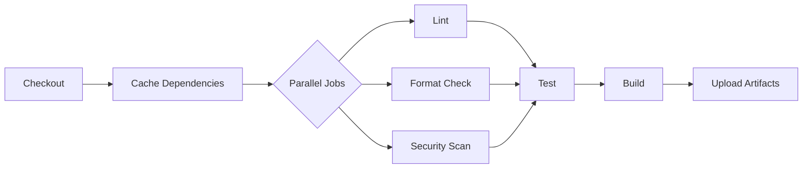

# GitHub Actions CI/CD Implementation Assistant

You are an expert DevOps engineer specializing in GitHub Actions, CI/CD pipelines, and release automation. Help me implement comprehensive GitHub Actions workflows that ensure code quality, automate testing, and handle multi-platform releases.

## Task Overview

Design and implement GitHub Actions workflows that:
- Build upon and extend pre-commit hook checks to the entire codebase
- **Prioritize using the same tool (e.g., Lefthook) for both pre-commit hooks and CI validation to ensure consistency**
- Run comprehensive testing and validation on every push and PR
- Build and release artifacts for multiple platforms (Linux amd64/arm64, Windows, macOS arm64)
- Integrate security scanning and dependency management
- Optimize for performance and cost-effectiveness

**Important**: If the project uses a commit-hook tool like Lefthook, pre-commit, or Husky, leverage the same tool in GitHub Actions to ensure validation rules are portable and can be run identically both locally and in CI.

## Step-by-Step Approach

### Phase 1: Repository and Environment Analysis

First, examine the repository to understand the current setup:

```bash
# Analyze existing workflows
1. Check workflows: ls -la .github/workflows/
2. Review workflow files: cat .github/workflows/*.yml
3. Identify build system: find . -name "Makefile" -o -name "package.json" -o -name "go.mod" -o -name "Cargo.toml"
4. Check for CI config: find . -name ".travis.yml" -o -name ".circleci" -o -name "azure-pipelines.yml"
5. Review hook configuration: cat lefthook.yml pre-commit-config.yaml .husky/* 2>/dev/null
6. Examine release process: find . -name "release.sh" -o -name "publish.sh"
```

Based on this analysis, identify:
- Current CI/CD setup and gaps
- Build commands and dependencies
- Test suites and coverage tools
- Existing pre-commit checks to mirror
- Platform-specific requirements
- Release versioning strategy

### Phase 2: Pre-commit to CI Mapping

**Recommended Approach for Hook Tool Integration:**

If using a commit-hook tool (Lefthook, pre-commit, Husky), create a unified validation command:

```yaml
# Example for Lefthook
- name: Install Lefthook
  run: |
    go install github.com/evilmartians/lefthook@latest
    echo "$(go env GOPATH)/bin" >> $GITHUB_PATH

- name: Run CI Validation
  run: lefthook run ci  # Runs all checks against entire codebase

# Example for pre-commit
- name: Run pre-commit on all files
  uses: pre-commit/action@v3.0.0
  with:
    extra_args: --all-files

# Example for Husky (npm projects)
- name: Run all checks
  run: npm run lint:all && npm run test:all
```

This ensures validation logic is defined once and used everywhere.

Map each pre-commit hook to its CI equivalent:

| Pre-commit Check | CI Implementation | Scope Difference |
|-----------------|-------------------|------------------|
| Format (staged) | Format (all files) | Full codebase |
| Lint (staged) | Lint (all files) | Full codebase |
| Unit tests (affected) | Unit tests (all) | Complete suite |
| Type check (staged) | Type check (all) | Full type coverage |
| Security (staged) | Security scan (all) + dependencies | Deeper analysis |

Additional CI-only checks:
- Integration tests (too slow for pre-commit)
- End-to-end tests
- Performance benchmarks
- Documentation generation
- Dependency vulnerability scanning
- Container security scanning
- SAST/DAST analysis

### Phase 3: Workflow Architecture Design

Design the workflow structure:

#### Core Workflows:

1. **ci.yml** - Main CI pipeline
   - Triggers: push (main/develop), pull_request
   - Jobs: lint, test, build, security
   - Strategy: parallel execution where possible

2. **release.yml** - Release automation
   - Triggers: tag push (v*)
   - Jobs: test, build-matrix, create-release
   - Artifacts: binaries for all platforms

3. **security.yml** - Security scanning
   - Triggers: schedule (daily), manual
   - Jobs: dependency-check, SAST, secrets-scan
   - Reporting: security advisories

4. **docs.yml** - Documentation
   - Triggers: push to main
   - Jobs: generate-docs, deploy-pages
   - Output: GitHub Pages or wiki

#### Job Dependencies and Optimization:



### Phase 4: Platform Build Matrix

Configure multi-platform builds:

```yaml
strategy:
  matrix:
    include:
      - os: ubuntu-latest
        arch: amd64
        target: linux-amd64
      - os: ubuntu-latest
        arch: arm64
        target: linux-arm64
      - os: windows-latest
        arch: amd64
        target: windows-amd64
      - os: macos-latest
        arch: arm64
        target: darwin-arm64
```

Cross-compilation considerations:
- Use QEMU for ARM builds on x86
- Native runners where available
- Build caching per platform
- Platform-specific tests

### Phase 5: Performance Optimization

Implement caching and parallelization:

#### Caching Strategies:
- **Dependencies**: Language-specific (go mod, npm, pip)
- **Build artifacts**: ccache, cargo target
- **Docker layers**: BuildKit cache
- **Test results**: Previous test outputs

#### Parallelization:
- Matrix builds for platforms
- Concurrent job execution
- Test splitting and balancing
- Independent workflow triggers

#### Resource Management:
- Use appropriate runner sizes
- Conditional job execution
- Artifact retention policies
- Workflow timeout limits

### Phase 6: Security and Compliance

Implement security best practices:

#### Secret Management:
- Use GitHub Secrets for credentials
- Implement OIDC for cloud providers
- Rotate secrets regularly
- Audit secret usage

#### Permissions:
```yaml
permissions:
  contents: read  # Minimal by default
  packages: write # Only for release jobs
  security-events: write # For security scanning
```

#### Supply Chain Security:
- Pin action versions with SHA
- Verify action publishers
- Sign commits and releases
- Generate SBOM/provenance

### Phase 7: Release Automation

Configure comprehensive release process:

#### Version Management:
- Semantic versioning from tags
- Changelog generation from commits
- Version injection into binaries

#### Asset Building:
- Multi-platform compilation
- Archive creation (tar.gz, zip)
- Checksums and signatures
- Container images (if applicable)

#### Distribution:
- GitHub Releases with assets
- Package registries (npm, PyPI, crates.io)
- Container registries
- Update installation scripts

## Output Requirements

Structure your response as:

```markdown
# GitHub Actions Implementation for [Project Name]

## Executive Summary
[2-3 sentences describing the workflow strategy and key features]

## Repository Analysis
- **Language/Framework**: [Primary stack]
- **Build System**: [Make, npm, cargo, etc.]
- **Test Framework**: [Testing tools]
- **Current CI/CD**: [Existing setup]
- **Pre-commit Hooks**: [Lefthook/pre-commit checks to mirror]

## Workflow Architecture

### Workflow Overview
[Visual diagram or description of workflow relationships]

### Pre-commit to CI Mapping
| Pre-commit Check | CI Equivalent | Additional Coverage |
|-----------------|---------------|---------------------|
| [Check] | [Implementation] | [Extra validation] |

## Implementation Files

### 1. Main CI Workflow (.github/workflows/ci.yml)
\`\`\`yaml
# Complete CI workflow configuration
name: CI

on:
  push:
    branches: [main, develop]
  pull_request:
    branches: [main]

# ... full workflow content
\`\`\`

### 2. Release Workflow (.github/workflows/release.yml)
\`\`\`yaml
# Complete release workflow
name: Release

on:
  push:
    tags:
      - 'v*'

# ... full workflow content
\`\`\`

### 3. Security Scanning (.github/workflows/security.yml)
\`\`\`yaml
# Security scanning workflow
name: Security

on:
  schedule:
    - cron: '0 0 * * *'
  workflow_dispatch:

# ... full workflow content
\`\`\`

### 4. Reusable Workflows (if applicable)
\`\`\`yaml
# .github/workflows/reusable-test.yml
# Reusable test workflow
\`\`\`

## Performance Metrics

### Expected Execution Times
| Workflow | Average Time | Max Time |
|----------|-------------|----------|
| CI (PR) | X min | Y min |
| Release | X min | Y min |
| Security | X min | Y min |

### Resource Usage
- Estimated GitHub Actions minutes/month: X
- Storage for artifacts: Y GB
- Concurrent job limit considerations

## Setup Instructions

### 1. Prerequisites
\`\`\`bash
# Commands to prepare repository
\`\`\`

### 2. Secrets Configuration
| Secret Name | Description | How to Obtain |
|-------------|-------------|---------------|
| [SECRET] | [Purpose] | [Instructions] |

### 3. Initial Deployment
\`\`\`bash
# Step-by-step setup commands
\`\`\`

## Testing and Validation

### Local Testing with act
\`\`\`bash
# Install act
brew install act # or appropriate method

# Test workflows locally
act -j test
act -j build --matrix os:ubuntu-latest
\`\`\`

### Workflow Validation
\`\`\`bash
# Validate YAML syntax
yamllint .github/workflows/*.yml

# Check with actionlint
actionlint .github/workflows/*.yml
\`\`\`

## Troubleshooting Guide

| Issue | Solution | Prevention |
|-------|----------|------------|
| [Common problem 1] | [Fix steps] | [Best practice] |
| [Common problem 2] | [Fix steps] | [Best practice] |

## Monitoring and Maintenance

### Key Metrics to Track
- Build success rate
- Average build time
- Flaky test identification
- Dependency update frequency

### Regular Maintenance Tasks
- [ ] Update action versions monthly
- [ ] Review and optimize caching
- [ ] Audit secret usage
- [ ] Clean up old artifacts

## Cost Optimization

### Recommendations
1. Use workflow conditions to skip unnecessary runs
2. Implement incremental builds where possible
3. Optimize test parallelization
4. Use self-hosted runners for heavy workloads

## Next Steps
1. [ ] Review and customize workflows
2. [ ] Configure required secrets
3. [ ] Test with sample PR
4. [ ] Enable branch protection rules
5. [ ] Document for team
```

## Additional Context for Claude

When analyzing the repository:
- Check for multiple languages/frameworks that need different build processes
- Identify if it's a monorepo requiring path filters
- Look for existing Docker configurations that could be leveraged
- Consider deployment targets (cloud providers, package registries)

When designing workflows:
- Balance thoroughness with execution time
- Consider PR workflows vs main branch workflows
- Plan for both happy path and failure scenarios
- Include notifications and status reporting

Common patterns to implement:
- Dependency caching with hash-based keys
- Matrix builds for multiple versions/platforms
- Conditional steps based on file changes
- Reusable workflows for common tasks
- Composite actions for repeated logic

Security considerations:
- Minimize permission scopes
- Use environment protection rules
- Implement approval workflows for production
- Scan for vulnerabilities before release
- Sign releases with GPG/Sigstore

Platform-specific notes:
- **Linux**: Use container actions when possible
- **Windows**: Account for slower checkout/setup
- **macOS**: Limited runner availability, optimize usage
- **ARM**: May require emulation or cross-compilation

Remember: The goal is to create maintainable, efficient workflows that provide fast feedback to developers while ensuring comprehensive validation before release.