# HELIX Workflow Quick Start Guide

## 🚀 Getting Started in 5 Minutes

### Prerequisites
- DDx CLI installed (`ddx` command available)
- Git repository initialized
- Basic understanding of Test-Driven Development (TDD)

### Initialize HELIX in Your Project

```bash
# Initialize DDx with HELIX workflow
ddx init --workflow helix

# This creates the HELIX structure in your project:
# - docs/ directory for all artifacts
# - .ddx.yml configuration file
# - workflow templates and prompts
```

## 📚 Your First HELIX Project: A Simple TODO API

Let's walk through building a TODO list API using the HELIX workflow.

### Phase 1: FRAME - Define What We're Building

#### Step 1: Create the Problem Statement
```bash
# Use AI assistance to generate initial PRD
ddx apply prompts/helix/frame/prd

# Or create manually
cat > docs/helix/01-frame/prd.md << 'EOF'
# Product Requirements Document: TODO API

## Problem Statement
Development teams need a simple, reliable API to manage task lists with
clear priorities and due dates.

## Success Metrics
- API response time < 200ms for 95% of requests
- 99.9% uptime
- Support 1000 concurrent users

## P0 Requirements
- Create, read, update, delete tasks
- Task priority levels (High, Medium, Low)
- Due date tracking
- RESTful JSON API
EOF
```

#### Step 2: Define User Stories
```bash
# Generate user stories from PRD
ddx apply prompts/helix/frame/user-stories

# Example user story
cat > docs/helix/01-frame/user-stories/US-001-create-task.md << 'EOF'
# US-001: Create Task

As a developer, I want to create a new task via API,
so that I can add items to my TODO list programmatically.

## Acceptance Criteria
- Given: A valid task payload with title and priority
- When: POST request sent to /api/tasks
- Then: Task is created and returns with unique ID
EOF
```

#### Gate Check: Ready for Design?
```bash
# Validate Frame outputs
ddx validate frame

# Checklist:
# ✓ PRD approved
# ✓ User stories have acceptance criteria
# ✓ Success metrics defined
# ✓ Stakeholders aligned
```

### Phase 2: DESIGN - How We'll Build It

#### Step 3: Create Architecture
```bash
# Generate architecture from requirements
ddx apply prompts/helix/design/architecture

# Key decisions to document:
cat > docs/helix/02-design/architecture.md << 'EOF'
# TODO API Architecture

## Technology Stack
- Language: Go 1.21+
- Framework: Gin for HTTP routing
- Database: PostgreSQL with GORM
- Testing: testify + httptest

## API Design
- RESTful endpoints
- JSON request/response
- JWT authentication
- Semantic versioning
EOF
```

#### Step 4: Define API Contracts
```bash
# Create OpenAPI specification
cat > docs/helix/02-design/contracts/api-spec.yaml << 'EOF'
openapi: 3.0.0
info:
  title: TODO API
  version: 1.0.0
paths:
  /api/tasks:
    post:
      summary: Create a new task
      requestBody:
        content:
          application/json:
            schema:
              type: object
              required: [title, priority]
              properties:
                title:
                  type: string
                priority:
                  type: string
                  enum: [high, medium, low]
      responses:
        201:
          description: Task created successfully
EOF
```

### Phase 3: TEST - Write Tests First (Red Phase)

#### Step 5: Create Failing Tests
```bash
# Generate test suites from contracts
ddx apply prompts/helix/test/contract-tests

# Example contract test (this MUST fail initially)
cat > tests/contract/task_api_test.go << 'EOF'
func TestCreateTask(t *testing.T) {
    // Arrange
    payload := map[string]string{
        "title": "Write documentation",
        "priority": "high",
    }

    // Act
    resp := POST("/api/tasks", payload)

    // Assert
    assert.Equal(t, 201, resp.StatusCode)
    assert.NotEmpty(t, resp.Body["id"])
    assert.Equal(t, "Write documentation", resp.Body["title"])
}
EOF

# Run tests - they MUST fail
go test ./tests/...
# Expected: FAIL (no implementation yet)
```

#### Gate Check: All Tests Failing?
```bash
# Verify we're in RED phase
ddx validate test --expect-failures

# ✓ All contract tests written
# ✓ All tests are failing
# ✓ Test coverage plan complete
```

### Phase 4: BUILD - Make Tests Pass (Green Phase)

#### Step 6: Implement Code
```bash
# NOW we write implementation code
cat > internal/handlers/task_handler.go << 'EOF'
func CreateTask(c *gin.Context) {
    var task Task
    if err := c.BindJSON(&task); err != nil {
        c.JSON(400, gin.H{"error": err.Error()})
        return
    }

    task.ID = uuid.New().String()
    task.CreatedAt = time.Now()

    if err := db.Create(&task).Error; err != nil {
        c.JSON(500, gin.H{"error": "Failed to create task"})
        return
    }

    c.JSON(201, task)
}
EOF

# Run tests again - they should PASS
go test ./tests/...
# Expected: PASS (tests now green)
```

#### Step 7: Refactor (Still Green)
```bash
# Improve code quality while keeping tests green
# - Extract validation logic
# - Add error handling
# - Improve naming
# - Add logging

# Verify tests still pass after refactoring
go test ./tests/...
```

### Phase 5: DEPLOY - Ship It

#### Step 8: Deploy to Production
```bash
# Build and deploy
ddx apply prompts/helix/deploy/deployment-plan

# Example deployment
docker build -t todo-api:v1.0.0 .
docker push registry/todo-api:v1.0.0
kubectl apply -f k8s/deployment.yaml

# Verify deployment
curl https://api.example.com/health
```

### Phase 6: ITERATE - Learn and Improve

#### Step 9: Analyze and Plan Next Iteration
```bash
# Collect metrics
ddx apply prompts/helix/iterate/metrics-analysis

# Review performance
# - Average response time: 150ms ✓
# - Error rate: 0.1% ✓
# - User feedback: "Need task categories"

# Plan next iteration
echo "FEAT-002: Add task categories" >> docs/helix/06-iterate/backlog.md
```

## 🎯 Common Scenarios

### Scenario 1: Starting a New Feature
```bash
# 1. Add to Feature Registry
ddx feature add "User Authentication"

# 2. Create Feature Specification
ddx apply prompts/helix/frame/feature-spec

# 3. Follow phases 1-6 for the feature
```

### Scenario 2: Fixing a Bug
```bash
# 1. Write failing test that reproduces bug
echo "Test for bug #123" >> tests/bugs/bug_123_test.go

# 2. Fix the bug (make test pass)
# 3. Deploy fix
# 4. Add to lessons learned
```

### Scenario 3: Major Architecture Change
```bash
# 1. Create ADR (Architecture Decision Record)
ddx apply prompts/helix/design/adr

# 2. Update threat model
ddx apply prompts/helix/frame/threat-model

# 3. Follow full HELIX cycle
```

## 🤖 AI Assistance Commands

### Frame Phase
```bash
ddx apply prompts/helix/frame/prd              # Generate PRD
ddx apply prompts/helix/frame/user-stories     # Create user stories
ddx apply prompts/helix/frame/threat-model     # Security analysis
```

### Design Phase
```bash
ddx apply prompts/helix/design/architecture    # System design
ddx apply prompts/helix/design/api-contracts   # API specifications
ddx apply prompts/helix/design/data-model      # Database design
```

### Test Phase
```bash
ddx apply prompts/helix/test/test-plan        # Test strategy
ddx apply prompts/helix/test/contract-tests   # API tests
ddx apply prompts/helix/test/security-tests   # Security validation
```

### Build Phase
```bash
ddx apply prompts/helix/build/implementation  # Code generation
ddx apply prompts/helix/build/refactoring     # Code improvement
```

## 🚦 Decision Tree: Is HELIX Right for Your Project?

```mermaid
graph TD
    Start[New Project] --> Q1{Clear Requirements?}
    Q1 -->|No| Research[Do Research First]
    Q1 -->|Yes| Q2{Quality Critical?}
    Q2 -->|No| Other[Consider Agile/Lean]
    Q2 -->|Yes| Q3{Team Knows TDD?}
    Q3 -->|No| Learn[Learn TDD First]
    Q3 -->|Yes| HELIX[Use HELIX ✓]

    Research --> Q1
    Learn --> Q3
```



## ⚠️ Common Pitfalls and Solutions

### Pitfall 1: Skipping Tests
**Problem**: "Let's just write the code first..."
**Solution**: Tests ARE your specification. No tests = unclear requirements.

### Pitfall 2: Over-Engineering in Frame
**Problem**: Designing technical solutions during requirements
**Solution**: Frame = WHAT and WHY. Design = HOW.

### Pitfall 3: Not Letting Tests Fail
**Problem**: Writing tests after code
**Solution**: Tests must fail first (Red) to prove they're testing something.

### Pitfall 4: Skipping Gates
**Problem**: Moving to next phase without validation
**Solution**: Gates prevent costly rework. Always validate.

## 📈 Success Metrics

Track these to measure HELIX effectiveness:

- **Defect Rate**: Should decrease with each iteration
- **Test Coverage**: Aim for >80% code coverage
- **Cycle Time**: Time from Frame to Deploy
- **Rework Rate**: How often you revisit completed phases
- **Stakeholder Satisfaction**: Regular feedback scores

## 🔧 Troubleshooting

### "I don't know what tests to write"
- Review user stories acceptance criteria
- Check API contracts for endpoints
- Look at security requirements for validation tests

### "Tests are passing but feature doesn't work"
- Missing test cases - add more tests
- Tests not testing the right thing - review test quality
- Integration issues - add integration tests

### "Too much documentation"
- Focus on P0 requirements only
- Use templates to maintain consistency
- Leverage AI to generate boilerplate

### "Process feels slow"
- HELIX invests time upfront to save time later
- Measure total cycle time, not phase time
- Practice improves speed significantly

## 📚 Next Steps

1. **Complete Tutorial**: Build the TODO API following this guide
2. **Read Phase Guides**: Deep dive into each phase's README
3. **Study Templates**: Explore artifact templates for your domain
4. **Join Community**: Share experiences and learn from others

## 🎓 Learning Resources

- **TDD Basics**: [Test-Driven Development fundamentals]
- **API Design**: [RESTful API best practices]
- **Security**: [OWASP Top 10 and mitigation]
- **Architecture**: [C4 model for architecture diagrams]

## 💡 Tips from Practitioners

> "Spend extra time in Frame. Every hour there saves a day in Build." - Senior Engineer

> "Write tests like you're explaining to a new team member." - Tech Lead

> "The magic happens in Iterate - that's where real learning occurs." - Product Manager

> "Security isn't a phase, it's woven through everything." - Security Champion

---

Ready to start? Run `ddx init --workflow helix` and begin your HELIX journey!