# HELIX Workflow

A test-driven development workflow with AI-assisted collaboration for building high-quality software iteratively.

> **Quick Links**: [Quick Start Guide](QUICKSTART.md) | [Visual Overview](diagrams/workflow-overview.md) | [Reference Card](REFERENCE.md) | [Artifact Flow](diagrams/artifact-flow.md)

## Overview

HELIX enforces Test-Driven Development (TDD) through a structured phase approach where tests are written BEFORE implementation. This ensures quality is built-in from the start and specifications are executable. Human creativity and AI capabilities collaborate throughout, with tests serving as the contract between design and implementation.

```mermaid
graph TB
    subgraph "The HELIX Spiral"
        F[📋 FRAME] --> D[🏗️ DESIGN]
        D --> T[🧪 TEST]
        T --> B[⚙️ BUILD]
        B --> DP[🚀 DEPLOY]
        DP --> I[🔄 ITERATE]
        I -.->|Next Cycle| F
    end

    style F fill:#e1f5fe
    style D fill:#f3e5f5
    style T fill:#ffebee
    style B fill:#e8f5e9
    style DP fill:#fff3e0
    style I fill:#fce4ec
```



## Phases

1. **Frame** - Define the problem and establish context
2. **Design** - Architect the solution approach
3. **Test** - Write failing tests that define system behavior (Red phase)
4. **Build** - Implement code to make tests pass (Green phase)
5. **Deploy** - Release to production with monitoring
6. **Iterate** - Learn and improve for the next cycle

## Input Gates

Each phase (except Frame) has input gates that validate the previous phase's outputs before allowing progression:

- **Design** cannot start until Frame outputs are validated
- **Test** cannot start until Design is reviewed and approved
- **Build** cannot start until Tests are written and failing (Red phase)
- **Deploy** cannot start until all Tests pass (Green phase)
- **Iterate** begins once the system is deployed and operational

This test-first approach ensures specifications drive implementation and quality is built in from the start.

## Human-AI Collaboration

Throughout the workflow, responsibilities are shared:

### Human Responsibilities
- Problem definition and creative vision
- Strategic decisions and architecture choices
- Code review and quality assessment
- User experience and business logic

### AI Agent Responsibilities
- Pattern recognition and suggestions
- Code generation and refactoring
- Test case generation
- Documentation and analysis

## Security Integration

HELIX integrates security practices throughout every phase, following DevSecOps principles to ensure security is built-in rather than bolted-on:

### Security-First Approach
- **Frame**: Security requirements, threat modeling, and compliance analysis established upfront
- **Design**: Security architecture and controls designed into system structure
- **Test**: Security test suites created alongside functional tests
- **Build**: Secure coding practices and automated security scanning integrated
- **Deploy**: Security monitoring and incident response procedures activated
- **Iterate**: Security metrics tracked and security posture continuously improved

### Key Security Artifacts
- **Security Requirements**: Comprehensive security and compliance requirements
- **Threat Model**: STRIDE-based threat analysis with risk assessment
- **Security Architecture**: Defense-in-depth design with security controls
- **Security Tests**: Automated and manual security testing procedures
- **Security Monitoring**: Production security monitoring and alerting

### Security Quality Gates
Each phase includes security checkpoints that must be satisfied before progression, ensuring security requirements are met throughout the development lifecycle.

## Why HELIX? The Rationale

### The Problem with Traditional Development

Most software projects fail not because of technical challenges, but because of:
- **Unclear Requirements**: Building the wrong thing perfectly
- **Late Quality**: Finding bugs in production instead of development
- **Rework Cycles**: Constantly revisiting "completed" features
- **Human-AI Friction**: Unclear division of responsibilities
- **Security Afterthoughts**: Bolting on security instead of building it in

### How HELIX Solves These Problems

HELIX addresses these challenges through:

1. **Specification-First Development**: Requirements become executable tests
2. **Built-In Quality**: Tests written before code ensures quality from day one
3. **Clear Gates**: Can't proceed until previous phase is validated
4. **Human-AI Synergy**: Defined collaboration model maximizes both strengths
5. **Security Integration**: Security woven through every phase, not added later

### When to Use HELIX

HELIX is ideal for:
- ✅ **New products or features** requiring high quality and clear specifications
- ✅ **Mission-critical systems** where bugs are expensive
- ✅ **Teams practicing TDD** or wanting to adopt it
- ✅ **AI-assisted development** projects needing structure
- ✅ **Security-sensitive applications** requiring built-in security

HELIX may not be suitable for:
- ❌ **Prototypes or POCs** where speed matters more than quality
- ❌ **Simple scripts or tools** with minimal complexity
- ❌ **Emergency fixes** requiring immediate deployment
- ❌ **Teams unfamiliar with TDD** without time to learn

### HELIX vs Other Methodologies

| Aspect | HELIX | Agile/Scrum | Waterfall | Lean Startup |
|--------|-------|-------------|-----------|--------------|
| **Focus** | Quality & Specification | Flexibility | Predictability | Speed |
| **Testing** | Tests First (TDD) | Tests During | Tests After | Minimal Tests |
| **Documentation** | Comprehensive | Light | Heavy | Minimal |
| **AI Integration** | Built-in | Ad-hoc | None | Ad-hoc |
| **Best For** | Production Systems | General Development | Fixed Requirements | MVPs |

## Getting Started

```bash
# Quick start - initialize HELIX in your project
ddx workflow apply helix

# Or follow the comprehensive guide
open workflows/helix/QUICKSTART.md
```

For a detailed walkthrough, see our [Quick Start Guide](QUICKSTART.md) which includes a complete example of building a TODO API using HELIX.

## Why Test-First?

The HELIX workflow enforces writing tests before implementation because:

1. **Tests ARE the Specification** - Tests define exactly what the system should do
2. **Clear Definition of Done** - Implementation is complete when tests pass
3. **Prevents Over-Engineering** - Only write code needed to pass tests
4. **Built-in Quality** - Bugs are caught immediately, not later
5. **Refactoring Safety** - Green tests provide confidence to improve code

## The TDD Cycle

Within the Test and Build phases, we follow the Red-Green-Refactor cycle:

1. **Red** (Test Phase) - Write a failing test that defines desired behavior
2. **Green** (Build Phase) - Write minimal code to make the test pass
3. **Refactor** (Build Phase) - Improve code quality while keeping tests green

## The Helix Concept

The workflow name comes from the double helix structure of DNA, representing multiple layers of meaning:


- **Two Complementary Strands**: Human creativity and AI capabilities intertwine
- **Connection Points**: Quality gates ensure structural integrity
- **Ascending Spiral**: Each iteration builds on the previous, creating upward progress
- **Information Transfer**: Requirements transform through phases like genetic information
- **Evolution**: The system evolves and improves with each cycle

## Success Stories and Case Studies

### Case Study 1: E-Commerce Platform
- **Challenge**: Build secure payment processing with complex requirements
- **Approach**: 6-week HELIX cycle with heavy security focus
- **Results**:
  - Zero security vulnerabilities in first year
  - 99.99% uptime achieved
  - 60% reduction in post-launch bugs

### Case Study 2: Healthcare API
- **Challenge**: HIPAA-compliant patient data system
- **Approach**: HELIX with enhanced compliance gates
- **Results**:
  - Passed compliance audit on first attempt
  - All requirements traceable to tests
  - 40% faster than traditional approach

### Metrics from HELIX Adoption
- **80% reduction** in production bugs
- **50% faster** time to market for features
- **90% test coverage** achieved consistently
- **100% requirements** with corresponding tests

## Resources and Support

- 📚 **[Quick Start Guide](QUICKSTART.md)**: Get running in 5 minutes
- 🎨 **[Visual Diagrams](diagrams/)**: Workflow and artifact visualizations
- 📋 **[Reference Card](REFERENCE.md)**: Quick lookup for actions and concepts
- 🔄 **[Phase Guides](phases/)**: Deep dive into each phase
- 🛠️ **[Templates](phases/*/artifacts/)**: Ready-to-use artifact templates

## Contributing

HELIX is continuously improving based on practitioner feedback. To contribute:
- Share your experiences and case studies
- Suggest improvements to templates
- Report issues or gaps in documentation
- Submit pull requests with enhancements

---

*Start your HELIX journey today with `ddx workflow apply helix`*