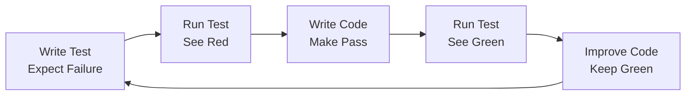

# HELIX Quick Reference Card

## 📋 Phase Overview

| Phase | Purpose | Key Outputs | Duration |
|-------|---------|-------------|----------|
| **1. FRAME** | Define WHAT & WHY | PRD, User Stories, Threat Model | 1-2 days |
| **2. DESIGN** | Define HOW | Architecture, API Contracts, ADRs | 1-2 days |
| **3. TEST** | Write failing tests | Test Suites (Red) | 2-3 days |
| **4. BUILD** | Make tests pass | Source Code (Green) | Variable |
| **5. DEPLOY** | Release to production | Deployed System | 1 day |
| **6. ITERATE** | Learn & improve | Metrics, Lessons | Ongoing |

## 🚦 Gate Checklist

### Frame → Design Gate
- [ ] PRD approved by stakeholders
- [ ] User stories have acceptance criteria
- [ ] Success metrics defined with targets
- [ ] Security requirements documented
- [ ] Threat model completed

### Design → Test Gate
- [ ] Architecture diagrams complete
- [ ] API contracts specified
- [ ] Technology decisions documented (ADRs)
- [ ] Security architecture approved
- [ ] Data design finalized

### Test → Build Gate
- [ ] Test plan approved
- [ ] All tests written and failing (Red)
- [ ] Contract tests complete
- [ ] Security tests defined
- [ ] Coverage targets set

### Build → Deploy Gate
- [ ] All tests passing (Green)
- [ ] Code reviewed and approved
- [ ] Documentation complete
- [ ] Security scans passed
- [ ] Performance targets met

### Deploy → Iterate Gate
- [ ] Successfully deployed
- [ ] Monitoring active
- [ ] Runbooks ready
- [ ] Rollback tested
- [ ] Metrics collecting

## 🛠️ Essential Commands

### Workflow Management
```bash
ddx init --workflow helix          # Initialize HELIX
ddx workflow apply helix           # Apply workflow
ddx validate <phase>               # Validate phase completion
ddx feature add "<name>"           # Add new feature
```

### Frame Phase
```bash
ddx apply prompts/helix/frame/prd
ddx apply prompts/helix/frame/user-stories
ddx apply prompts/helix/frame/threat-model
ddx apply prompts/helix/frame/feature-spec
```

### Design Phase
```bash
ddx apply prompts/helix/design/architecture
ddx apply prompts/helix/design/api-contracts
ddx apply prompts/helix/design/adr
ddx apply prompts/helix/design/data-model
```

### Test Phase
```bash
ddx apply prompts/helix/test/test-plan
ddx apply prompts/helix/test/contract-tests
ddx apply prompts/helix/test/integration-tests
ddx apply prompts/helix/test/security-tests
```

### Build Phase
```bash
ddx apply prompts/helix/build/implementation
ddx apply prompts/helix/build/refactoring
ddx apply prompts/helix/build/code-review
```

## 📁 Directory Structure

```
project/
├── .ddx.yml                    # DDx configuration
├── docs/
│   ├── 01-frame/              # Requirements & specifications
│   │   ├── prd.md
│   │   ├── user-stories/
│   │   ├── features/
│   │   └── threat-model.md
│   ├── 02-design/             # Architecture & design
│   │   ├── architecture.md
│   │   ├── contracts/
│   │   └── adr/
│   ├── 03-test/               # Test documentation
│   │   ├── test-plan.md
│   │   └── test-procedures.md
│   ├── 04-build/              # Implementation docs
│   │   └── implementation-plan.md
│   ├── 05-deploy/             # Deployment docs
│   │   └── deployment-plan.md
│   └── 06-iterate/            # Metrics & lessons
│       └── metrics-reports/
├── src/                       # Source code
├── tests/                     # Test suites
│   ├── unit/
│   ├── integration/
│   ├── contract/
│   └── security/
└── scripts/                   # Automation scripts
```

## 🎯 Key Artifacts by Phase

### FRAME (What & Why)
- **PRD**: Problem, metrics, scope
- **User Stories**: User needs with acceptance criteria
- **Feature Specs**: Detailed requirements
- **Threat Model**: Security risks and mitigations
- **Principles**: Constraints and guidelines

### DESIGN (How)
- **Architecture**: System design and components
- **API Contracts**: Interface specifications
- **ADRs**: Architectural decisions with rationale
- **Data Design**: Database schema and patterns
- **Security Architecture**: Security controls

### TEST (Validation)
- **Test Plan**: Testing strategy and approach
- **Contract Tests**: API behavior validation
- **Integration Tests**: Component interaction
- **Unit Tests**: Function-level validation
- **Security Tests**: Vulnerability checks

### BUILD (Implementation)
- **Source Code**: Actual implementation
- **Documentation**: Code and API docs
- **Reviews**: Code review feedback
- **Build Artifacts**: Compiled/packaged code

### DEPLOY (Release)
- **Deployment Plan**: Release strategy
- **Release Notes**: What's new/fixed
- **Monitoring**: Alerts and dashboards
- **Runbooks**: Operational procedures

### ITERATE (Improve)
- **Metrics Reports**: Performance data
- **Lessons Learned**: What worked/didn't
- **Improvement Backlog**: Next iteration items
- **Root Cause Analysis**: Issue investigations

## ⚡ TDD Quick Guide



### TDD Rules
1. **Never write code without a failing test**
2. **Write minimal code to pass the test**
3. **Refactor only when tests are green**
4. **One test at a time**
5. **Keep tests simple and focused**

## 🤖 Human-AI Division

### Human Leads
- Problem definition
- Business decisions
- User experience
- Architecture choices
- Final approval

### AI Assists
- Documentation generation
- Test case creation
- Code implementation
- Pattern recognition
- Metric analysis

### Joint Efforts
- Design reviews
- Problem analysis
- Quality assurance
- Security assessment
- Performance optimization

## 🚫 Common Anti-Patterns

| Anti-Pattern | Why It's Bad | Do Instead |
|--------------|--------------|------------|
| Skip tests | Unclear specs | Write tests first |
| Design in Frame | Premature solutioning | Focus on problems |
| Code before tests | Not TDD | Red → Green → Refactor |
| Skip gates | Quality issues | Validate each phase |
| No metrics | Can't improve | Measure everything |

## 📊 Success Metrics

### Quality Metrics
- Test coverage > 80%
- Defect escape rate < 5%
- Code review coverage 100%
- Security scan pass rate 100%

### Process Metrics
- Cycle time (Frame → Deploy)
- Gate passage rate
- Rework percentage
- Requirement stability

### Business Metrics
- Feature delivery rate
- User satisfaction score
- System availability
- Performance SLAs

## 🔧 Troubleshooting

| Problem | Solution |
|---------|----------|
| **Tests not failing** | Check test is actually testing something |
| **Can't write tests** | Requirements unclear, revisit Frame |
| **Tests too complex** | Break into smaller units |
| **Build takes forever** | Too much complexity, simplify |
| **Deploy fails** | Missing deployment tests |

## 🎓 HELIX Principles

1. **Specification Completeness**: No ambiguous requirements
2. **Test-First Development**: Tests before implementation
3. **Simplicity First**: Start minimal, add complexity later
4. **Observable Interfaces**: Everything testable
5. **Continuous Validation**: Always checking quality
6. **Feedback Integration**: Learn from production

## 📌 Quick Tips

- **Frame**: Spend time here, it saves time later
- **Design**: Think twice, code once
- **Test**: If it's hard to test, redesign it
- **Build**: Only write code to pass tests
- **Deploy**: Automate everything possible
- **Iterate**: Measure, learn, improve

## 🔗 Useful Links

- [HELIX Overview](README.md)
- [Quick Start Guide](QUICKSTART.md)
- [Visual Diagrams](diagrams/)
- [Phase Details](phases/)
- [Artifact Templates](phases/*/artifacts/)

---

*Keep this reference handy during your HELIX development cycle!*