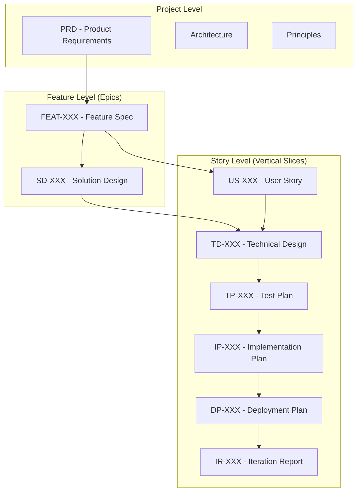

# HELIX Artifact Hierarchy and Naming Conventions

*Understanding how artifacts flow through the HELIX workflow*

## Overview

The HELIX workflow uses a consistent artifact naming system that enables:
- **Traceability**: Track artifacts from requirements to deployment
- **Vertical Slicing**: Implement stories independently
- **Parallel Development**: Multiple stories in different phases
- **Clear Organization**: Predictable file locations

## Artifact Types and Relationships

### Three Levels of Artifacts



## Story-Level Progression (Vertical Slices)

Each user story progresses through all phases independently:

### Naming Pattern
`{Prefix}-{Number}-{descriptive-name}.md`

### Phase Progression
```
Frame:   US-036-list-mcp-servers.md
Design:  TD-036-list-mcp-servers.md
Test:    TP-036-list-mcp-servers.md
Build:   IP-036-list-mcp-servers.md
Deploy:  DP-036-list-mcp-servers.md
Iterate: IR-036-list-mcp-servers.md
```

### Artifact Descriptions

| Prefix | Artifact Type | Phase | Purpose |
|--------|--------------|-------|---------|
| US | User Story | Frame | Defines WHAT needs to be built |
| TD | Technical Design | Design | Details HOW to build it |
| TP | Test Plan | Test | Specifies tests to verify it |
| IP | Implementation Plan | Build | Guides TDD implementation |
| DP | Deployment Plan | Deploy | Plans rollout strategy |
| IR | Iteration Report | Iterate | Captures metrics and learnings |

## Feature-Level Progression (Epics)

Features represent collections of related stories:

### Naming Pattern
```
Frame:   FEAT-001-mcp-server-management.md
Design:  SD-001-mcp-management.md
```

### Relationships
- One feature (FEAT) contains multiple user stories (US)
- One solution design (SD) guides multiple technical designs (TD)

## Directory Structure

All HELIX artifacts are under `docs/helix/` to support multiple workflows:

```
docs/
└── helix/                              # HELIX workflow artifacts
    ├── 01-frame/
    │   ├── prd.md                     # Project-level
    │   ├── principles.md               # Project-level
    │   ├── features/
    │   │   └── FEAT-001-*.md          # Feature-level
    │   └── user-stories/
    │       └── US-XXX-*.md            # Story-level
    ├── 02-design/
    │   ├── architecture.md            # Project-level
    │   ├── solution-designs/
    │   │   └── SD-XXX-*.md           # Feature-level
    │   └── technical-designs/
    │       └── TD-XXX-*.md           # Story-level (NEW)
    ├── 03-test/
    │   ├── test-plan.md               # Project-level
    │   └── test-plans/
    │       └── TP-XXX-*.md           # Story-level (NEW)
    ├── 04-build/
    │   ├── implementation-plan.md     # Project-level
    │   └── implementation-plans/
    │       └── IP-XXX-*.md           # Story-level (NEW)
    ├── 05-deploy/
    │   ├── deployment-checklist.md    # Project-level
    │   └── deployment-plans/
    │       └── DP-XXX-*.md           # Story-level (NEW)
    └── 06-iterate/
        ├── metrics-dashboard.md       # Project-level
        └── iteration-reports/
            └── IR-XXX-*.md           # Story-level (NEW)
```

## Cross-References

Each artifact references its dependencies:

### Story-Level References
```markdown
# TD-036-list-mcp-servers.md
**User Story**: [[US-036-list-mcp-servers]]
**Parent Feature**: [[FEAT-001-mcp-server-management]]
**Solution Design**: [[SD-001-mcp-management]]
```

### Traceability Chain
```
FEAT-001 → US-036 → TD-036 → TP-036 → IP-036 → DP-036 → IR-036
         ↓
         US-037 → TD-037 → TP-037 → IP-037 → DP-037 → IR-037
         ↓
         US-038 → TD-038 → TP-038 → IP-038 → DP-038 → IR-038
```

## Naming Rules

### Consistency Rules
1. **Number stays constant**: 036 throughout all phases
2. **Name stays constant**: "list-mcp-servers" throughout
3. **Only prefix changes**: US → TD → TP → IP → DP → IR

### Valid Examples
✅ `US-001-initialize-ddx.md`
✅ `TD-001-initialize-ddx.md`
✅ `FEAT-014-obsidian-integration.md`

### Invalid Examples
❌ `US-1-init.md` (number must be 3 digits)
❌ `td-001-initialize.md` (prefix must be uppercase)
❌ `US-001-init-ddx.md` (name changed between artifacts)

## State Detection

The workflow state is determined by which artifacts exist:

### Story State Detection
```yaml
If exists US-036: Story is in FRAME
If exists TD-036: Story is in DESIGN
If exists TP-036: Story is in TEST
If exists IP-036: Story is in BUILD
If exists DP-036: Story is in DEPLOY
If exists IR-036: Story is in ITERATE
```

### Feature State Detection
```yaml
If all stories have US: Feature is in FRAME
If all stories have TD: Feature is in DESIGN
If all stories have tests passing: Feature is in BUILD
```

## Benefits

### 1. Vertical Slicing
Each story can be deployed independently:
- US-036 could be in production (ITERATE)
- US-037 could be in testing (TEST)
- US-038 could be in design (DESIGN)

### 2. Clear Traceability
Follow any requirement through its lifecycle:
```bash
grep -r "US-001" docs/helix/  # Find all artifacts for story 001
```

### 3. Parallel Development
Multiple team members can work on different stories:
- Developer A: Implementing US-036 (BUILD)
- Developer B: Designing US-037 (DESIGN)
- Developer C: Writing tests for US-038 (TEST)

### 4. No State File Needed
State is derived from artifacts:
- No `.helix-state.yml` to maintain
- Git history shows state changes
- Self-healing (state always reflects reality)

## Migration Path

For existing projects:

### Option 1: New Stories Only
- Keep existing artifacts as-is
- Use new naming for new stories
- Both systems coexist

### Option 2: Gradual Migration
- Rename artifacts as they're updated
- Start with active stories
- Complete over time

### Option 3: Full Migration
- Batch rename all artifacts
- Update all references
- Clean cutover

## Examples

### Example 1: MCP Server Management Feature

```
Feature Level:
  FEAT-001-mcp-server-management.md
  SD-001-mcp-management.md

Story Level:
  US-036-list-mcp-servers.md → ... → IR-036-list-mcp-servers.md
  US-037-install-mcp-server.md → ... → IR-037-install-mcp-server.md
  US-038-configure-mcp-server.md → ... → IR-038-configure-mcp-server.md
```

### Example 2: Story in Multiple Phases

```
Monday:   Create US-041-user-authentication.md (FRAME)
Tuesday:  Create TD-041-user-authentication.md (DESIGN)
Wednesday: Create TP-041-user-authentication.md (TEST)
Thursday: Create IP-041-user-authentication.md (BUILD)
Friday:   Create DP-041-user-authentication.md (DEPLOY)
Next Week: Create IR-041-user-authentication.md (ITERATE)
```

## Commands

DDX commands work with this hierarchy:

```bash
# Check story state
ddx workflow status --story US-036

# Advance to next phase
ddx workflow advance US-036

# Create next artifact
ddx workflow create TD-036

# Validate progression
ddx workflow validate US-036
```

---

*This hierarchy enables true agile development with independently deployable story slices while maintaining full traceability.*