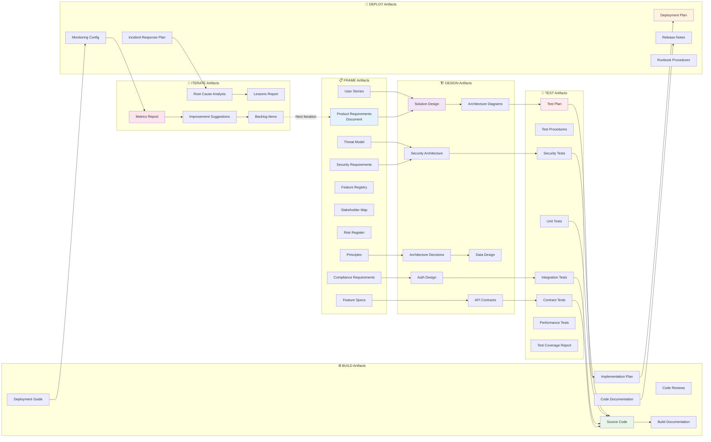
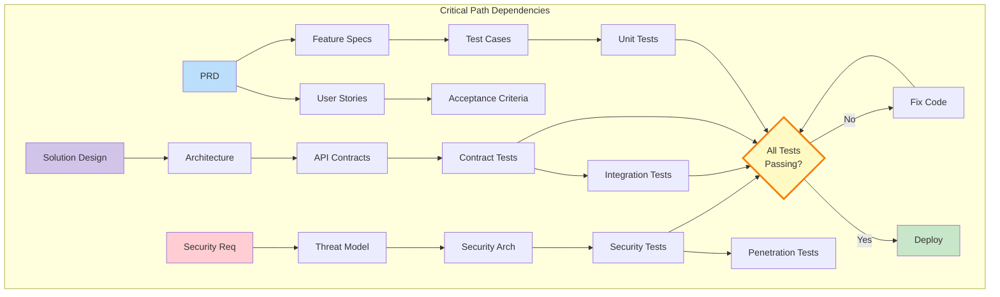
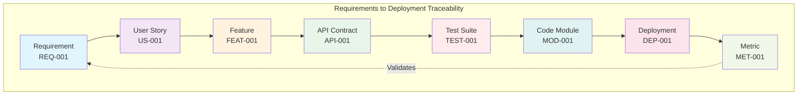
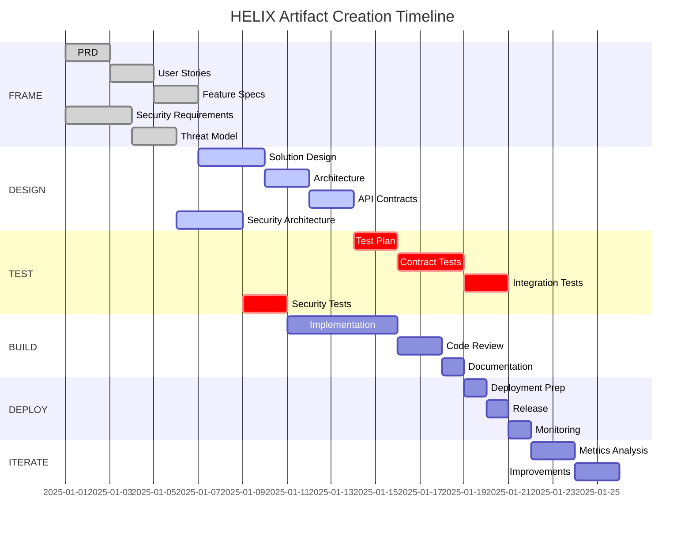
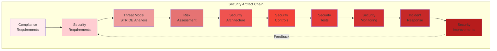
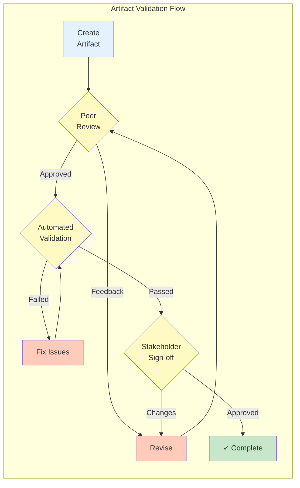

# HELIX Artifact Flow and Dependencies

## Artifact Flow Between Phases



## Artifact Dependency Matrix



## Cross-Phase Traceability



## Artifact Creation Timeline



## Security Artifact Dependencies



## Artifact Quality Gates



## Key Artifact Relationships

### Critical Dependencies
1. **PRD → All Design Artifacts**: Requirements drive all technical decisions
2. **API Contracts → Contract Tests**: Every API must have corresponding tests
3. **Threat Model → Security Tests**: Each threat must have validation tests
4. **Test Plan → Implementation Plan**: Tests define what needs to be built
5. **Metrics → Next Iteration PRD**: Production data informs future requirements

### Validation Chains
- Requirements → Stories → Tests → Code → Deployment → Metrics
- Security Requirements → Architecture → Controls → Tests → Monitoring
- Principles → Decisions → Implementation → Validation → Compliance

### Feedback Loops
- Metrics feed back to Requirements
- Incidents feed back to Security Requirements
- Lessons Learned feed back to Principles
- Test Results feed back to Design

## Artifact Storage Structure

```
docs/
├── 01-frame/
│   ├── prd.md
│   ├── principles.md
│   ├── user-stories/
│   ├── features/
│   ├── security-requirements.md
│   └── threat-model.md
├── 02-design/
│   ├── architecture.md
│   ├── solution-designs/
│   ├── contracts/
│   ├── adr/
│   └── security-architecture.md
├── 03-test/
│   ├── test-plan.md
│   ├── test-procedures.md
│   └── test-suites/
├── 04-build/
│   ├── implementation-plan.md
│   └── code-reviews/
├── 05-deploy/
│   ├── deployment-plan.md
│   ├── release-notes.md
│   └── runbooks/
└── 06-iterate/
    ├── metrics-reports/
    ├── lessons-learned/
    └── improvement-backlog.md
```