# HELIX Workflow Visual Overview

## Master Workflow Diagram

```mermaid
graph TB
    subgraph "🧬 HELIX Development Spiral"
        F[📋 1. FRAME<br/>Define Problem & Requirements]
        D[🏗️ 2. DESIGN<br/>Architecture & Solutions]
        T[🧪 3. TEST<br/>Write Failing Tests]
        B[⚙️ 4. BUILD<br/>Implement to Pass Tests]
        DP[🚀 5. DEPLOY<br/>Release & Monitor]
        I[🔄 6. ITERATE<br/>Learn & Improve]
    end

    F -->|Requirements & Stories| D
    D -->|Contracts & Architecture| T
    T -->|Red Tests| B
    B -->|Green Tests| DP
    DP -->|Metrics & Feedback| I
    I -->|Insights| F

    style F fill:#e1f5fe,stroke:#01579b,stroke-width:3px
    style D fill:#f3e5f5,stroke:#4a148c,stroke-width:3px
    style T fill:#ffebee,stroke:#b71c1c,stroke-width:3px
    style B fill:#e8f5e9,stroke:#1b5e20,stroke-width:3px
    style DP fill:#fff3e0,stroke:#e65100,stroke-width:3px
    style I fill:#fce4ec,stroke:#880e4f,stroke-width:3px
```

## Phase Flow with Gates

```mermaid
graph LR
    subgraph "Phase Progression with Quality Gates"
        Start([Start]) --> IG1{Input<br/>Gate}
        IG1 -->|✓| Frame[1. FRAME]
        Frame --> EG1{Exit<br/>Gate}
        EG1 -->|✓| IG2{Input<br/>Gate}
        IG2 -->|✓| Design[2. DESIGN]
        Design --> EG2{Exit<br/>Gate}
        EG2 -->|✓| IG3{Input<br/>Gate}
        IG3 -->|✓| Test[3. TEST]
        Test --> EG3{Exit<br/>Gate}
        EG3 -->|✓| IG4{Input<br/>Gate}
        IG4 -->|✓| Build[4. BUILD]
        Build --> EG4{Exit<br/>Gate}
        EG4 -->|✓| IG5{Input<br/>Gate}
        IG5 -->|✓| Deploy[5. DEPLOY]
        Deploy --> EG5{Exit<br/>Gate}
        EG5 -->|✓| Iterate[6. ITERATE]
        Iterate --> Next([Next Cycle])
    end

    style IG1 fill:#fff9c4
    style IG2 fill:#fff9c4
    style IG3 fill:#fff9c4
    style IG4 fill:#fff9c4
    style IG5 fill:#fff9c4
    style EG1 fill:#c8e6c9
    style EG2 fill:#c8e6c9
    style EG3 fill:#c8e6c9
    style EG4 fill:#c8e6c9
    style EG5 fill:#c8e6c9
```

## Human-AI Collaboration Model

## TDD Red-Green-Refactor Cycle

```mermaid
graph LR
    subgraph "Test-Driven Development Core"
        Red[🔴 RED<br/>Write Failing Test] --> Green[🟢 GREEN<br/>Write Minimal Code]
        Green --> Refactor[🔵 REFACTOR<br/>Improve Code Quality]
        Refactor --> Red
    end

    Frame[FRAME Phase] -->|Requirements| Red
    Red -->|Test Phase| TestPhase[TEST Phase]
    Green -->|Build Phase| BuildPhase[BUILD Phase]
    Refactor -->|Build Phase| BuildPhase

    style Red fill:#ffcdd2,stroke:#d32f2f,stroke-width:3px
    style Green fill:#c8e6c9,stroke:#388e3c,stroke-width:3px
    style Refactor fill:#bbdefb,stroke:#1976d2,stroke-width:3px
```

## Security Integration Throughout HELIX

## The DNA Helix Metaphor

The HELIX workflow is named after the double helix structure of DNA, representing:

- **Two Complementary Strands**: Human creativity and AI capabilities
- **Connection Points**: Quality gates ensure structural integrity
- **Ascending Spiral**: Each iteration builds on the previous
- **Information Transfer**: Requirements transform through phases like genetic information
- **Evolution**: The system evolves and improves with each cycle

This biological metaphor emphasizes the organic, evolutionary nature of software development when humans and AI collaborate effectively.