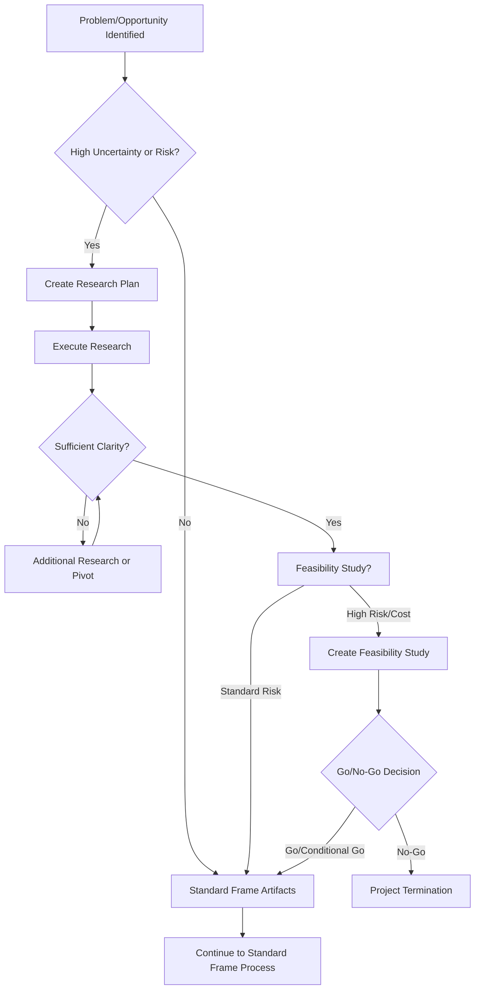
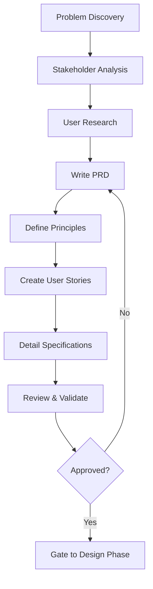

# Phase 01: Frame

The foundation phase where we define WHAT to build and WHY before considering HOW.

## Purpose

The Frame phase establishes the project's foundation by focusing on understanding the problem, defining business value, and aligning stakeholders on objectives. This phase deliberately avoids technical solutions to ensure we're solving the right problem for the right users.

## Key Principle

**Problem First, Solution Later**: Frame is about deeply understanding the problem space and user needs. Technical architecture and implementation details are intentionally deferred to the Design phase.

## Input Gates

Prerequisites to enter this phase (defined in `input-gates.yml`):
- **Problem or opportunity identified**: A clear business need or challenge requiring solution
- **Time allocated for analysis**: Dedicated time for thorough problem exploration

These gates ensure the team is ready to invest in proper framing before jumping to solutions.

## Exit Gates

Criteria that must be met before proceeding to Design phase (defined in `exit-gates.yml`):
- **PRD approved**: All stakeholders have signed off on requirements
- **P0 requirements specified**: Critical features have detailed specifications
- **Success metrics measurable**: Metrics have baselines, targets, and measurement methods
- **Principles established**: Technical and project constraints are documented
- **Risks assessed**: Major risks identified with mitigation strategies
- **Stakeholder alignment**: RACI matrix complete and communication plan established
- **Security requirements defined**: Security requirements documented and approved
- **Threat model completed**: Primary threats identified with mitigation strategies
- **Compliance requirements mapped**: Regulatory obligations identified and planned
- **Validation complete**: All artifacts reviewed and quality gates passed

The exit gates include automated validation rules and require formal approval from Product Owner, Technical Lead, Security Champion, and key stakeholders.

## Work Items

### Artifacts (Template-Based Outputs)

All artifacts for this phase are located in the `artifacts/` directory. Each artifact includes:
- **Templates**: Define the structure and sections required
- **Prompts**: Guide the creation and completion of templates
- **Examples**: Reference implementations (when available)

#### 1. Product Requirements Document (PRD)
**Artifact Location**: `artifacts/prd/`
**Output Location**: `docs/helix/01-frame/prd.md`

The business vision document that:
- Defines the problem and opportunity
- Establishes success metrics and goals
- Identifies users and personas
- Prioritizes requirements (P0/P1/P2)
- Sets scope and timeline

**Key Sections**:
- Executive Summary (write last)
- Problem Statement with quantifiable impact
- Success Metrics with specific targets
- User Personas based on research
- Prioritized Requirements
- Risks and Mitigation strategies

#### 2. Principles Document
**Artifact Location**: `artifacts/principles/`
**Output Location**: `docs/helix/01-frame/principles.md`

Technical and project constraints that will guide all development:
- Core development principles (e.g., library-first, test-first)
- Technology constraints and decisions
- Quality standards and practices
- Exception tracking for justified violations

#### 3. User Stories
**Artifact Location**: `artifacts/user-stories/`
**Output Location**: `docs/helix/01-frame/user-stories/US-XXX-[name].md`

Concrete user needs with clear acceptance criteria:
- Story format: As a [user], I want [goal], so that [value]
- Acceptance criteria using Given/When/Then format
- Definition of Done for each story
- Story prioritization and dependencies
- Validation scenarios

#### 4. Feature Specification
**Artifact Location**: `artifacts/feature-specification/`
**Output Location**: `docs/helix/01-frame/features/FEAT-XXX-[name].md`

Detailed requirements and constraints:
- Functional requirements (what the system must do)
- Non-functional requirements (performance, security, scalability)
- Edge cases and error handling
- Dependencies and assumptions
- Explicit out-of-scope items

#### 5. Feature Registry
**Artifact Location**: `artifacts/feature-registry/`
**Output Location**: `docs/helix/01-frame/feature-registry.md`

Centralized registry of all features:
- Feature identification with FEAT-XXX IDs
- Status tracking across all phases
- Dependency management and relationships
- Team ownership and responsibility
- Cross-phase traceability
- Priority categorization (P0/P1/P2)

#### 6. Stakeholder Map
**Artifact Location**: `artifacts/stakeholder-map/`
**Output Location**: `docs/helix/01-frame/stakeholder-map.md`

Comprehensive stakeholder analysis and engagement planning:
- Stakeholder identification and categorization
- RACI matrix for clear accountability
- Power/Interest grid analysis
- Communication and engagement strategies
- Escalation paths and contact information

#### 7. Risk Register
**Artifact Location**: `artifacts/risk-register/`
**Output Location**: `docs/helix/01-frame/risk-register.md`

Systematic risk identification and management:
- Risk assessment (probability × impact)
- Mitigation strategies and contingency plans
- Risk ownership and accountability
- Monitoring schedule and triggers
- Risk budget and reserve tracking

#### 8. Validation Checklist
**Artifact Location**: `artifacts/validation-checklist/`
**Output Location**: `docs/helix/01-frame/validation-checklist.md`

Phase completion validation and quality assurance:
- Comprehensive artifact review
- Quality gate verification
- Stakeholder approval tracking
- Cross-reference validation
- Go/no-go decision framework

### Security Artifacts

#### 9. Security Requirements
**Artifact Location**: `artifacts/security-requirements/`
**Output Location**: `docs/helix/01-frame/security-requirements.md`

Comprehensive security requirements definition:
- Security user stories with acceptance criteria
- Authentication and authorization requirements
- Data protection and privacy requirements
- Compliance and regulatory requirements
- Security risk assessment and tolerance levels

#### 10. Threat Model
**Artifact Location**: `artifacts/threat-model/`
**Output Location**: `docs/helix/01-frame/threat-model.md`

Systematic threat identification and analysis:
- STRIDE-based threat analysis
- Attack tree modeling
- Risk assessment and prioritization
- Security control mapping
- Mitigation strategy planning

#### 11. Compliance Requirements
**Artifact Location**: `artifacts/compliance-requirements/`
**Output Location**: `docs/helix/01-frame/compliance-requirements.md`

Regulatory and compliance obligations:
- Applicable regulations and standards identification
- Compliance requirements matrix
- Data classification and handling requirements
- Privacy impact assessment
- Audit and reporting requirements

#### 12. Assumptions & Constraints (Optional)
**Artifact Location**: `artifacts/assumptions-constraints/`
**Output Location**: `docs/helix/01-frame/assumptions-constraints.md`

Explicit documentation of project boundaries:
- Technical assumptions and their impact
- Business assumptions and validation
- Known constraints and limitations
- Dependency on external factors

#### 10. Glossary (Optional)
**Artifact Location**: `artifacts/glossary/`
**Output Location**: `docs/helix/01-frame/glossary.md`

Shared understanding of terminology:
- Domain-specific terms and definitions
- Technical acronyms and abbreviations
- Project-specific nomenclature

#### 11. Traceability Matrix (Optional)
**Artifact Location**: `artifacts/traceability-matrix/`
**Output Location**: `docs/helix/01-frame/traceability-matrix.md`

Requirements tracking and alignment:
- Requirements to user stories mapping
- User stories to test cases (forward reference)
- Features to business goals alignment
- Cross-phase traceability

### Research Artifacts (Optional - When Uncertainty Exists)

When significant unknowns exist about the problem space, market opportunity, or project viability, research artifacts can be used to investigate and validate assumptions before proceeding with detailed requirements.

#### 12. Research Plan (Optional)
**Artifact Location**: `artifacts/research-plan/`
**Output Location**: `docs/helix/01-frame/research-plan.md`

Structured investigation plan for unknown requirements:
- **When to Use**: Problem space unclear, user needs unknown, market validation required
- **Research Objectives**: Specific questions that need answers
- **Investigation Methods**: User interviews, market analysis, competitive research
- **Timeline and Resources**: Time-boxed research activities
- **Success Criteria**: Clear completion criteria and decision points
- **Expected Outcomes**: How findings will inform PRD and requirements

**Triggers for Research Plan**:
- "We think users want..." (assumption needs validation)
- "The market might..." (market uncertainty exists)
- "Similar to [competitor]..." (competitive analysis needed)
- Unknown problem domain or unclear user needs
- Significant assumptions that could invalidate the project

#### 13. Feasibility Study (Optional)
**Artifact Location**: `artifacts/feasibility-study/`
**Output Location**: `docs/helix/01-frame/feasibility-study.md`

Systematic viability analysis across multiple dimensions:
- **When to Use**: Large investment, complex project, unclear viability, significant constraints
- **Technical Feasibility**: Can we build this with available resources and skills?
- **Business Feasibility**: Is there sufficient market opportunity and value?
- **Operational Feasibility**: Can we deploy, maintain, and support this?
- **Resource Feasibility**: Do we have adequate budget, timeline, and team capacity?
- **Risk Assessment**: What are the critical risks and mitigation strategies?
- **Go/No-Go Recommendation**: Clear decision with supporting rationale

**Triggers for Feasibility Study**:
- High-cost or high-risk project proposals
- Novel approaches or unproven technologies
- Uncertain market conditions or competitive landscape
- Significant resource or timeline constraints
- Regulatory or compliance uncertainties

### Research Workflow Integration

#### When Research is Needed
Research artifacts should be considered when:

1. **High Uncertainty**: Significant unknowns about problem, users, or market
2. **High Stakes**: Large investment or strategic importance requires validation
3. **Novel Domain**: Unfamiliar problem space or market opportunity
4. **Assumption-Heavy**: Key decisions based on unvalidated assumptions
5. **Stakeholder Disagreement**: Different views on problem or approach

#### Research-First Process Flow


#### Integration with Standard Artifacts
Research findings directly inform standard Frame artifacts:

- **Research Plan → PRD**: User insights become personas, pain points become problem statements
- **Feasibility Study → Risk Register**: Risk assessment informs project risk management
- **Market Research → Stakeholder Map**: Market analysis identifies key stakeholders
- **User Research → User Stories**: Validated user needs become detailed user stories

#### Time Management
- **Research Plan**: 1-4 weeks maximum, time-boxed investigation
- **Feasibility Study**: 1-3 weeks, systematic analysis across dimensions
- **Decision Gates**: Clear criteria for when research is "good enough"
- **Integration Time**: Budget 1-2 weeks to integrate findings into standard artifacts

### Actions (Prompt-Only Operations)

The Frame phase focuses entirely on structured documentation (artifacts) and does not include arbitrary actions. All work items follow templates to ensure consistency, completeness, and alignment across stakeholders.

## Artifact Metadata

Each artifact directory includes a `meta.yml` file that formally defines:
- Dependencies on other artifacts
- Validation rules and requirements
- Output file locations
- Required variables and conditionals
- Workflow integration points
- Quality checks and automated validation

This metadata enables automated validation, dependency tracking, and quality assurance across the workflow. The meta.yml files ensure consistency and completeness while providing clear guidance for both human teams and AI assistants.

## Workflow Principles

This phase operates under the HELIX workflow principles, emphasizing:
- **Human-AI Collaboration**: Humans provide vision and priorities; AI assists with documentation
- **Phase Separation**: Clear boundaries between Frame (what/why) and Design (how)
- **Validation Gates**: Input gates ensure readiness; exit criteria ensure completeness
- **Iterative Refinement**: Continuous improvement through feedback loops

The workflow's overarching principles guide all decisions and ensure consistency across phases.

## File Organization

### Structure Overview
- **Artifact Definitions**: `workflows/helix/phases/01-frame/artifacts/`
  - Contains templates, prompts, and examples for each artifact
  - Defines the structure and guidance for artifact creation

- **Generated Outputs**: `docs/helix/01-frame/`
  - Where completed artifacts are stored in the project
  - Makes documentation easily accessible to all stakeholders
  - Features organized by FEAT-XXX identifier
  - User stories organized by US-XXX identifier

This separation keeps workflow templates reusable while placing outputs where they're most useful in the project structure.

## Process Flow



## Human vs AI Responsibilities

### Human Responsibilities
- **Vision Setting**: Define business goals and strategy
- **Stakeholder Alignment**: Gather input and build consensus
- **Priority Decisions**: Determine P0/P1/P2 requirements
- **Success Metrics**: Define measurable business outcomes
- **Final Approval**: Review and sign off on artifacts

### AI Assistant Responsibilities
- **Documentation Support**: Help structure and write artifacts
- **Consistency Checking**: Ensure alignment across documents
- **Gap Analysis**: Identify missing requirements or considerations
- **Template Application**: Apply best practices and formats
- **Question Generation**: Surface clarification needs
- **Research Analysis**: Synthesize research findings and identify patterns
- **Data Analysis**: Process user research data and extract insights
- **Risk Assessment**: Identify and assess project risks from multiple perspectives

## Quality Gates

Before proceeding to Design phase, ensure:

### Completeness Checklist
- [ ] PRD approved by stakeholders
- [ ] Success metrics are specific and measurable
- [ ] All P0 requirements have clear acceptance criteria
- [ ] User personas validated with actual user data
- [ ] Principles document reflects technical constraints
- [ ] No [NEEDS CLARIFICATION] markers remain

#### Research Completion (When Applicable)
- [ ] Research plan objectives achieved with evidence
- [ ] Key assumptions validated or invalidated
- [ ] User needs confirmed through research data
- [ ] Market opportunity validated with concrete evidence
- [ ] Feasibility study completed with go/no-go decision
- [ ] Research findings integrated into PRD and requirements

### Validation Questions
1. **Problem Clarity**: Can a new team member understand what problem we're solving?
2. **User Focus**: Are we designing for specific, validated personas?
3. **Success Definition**: Do we know exactly how to measure success?
4. **Scope Boundaries**: Is it clear what we're NOT building?
5. **Risk Awareness**: Have we identified and planned for major risks?

## Common Pitfalls

### ❌ Avoid These Mistakes

1. **Solution Bias**
   - Bad: "Users need a dashboard with real-time updates"
   - Good: "Users can't track project progress effectively"

2. **Vague Metrics**
   - Bad: "Improve user experience"
   - Good: "Reduce task completion time from 5 minutes to 2 minutes"

3. **Everyone User**
   - Bad: "This is for all developers"
   - Good: "Primary: Senior backend engineers at startups (50-200 employees)"

4. **Feature Creep**
   - Bad: Adding "nice to have" features to P0
   - Good: Ruthless prioritization with clear P0/P1/P2 boundaries

5. **Missing NFRs**
   - Bad: Only listing functional features
   - Good: Defining performance, security, and scalability requirements

## Success Criteria

The Frame phase is complete when:

1. **Alignment Achieved**: All stakeholders agree on problem and approach
2. **Metrics Defined**: Success is measurable with specific targets
3. **Users Identified**: Personas are based on real user research
4. **Scope Clear**: P0 requirements fit within timeline and resources
5. **Risks Acknowledged**: Major risks have mitigation strategies
6. **Documentation Complete**: All artifacts reviewed and approved

## Next Phase: Design

Once Frame is validated, proceed to Design phase where you'll:
- Create technical architecture based on requirements
- Design API contracts and interfaces
- Develop implementation plan
- Specify test strategies

Remember: Frame defines the "what" and "why" - Design will define the "how".

## Tips for Success

1. **Resist Solutioning**: When technical solutions arise, note them for Design phase
2. **Talk to Users**: Base personas on actual user interviews, not assumptions
3. **Quantify Everything**: Use numbers for metrics, timelines, and impact
4. **Document Decisions**: Capture why certain choices were made
5. **Iterate Quickly**: Use feedback loops to refine artifacts

## Using AI Assistance

When working with AI assistants during Frame:

### Standard Frame Artifacts
```bash
# Generate initial PRD from project idea
ddx apply prompts/helix/frame/prd

# Validate user stories for completeness
ddx apply prompts/helix/frame/user-stories

# Check specification for gaps
ddx apply prompts/helix/frame/specification
```

### Research Artifacts (When Uncertainty Exists)
```bash
# Create research plan for unknown requirements
ddx apply prompts/helix/frame/research-plan

# Conduct feasibility analysis
ddx apply prompts/helix/frame/feasibility-study

# Synthesize research findings into insights
ddx apply prompts/helix/frame/research-synthesis

# Validate assumptions with evidence
ddx apply prompts/helix/frame/assumption-testing
```

### AI Research Capabilities
AI assistants excel at:
- **Pattern Recognition**: Identifying trends across user interviews and market data
- **Synthesis**: Combining findings from multiple research sources
- **Gap Analysis**: Spotting missing research areas or unvalidated assumptions
- **Risk Assessment**: Identifying potential risks across technical, business, and market dimensions
- **Competitive Analysis**: Analyzing competitor information and identifying market gaps

The AI can help ensure completeness but human judgment is essential for business decisions, priority setting, and stakeholder alignment.

---

*The Frame phase sets the foundation for everything that follows. Time invested here prevents costly mistakes later.*