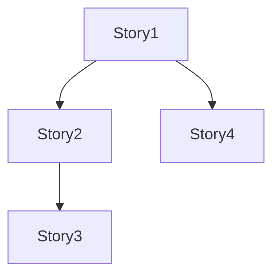

# User Stories for [FEAT-XXX] - [Feature Name]

**Feature**: FEAT-XXX
**Document Type**: User Stories Collection
**Status**: [Draft | Review | Approved]

## Story Format
Each story follows the format:
- **As a** [type of user]
- **I want** [goal/desire]
- **So that** [benefit/value]

## Primary User Stories

### Story US-XXX: [STORY_TITLE] [FEAT-XXX]
**Story ID**: US-XXX
**Feature**: FEAT-XXX
**Priority**: [P0 | P1 | P2]

**As a** [USER_TYPE]
**I want** [SPECIFIC_FUNCTIONALITY]
**So that** [BUSINESS_VALUE]

**Acceptance Criteria:**
- [ ] Given [context], when [action], then [outcome]
- [ ] Given [context], when [action], then [outcome]
- [ ] [Additional measurable criteria]

**Definition of Done:**
- [ ] Feature implemented and code reviewed
- [ ] Tests written and passing (unit, integration)
- [ ] Documentation updated
- [ ] Acceptance criteria verified

---

### Story US-XXX: [STORY_TITLE] [FEAT-XXX]
**Story ID**: US-XXX
**Feature**: FEAT-XXX
**Priority**: [P0 | P1 | P2]

**As a** [USER_TYPE]
**I want** [SPECIFIC_FUNCTIONALITY]
**So that** [BUSINESS_VALUE]

**Acceptance Criteria:**
- [ ] Given [context], when [action], then [outcome]
- [ ] Given [context], when [action], then [outcome]

**Definition of Done:**
- [ ] Feature implemented and code reviewed
- [ ] Tests written and passing
- [ ] Documentation updated
- [ ] Acceptance criteria verified

---

## Epic: [EPIC_TITLE]
*A collection of related stories*

### Stories in this Epic:
1. [Story reference]
2. [Story reference]

### Epic-Level Acceptance Criteria:
- [ ] [End-to-end functionality working]
- [ ] [Performance requirements met]
- [ ] [Security requirements satisfied]

---

## User Personas

### Persona 1: [PERSONA_NAME]
- **Role**: [Their job/position]
- **Goals**: [What they want to achieve]
- **Pain Points**: [Current frustrations]
- **Technical Level**: [Expertise level]

### Persona 2: [PERSONA_NAME]
- **Role**: [Their job/position]
- **Goals**: [What they want to achieve]
- **Pain Points**: [Current frustrations]
- **Technical Level**: [Expertise level]

---

## Story Prioritization

### Must Have (P0)
- [ ] US-XXX: [Story title] [FEAT-XXX] - [Brief reason]

### Should Have (P1)
- [ ] US-XXX: [Story title] [FEAT-XXX] - [Brief reason]

### Nice to Have (P2)
- [ ] US-XXX: [Story title] [FEAT-XXX] - [Brief reason]

---

## Story Dependencies

---

## Validation Scenarios
*For each story, define how it will be validated*

### Story US-XXX: [STORY_TITLE] [FEAT-XXX]
**Validation Approach:**
1. [Step to validate the functionality]
2. [Expected result]
3. [How to measure success]

---

## Feature Traceability

### Parent Feature
- **Feature Specification**: `docs/helix/01-frame/features/FEAT-XXX-[name].md`

### Related Design Artifacts
- **Contracts**: [To be created for APIs serving these stories]
- **Test Suites**: `tests/FEAT-XXX/acceptance/`

### Story Naming Convention
- Format: `US-[3-digit-number]`
- Example: `US-001`, `US-002`
- Stories are numbered sequentially across the project
- Each story ID is unique and permanent

---
*Note: Create user stories grouped by feature. Each feature may have multiple stories.*
*Story IDs (US-XXX) should be unique across the entire project.*