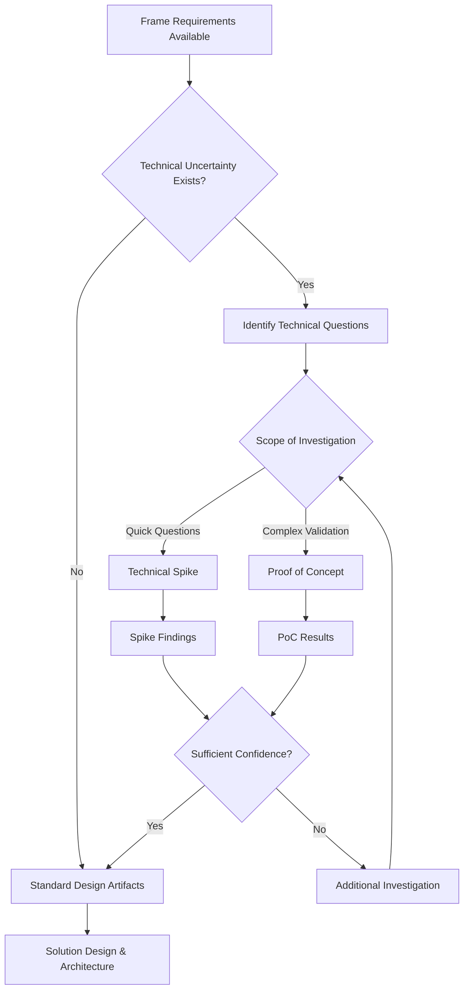
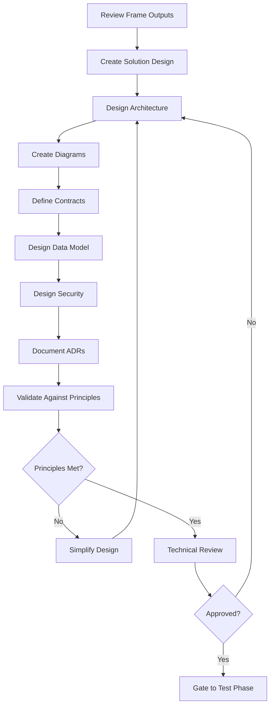

# Phase 02: Design

The architecture phase where we transform requirements into a concrete technical plan with contracts, tests, and implementation strategy.

## Purpose

The Design phase transforms validated business requirements from Frame into a comprehensive technical architecture. This phase focuses on making and documenting architectural decisions, defining system structure, and establishing contracts that will guide implementation.

## Key Principle

**Architecture Before Implementation**: Design establishes the system's structure, makes key technical decisions, and defines all interfaces before any code is written. This ensures a solid foundation and prevents architectural drift.

## Input Gate

Before starting Design, verify Frame outputs:
- [ ] PRD reviewed and approved
- [ ] Success metrics clearly defined
- [ ] User stories with acceptance criteria
- [ ] Principles document established
- [ ] All stakeholders aligned on scope
- [ ] Security requirements documented and approved
- [ ] Threat model completed with risk assessment
- [ ] Compliance requirements identified and mapped

## Artifacts

### 1. Solution Design
**Location**: `docs/design/solution-designs/SD-XXX-[name].md`

Bridges business requirements to technical implementation:
- **Requirements Mapping**: Transform functional/non-functional requirements to technical capabilities
- **Solution Approaches**: Multiple alternatives with trade-offs
- **Domain Model**: Core entities and business rules
- **Component Decomposition**: Breaking down the system
- **Technology Rationale**: Why specific technologies were chosen

### 2. Architecture Diagrams
**Location**: `docs/design/architecture.md`

Visual system documentation using C4 model:
- **System Context**: How the system fits in the larger ecosystem
- **Container Diagram**: Major architectural components
- **Component Diagrams**: Internal structure of containers
- **Deployment Diagram**: Infrastructure and deployment
- **Data Flow**: How information moves through the system

### 3. API/Interface Contracts
**Location**: `docs/design/contracts/API-XXX-[name].md`

Defines all external interfaces:
- **CLI Contracts**: Command structure, options, input/output formats
- **REST API Contracts**: Endpoints, request/response schemas, error codes
- **Library APIs**: Public functions, parameters, return types
- **Data Contracts**: JSON schemas, validation rules
- **Error Contracts**: Error codes, messages, recovery actions

### 4. Architecture Decision Records (ADRs)
**Location**: `docs/design/adr/ADR-XXX-[title].md`

Documents significant architectural decisions:
- **Decision Context**: Problem and constraints
- **Alternatives Considered**: Options with pros/cons
- **Decision Rationale**: Why this approach was chosen
- **Consequences**: Trade-offs and impacts
- **Success Criteria**: How to validate the decision

### 5. Data Design
**Location**: `docs/design/data-design.md`

Comprehensive data architecture:
- **Conceptual Model**: Business entities and relationships
- **Logical Model**: Database schema design
- **Data Patterns**: Soft deletes, audit trails, versioning
- **Access Patterns**: Common queries and optimization
- **Migration Strategy**: Moving from current to target state

### Security Design Artifacts

#### 6. Security Architecture
**Artifact Location**: `artifacts/security-architecture/`
**Output Location**: `docs/helix/02-design/security-architecture.md`

Comprehensive security architecture and controls:
- **Security principles and patterns applied**
- **Defense in depth implementation strategy**
- **Authentication and authorization architecture**
- **Data protection and encryption design**
- **Security monitoring and incident response integration**

#### 7. Authentication and Authorization Design
**Artifact Location**: `artifacts/auth-design/`
**Output Location**: `docs/helix/02-design/auth-design.md`

Detailed identity and access management design:
- **Identity provider integration and SSO design**
- **Multi-factor authentication implementation**
- **Role-based access control (RBAC) model**
- **Session management and token handling**
- **API authentication and authorization patterns**

#### 8. Data Protection Plan
**Artifact Location**: `artifacts/data-protection/`
**Output Location**: `docs/helix/02-design/data-protection.md`

Data security and privacy implementation:
- **Data classification and handling procedures**
- **Encryption at rest and in transit specifications**
- **Key management architecture**
- **Privacy controls and data subject rights**
- **Compliance implementation strategy**

### Technical Investigation Artifacts (Optional - When Technical Uncertainty Exists)

When significant technical unknowns exist about architecture, technology choices, integration complexity, or implementation approaches, technical investigation artifacts can be used to reduce risk and validate approaches before committing to detailed design.

#### 7. Technical Spike (Optional)
**Artifact Location**: `artifacts/tech-spike/`
**Output Location**: `docs/helix/02-design/spikes/SPIKE-XXX-[name].md`

Time-boxed technical investigation for unknowns:
- **When to Use**: Technical approach unclear, architecture decision risk, implementation complexity unknown
- **Objectives**: Specific technical questions that need answers
- **Investigation Methods**: Prototyping, benchmarking, comparative analysis, expert consultation
- **Time Budget**: Strict time boundaries (typically 1-5 days)
- **Evidence-Based Findings**: Concrete results with measurements and data
- **Actionable Recommendations**: Clear next steps for design decisions

**Triggers for Technical Spike**:
- "Which technology/approach should we use?" (needs validation)
- "Can this architecture handle our requirements?" (feasibility question)
- "How complex will integration with System X be?" (complexity assessment)
- Unknown performance characteristics or scalability limits
- Novel technical approaches requiring validation

#### 8. Proof of Concept (Optional)
**Artifact Location**: `artifacts/proof-of-concept/`
**Output Location**: `docs/helix/02-design/proofs-of-concept/POC-XXX-[name].md`

Minimal working implementation to validate technical concepts:
- **When to Use**: High-risk technical approach, novel architecture, complex integration, end-to-end validation needed
- **Working Implementation**: Functional system demonstrating core concept
- **End-to-End Validation**: Complete workflows tested from input to output
- **Production Readiness Assessment**: What would be needed for production deployment
- **Performance Characteristics**: Measured system behavior under realistic conditions
- **Integration Strategy**: Validated approach for connecting with other systems

**Triggers for Proof of Concept**:
- High-risk or novel architectural approaches
- Complex system integration requirements
- Performance requirements need validation
- User experience concepts require testing
- Technology stack viability needs demonstration

### Technical Investigation Workflow Integration

#### When Technical Investigation is Needed
Technical investigation artifacts should be considered when:

1. **Technical Uncertainty**: Unknown implementation complexity or approach viability
2. **High-Risk Decisions**: Architecture choices with significant impact if wrong
3. **Novel Technology**: Unproven or unfamiliar technical approaches
4. **Complex Integration**: Integration complexity or compatibility unknown
5. **Performance Critical**: Performance characteristics unknown or requirements stringent

#### Investigation-Informed Design Process


#### Integration with Standard Design Artifacts
Technical investigation findings directly inform design artifacts:

- **Spike Findings → Architecture Decisions**: Technical validation becomes ADR rationale
- **PoC Results → Solution Design**: Proven approaches inform implementation strategy
- **Performance Data → Contracts**: Measured characteristics define API performance requirements
- **Integration Testing → Data Design**: Validated integration patterns inform data architecture

#### Time Management for Technical Investigations
- **Technical Spike**: 1-5 days maximum, strictly time-boxed
- **Proof of Concept**: 1-2 weeks, focused on core concept validation
- **Decision Points**: Clear criteria for when investigation provides sufficient evidence
- **Integration Time**: Budget 1-2 days to integrate findings into design artifacts

## Artifact Selection Guide

Understanding which artifact to use is critical for maintaining clear documentation. This guide helps you choose the right artifact type for your design documentation needs.

### Quick Decision Tree

When deciding which artifact to use, ask these questions in order:

1. **Is this a fundamental architectural decision that would be expensive to change?**
   - YES → **ADR** (e.g., "Use GraphQL for internal APIs", "Adopt microservices architecture")
   - NO → Continue to question 2

2. **Are you evaluating or selecting specific technologies/libraries?**
   - YES → **Tech Spike** (e.g., "Redis vs Hazelcast for caching", "Caliban vs Sangria for GraphQL")
   - NO → Continue to question 3

3. **Are you defining how to implement an architectural approach?**
   - YES → **Solution Design** (e.g., "GraphQL federation architecture", "Database sharding strategy")
   - NO → Consider if this belongs in Build phase as an Implementation Guide

### Artifact Boundaries and Relationships

#### ADRs - Architectural Decisions (WHY)
**Purpose**: Document fundamental decisions that shape the system architecture
**Scope**: Protocol choices, architectural patterns, system boundaries, data strategies
**Review Cycle**: Only when requirements fundamentally change
**Example**: "We will separate internal and external API surfaces because they have different SLAs, security models, and evolution rates"

#### Tech Spikes - Technology Selection (WHAT)
**Purpose**: Evaluate and select specific technologies to implement architectural decisions
**Scope**: Library comparisons, performance testing, feasibility studies
**Review Cycle**: When new versions released or better alternatives emerge
**Example**: "After evaluating Caliban, Sangria, and GraphQL-Java, we selected Caliban for its native ZIO integration"

#### Solution Designs - Implementation Architecture (HOW)
**Purpose**: Define how to build the system using chosen technologies
**Scope**: Component design, integration patterns, data flows, deployment architecture
**Review Cycle**: When implementation reveals better patterns
**Example**: "Internal GraphQL will use Apollo Federation to combine Caliban services with PostGraphile"

### Artifact Flow Example

Here's how artifacts build on each other:

```
1. ADR-012: "Use GraphQL for internal APIs"
   ↓ (Architectural decision made)
2. SPIKE-003: "GraphQL library evaluation for Scala"
   ↓ (Caliban selected)
3. SD-005: "Internal GraphQL federation implementation"
   ↓ (Implementation defined)
4. Build Phase: Implementation guides and code
```

### Common Mistakes to Avoid

❌ **Don't put technology selection in ADRs**
- Wrong: ADR titled "Use Caliban for GraphQL"
- Right: ADR "Use GraphQL for internal APIs" + Spike "GraphQL library selection"

❌ **Don't repeat architectural rationale in Tech Spikes**
- Wrong: Tech Spike explaining why GraphQL is better than REST
- Right: Tech Spike comparing GraphQL libraries assuming GraphQL is already chosen

❌ **Don't put implementation details in Solution Designs**
- Wrong: Solution Design with code snippets and configuration values
- Right: Solution Design with architecture diagrams and patterns

### Cross-Referencing

Each artifact should reference related artifacts:
- ADRs should note which Tech Spikes validate the decision
- Tech Spikes should reference the ADR they support
- Solution Designs should reference both the ADR (why) and Tech Spike (what technology)

### Reference
For complete artifact boundary definitions, see [ADR-011: Design Phase Artifact Boundaries](/docs/helix/02-design/adr/adr-011-design-artifact-boundaries.md) in the DDX documentation.

## Process Flow



## Human vs AI Responsibilities

### Human Responsibilities
- **Architecture Decisions**: Choose technologies and patterns
- **Trade-off Analysis**: Balance competing constraints
- **Risk Assessment**: Identify technical challenges
- **Contract Definition**: Define external interfaces
- **Review and Approval**: Validate design decisions

### AI Assistant Responsibilities
- **Contract Generation**: Create detailed interface specifications
- **Test Case Design**: Generate comprehensive test scenarios
- **Consistency Validation**: Check alignment with requirements
- **Documentation**: Structure technical specifications
- **Pattern Suggestions**: Recommend proven solutions
- **Technical Analysis**: Synthesize spike and PoC findings into actionable insights
- **Risk Assessment**: Identify technical risks from multiple implementation approaches
- **Performance Analysis**: Process benchmark data and identify optimization opportunities

## Design Principles Enforcement

### Core Principles Checklist
- [ ] **Library-First**: Each feature is a standalone library
- [ ] **CLI Interface**: All functionality exposed via text interface
- [ ] **Test-First**: Tests specified before implementation
- [ ] **Simplicity**: Maximum 3 major components
- [ ] **Anti-Abstraction**: Direct framework usage, no wrappers
- [ ] **Integration Testing**: Real environments over mocks

### Complexity Budget
Track design complexity to prevent over-engineering:

| Component | Complexity Points | Justification |
|-----------|------------------|---------------|
| Component 1 | 1 | Core requirement |
| Component 2 | 1 | Essential integration |
| Component 3 | 1 | (Only if justified) |
| **Total** | **≤ 3** | Must stay within budget |

## Quality Gates

Before proceeding to Test phase:

### Completeness Checklist
- [ ] All contracts fully specified with examples
- [ ] Solution design bridges requirements to technical approach
- [ ] Architecture diagram shows data flow
- [ ] Technology choices justified
- [ ] ADRs document key decisions
- [ ] No [TO BE DEFINED] markers remain

#### Technical Investigation Completion (When Applicable)
- [ ] Technical spikes completed within time budget with evidence-based findings
- [ ] Proof of concepts demonstrate end-to-end functionality
- [ ] Investigation findings integrated into architecture and design decisions
- [ ] Technical risks identified and mitigation strategies documented
- [ ] Performance characteristics measured and documented
- [ ] Integration complexity assessed and approaches validated

### Validation Questions
1. **Contract Clarity**: Could another team implement from these contracts alone?
2. **Decision Rationale**: Are all architectural decisions justified with ADRs?
3. **Simplicity**: Have we used the minimum viable architecture?
4. **Principles**: Does the design comply with all project principles?
5. **Feasibility**: Can this be built within time and resource constraints?

## Common Pitfalls

### ❌ Avoid These Mistakes

1. **Over-Engineering**
   - Bad: Complex microservices for simple CRUD
   - Good: Monolithic library with CLI interface

2. **Implementation Details in Contracts**
   - Bad: "Calls internal processData() function"
   - Good: "Accepts JSON, returns transformed JSON"

3. **Mock-Heavy Testing**
   - Bad: Mocking all external dependencies
   - Good: Testing with real databases and services

4. **Abstraction Layers**
   - Bad: Custom wrapper around framework
   - Good: Direct framework usage

5. **Missing Error Cases**
   - Bad: Only happy path in contracts
   - Good: Comprehensive error scenarios

## Success Criteria

The Design phase is complete when:

1. **Solution Defined**: Requirements mapped to technical approach
2. **Architecture Documented**: Visual diagrams and component structure clear
3. **Contracts Specified**: All external interfaces defined
4. **Decisions Recorded**: ADRs document key choices with rationale
5. **Data Model Complete**: Schema and patterns designed
6. **Security Addressed**: Threats identified and mitigated

## Next Phase: Test

Once Design is validated, proceed to Test phase where you'll:
- Write comprehensive test specifications
- Implement failing tests (Red phase)
- Define test data and scenarios
- Establish test infrastructure

Remember: Design defines the architecture - Test validates it through executable specifications.

## Tips for Success

1. **Start with Contracts**: Define what before how
2. **Think in Tests**: Every contract needs test cases
3. **Embrace Constraints**: Principles prevent complexity
4. **Iterate on Simplicity**: First design is rarely simple enough
5. **Document Decisions**: Capture why, not just what

## Anti-Patterns to Avoid

### 🚫 Speculative Generality
Don't design for hypothetical future needs. Design for current requirements only.

### 🚫 Framework Religions
Choose tools pragmatically based on requirements, not preferences.

### 🚫 Test Theater
Don't write tests that always pass. Tests must fail first, then pass.

### 🚫 Contract Drift
Implementation must match contracts exactly. No undocumented behavior.

## Using AI Assistance

When working with AI assistants during Design:

### Standard Design Artifacts
```bash
# Generate contracts from requirements
ddx apply prompts/helix/design/contracts

# Create test specifications
ddx apply prompts/helix/design/test-specs

# Validate architecture simplicity
ddx apply prompts/helix/design/complexity-check
```

### Technical Investigation (When Technical Uncertainty Exists)
```bash
# Create technical spike plan
ddx apply prompts/helix/design/tech-spike

# Plan proof of concept development
ddx apply prompts/helix/design/proof-of-concept

# Analyze spike findings and create recommendations
ddx apply prompts/helix/design/spike-analysis

# Synthesize PoC results into design decisions
ddx apply prompts/helix/design/poc-analysis

# Generate ADR from technical investigation findings
ddx apply prompts/helix/design/adr-from-investigation
```

### AI Technical Investigation Capabilities
AI assistants excel at:
- **Comparative Analysis**: Evaluating trade-offs between technical approaches
- **Risk Assessment**: Identifying technical risks and mitigation strategies
- **Performance Analysis**: Processing benchmark data and identifying patterns
- **Integration Planning**: Analyzing integration complexity and approaches
- **Code Review**: Analyzing spike and PoC code for best practices and improvements

The AI excels at generating comprehensive contracts and test cases but human judgment is essential for architectural decisions and technical trade-offs.

## Design Review Checklist

Before approval, ensure:
- [ ] Contracts are complete and unambiguous
- [ ] Every contract has test cases
- [ ] Architecture is as simple as possible
- [ ] All principles are followed (or violations documented)
- [ ] Implementation plan is realistic
- [ ] Team understands and agrees with design

---

*Good design is not when there is nothing left to add, but when there is nothing left to remove.*