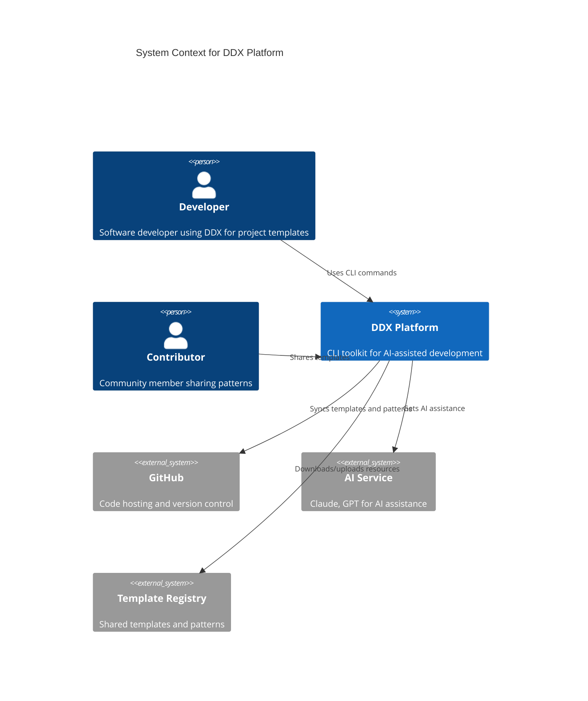
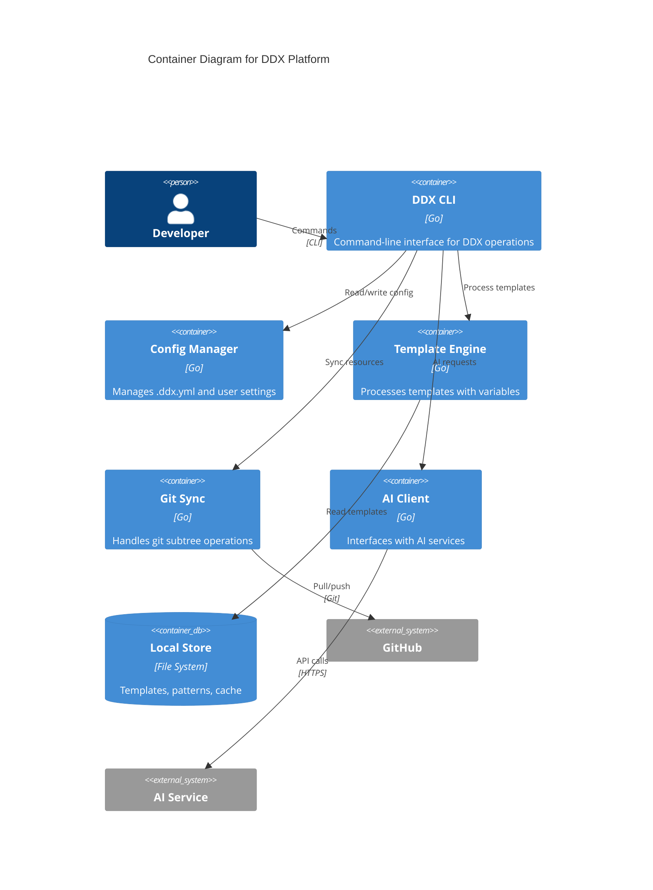
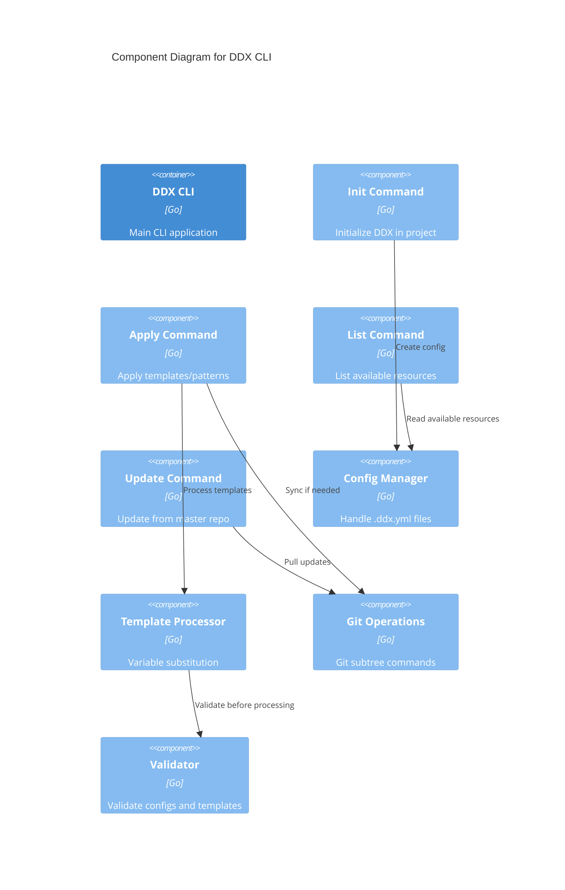
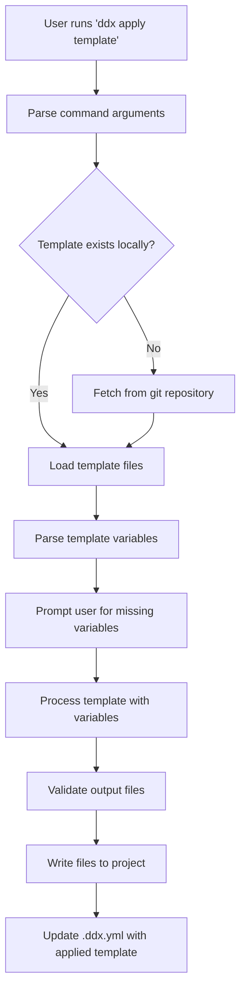
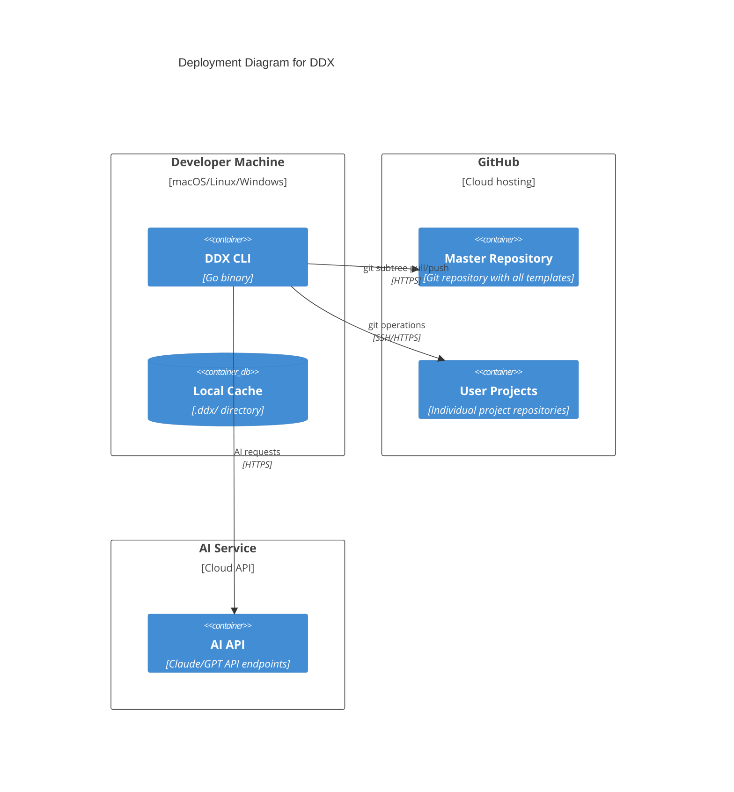
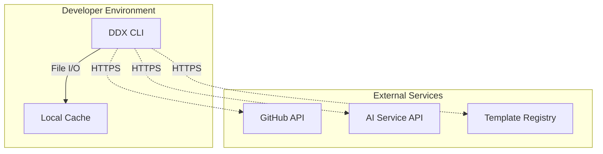
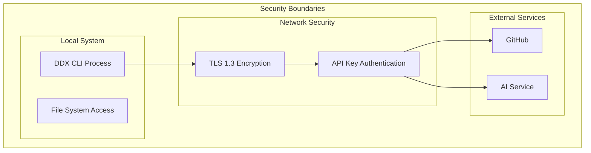

# Architecture Documentation Generation Prompt

Create comprehensive architecture documentation that visualizes system structure, components, and relationships using the C4 model and supporting diagrams.

## Storage Location

Store architecture documentation at: `docs/helix/02-design/architecture.md`

## Purpose

Architecture documentation provides:
- Visual system understanding for all stakeholders
- Clear component boundaries and responsibilities
- Data flow and interaction patterns
- Deployment and infrastructure context
- Reference for implementation decisions

## Key Requirements

### 1. C4 Model Implementation

Follow the C4 (Context, Containers, Components, Code) model for architectural views:

#### Level 1: System Context Diagram
Show how the system fits in the larger ecosystem:
- External users (personas, not generic "users")
- External systems and services
- High-level system purpose
- Key relationships and interactions



#### Level 2: Container Diagram
Show major architectural components:
- Applications, databases, file systems
- Technology choices for each container
- Communication protocols and data formats
- Security boundaries



#### Level 3: Component Diagram
Detail internal structure of key containers:
- Classes, interfaces, services
- Component responsibilities
- Dependencies and relationships



### 2. Data Flow Diagrams

Show how information moves through the system:



### 3. Deployment Architecture

Show infrastructure and deployment context:



## Diagram Types and Tools

### Mermaid Diagrams
Use Mermaid for most architectural diagrams:
- C4 diagrams for system architecture
- Flowcharts for data flow
- Sequence diagrams for interactions
- Entity relationship diagrams for data models

### Specialized Diagrams

#### Network Architecture


#### Security Architecture


## Documentation Structure

### Main Architecture Document
```markdown
# System Architecture

## Overview
[Brief system description and purpose]

## Architecture Principles
[Key principles guiding design decisions]

## System Context
[Context diagram and external interfaces]

## Container Architecture
[Container diagram and technology choices]

## Component Design
[Key component diagrams and responsibilities]

## Data Architecture
[Data flow and storage design]

## Security Architecture
[Security measures and boundaries]

## Deployment Architecture
[Infrastructure and deployment model]

## Quality Attributes
[How architecture supports NFRs]

## Architecture Decisions
[Links to relevant ADRs]
```

## Quality Attributes Mapping

### Performance
- Latency requirements and design implications
- Throughput considerations
- Caching strategies
- Resource utilization

### Scalability
- Horizontal vs vertical scaling approaches
- Load distribution mechanisms
- Capacity planning considerations
- Performance bottlenecks

### Security
- Security boundaries and trust zones
- Authentication and authorization flows
- Data protection mechanisms
- Attack surface analysis

### Maintainability
- Module boundaries and coupling
- Dependency management
- Testing strategies
- Deployment automation

### Reliability
- Failure modes and recovery
- Monitoring and alerting
- Backup and disaster recovery
- Circuit breakers and resilience

## Architecture Validation

### Principle Compliance
Verify architecture aligns with established principles:
- Simplicity over complexity
- Composition over inheritance
- Explicit over implicit
- Fail fast and safe
- Single responsibility

### Scenario Analysis
Test architecture against key scenarios:
- Normal operation flows
- Error and exception handling
- Performance under load
- Security attack vectors
- Evolution and change scenarios

### Architecture Review Checklist
- [ ] All major components identified
- [ ] Component responsibilities clear
- [ ] Dependencies explicitly shown
- [ ] Data flow documented
- [ ] Security boundaries defined
- [ ] Performance characteristics addressed
- [ ] Scalability approach defined
- [ ] Deployment model documented
- [ ] Quality attributes mapped
- [ ] Principles compliance verified

## Integration with Design Phase

Architecture documentation enables the Design phase by:
1. Providing visual system understanding
2. Establishing component boundaries
3. Defining integration points
4. Supporting technical decision making
5. Enabling implementation planning

Remember: Architecture diagrams are communication tools. They should clarify, not complicate. Focus on the essential structures and relationships that matter for understanding and implementing the system.