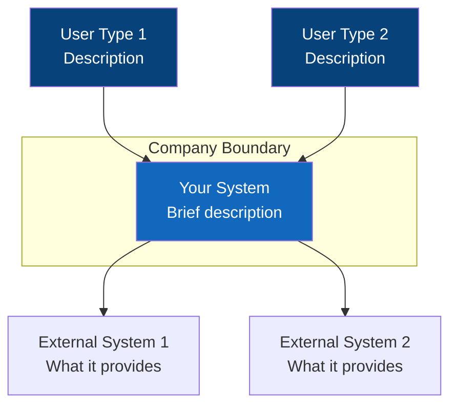
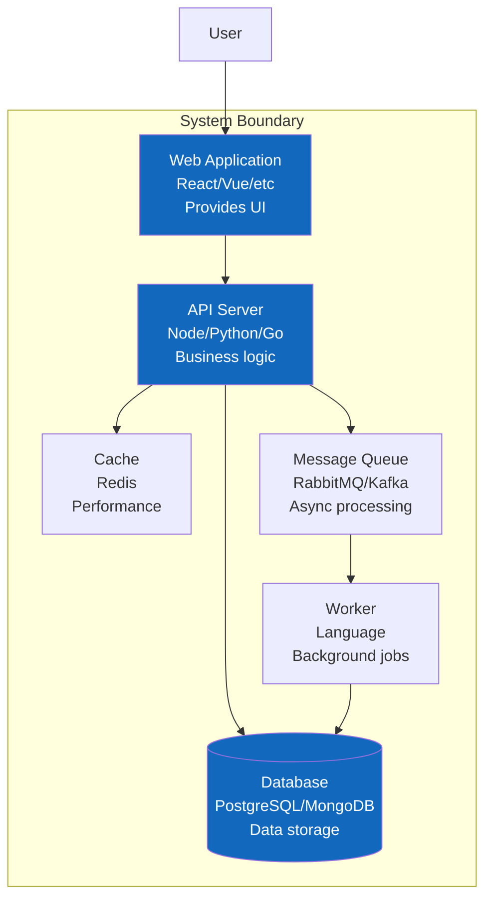
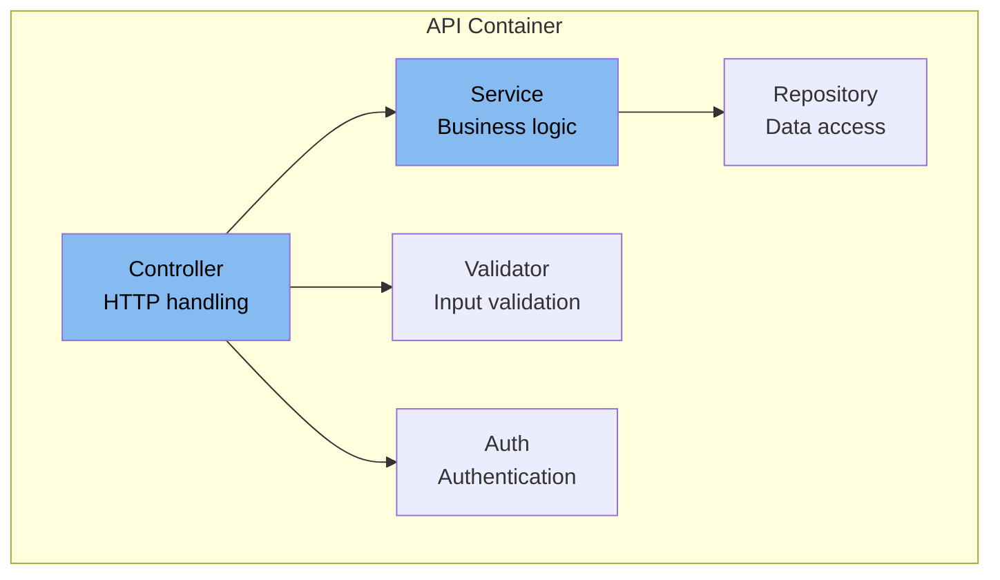
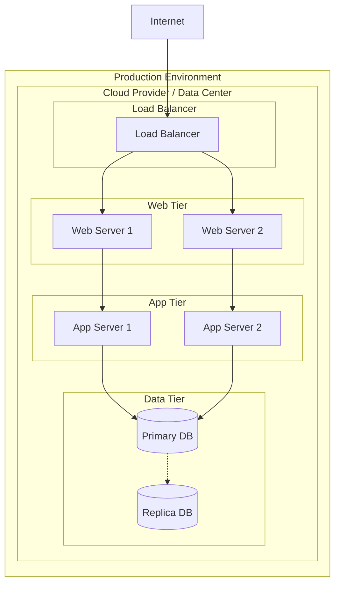
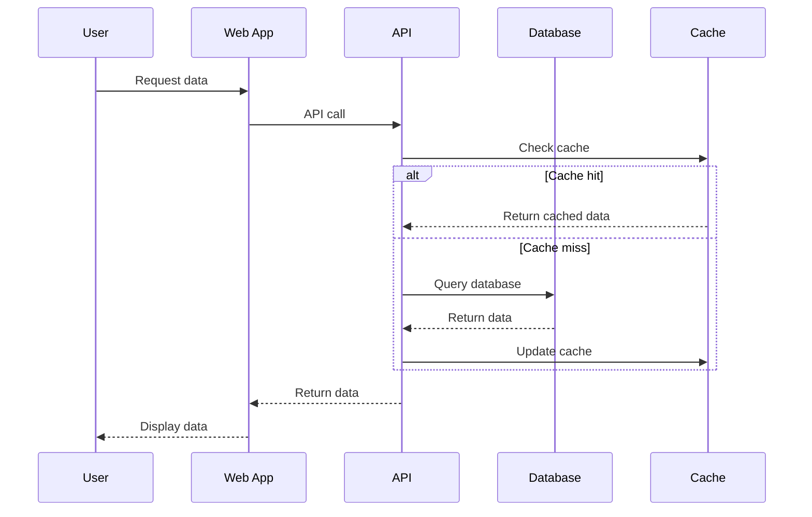
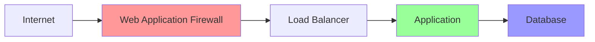

# Architecture Diagrams

*Visual documentation using the C4 model for clear system understanding*

## C4 Model Overview

The C4 model uses four levels of abstraction to document software architecture:
1. **Context** - How the system fits in the world
2. **Container** - High-level technology choices
3. **Component** - How containers are decomposed
4. **Code** - How components are implemented (rarely needed)

## Level 1: System Context

### Purpose
Shows how the system fits into the larger ecosystem.

### System Context Diagram

### Key Elements
- **Users**: [List user types and their primary interactions]
- **Our System**: [Core purpose and responsibility]
- **External Systems**: [Dependencies and integrations]

### Interactions
| From | To | Purpose | Protocol |
|------|----|---------|----------|
| User | System | [What they do] | [How - HTTP, CLI, etc.] |
| System | External | [What we need] | [How - API, DB, etc.] |

## Level 2: Container Diagram

### Purpose
Shows the major technology choices and how they communicate.

### Container Diagram

### Container Descriptions

#### Container: [Name]
- **Technology**: [Specific tech stack]
- **Purpose**: [What it does]
- **Responsibilities**:
  - [Responsibility 1]
  - [Responsibility 2]
- **Communication**: [How it talks to others]

### Container Interactions
| From | To | Purpose | Protocol | Format |
|------|----|---------|---------:|--------|
| Web | API | [Data/commands] | HTTPS | JSON |
| API | Database | [CRUD operations] | TCP | SQL |

## Level 3: Component Diagram

### Purpose
Shows the internal structure of each container.

### Component Diagram - [Container Name]

### Component Descriptions

#### Component: [Name]
- **Purpose**: [What it does]
- **Responsibilities**:
  - [Specific responsibility]
- **Implementation Notes**: [Key design decisions]

## Deployment Diagram

### Purpose
Shows how the system is deployed to infrastructure.

### Deployment Diagram

### Deployment Specifications

| Component | Infrastructure | Instances | Scaling | Notes |
|-----------|---------------|-----------|---------|-------|
| Web App | Container/VM | 2+ | Horizontal | Behind LB |
| API | Container/VM | 2+ | Horizontal | Auto-scaling |
| Database | Managed/VM | 1 primary + replicas | Vertical | HA setup |

## Data Flow Diagrams

### Purpose
Shows how data moves through the system.

### [Use Case] Data Flow

## Architecture Decisions Summary

### Key Architectural Patterns
- **Pattern**: [Why chosen and where used]
- **Pattern**: [Why chosen and where used]

### Technology Stack Rationale
| Layer | Technology | Why Chosen |
|-------|------------|------------|
| Frontend | [Tech] | [Reasoning] |
| Backend | [Tech] | [Reasoning] |
| Database | [Tech] | [Reasoning] |
| Infrastructure | [Tech] | [Reasoning] |

## Scalability Considerations

### Horizontal Scaling Points
- [Component]: [How it scales]
- [Component]: [How it scales]

### Bottlenecks and Mitigation
- [Potential bottleneck]: [Mitigation strategy]
- [Potential bottleneck]: [Mitigation strategy]

## Security Architecture

### Security Layers

### Security Controls
- **Network**: [Firewalls, segmentation]
- **Application**: [Authentication, authorization]
- **Data**: [Encryption at rest and in transit]

## Monitoring and Observability

### Monitoring Points
- **Infrastructure**: [Metrics collected]
- **Application**: [Metrics and logs]
- **Business**: [KPIs tracked]

### Observability Stack
- **Metrics**: [Tool and what's measured]
- **Logging**: [Tool and what's logged]
- **Tracing**: [Tool and what's traced]

## Disaster Recovery

### Recovery Strategy
- **RTO**: [Recovery Time Objective]
- **RPO**: [Recovery Point Objective]
- **Backup Strategy**: [How and where]
- **Failover Process**: [Manual/automatic]

---
*These diagrams provide a comprehensive view of the system architecture at multiple levels of abstraction.*