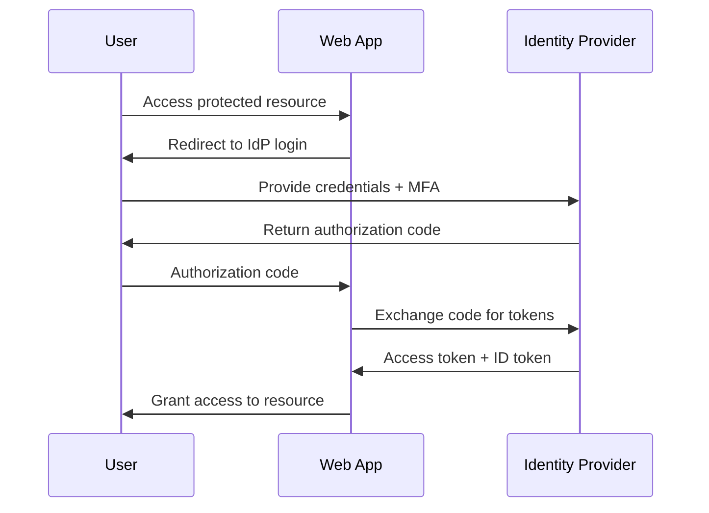
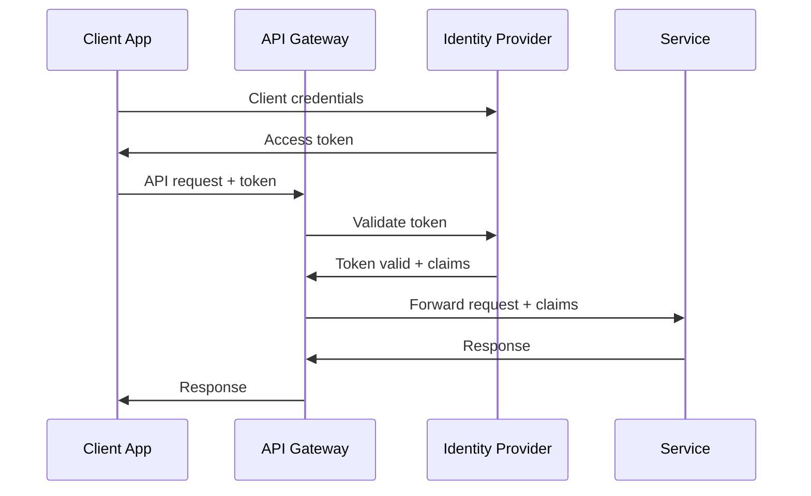

# Authentication and Authorization Design

**Project**: [Project Name]
**Version**: [Version Number]
**Date**: [Creation Date]
**Security Architect**: [Name]

---

## Executive Summary

**Authentication Strategy**: [High-level authentication approach]
**Authorization Model**: [RBAC, ABAC, etc.]
**Identity Provider**: [External IdP or built-in]
**Key Security Features**: [MFA, SSO, Zero Trust, etc.]

## Authentication Design

### Identity Provider Architecture
- **Provider**: [Azure AD, Auth0, Okta, Custom]
- **Protocol**: [SAML 2.0, OAuth 2.0, OpenID Connect]
- **Integration Type**: [Federated, Delegated, Hybrid]
- **Fallback Strategy**: [Local accounts, emergency access]

### Multi-Factor Authentication
- **Required For**: [All users, Admin users, Sensitive operations]
- **Primary Factors**: [Password, Certificate, Biometric]
- **Secondary Factors**: [SMS, Email, Authenticator App, Hardware Token]
- **Risk-Based MFA**: [Conditional triggers based on risk assessment]

### Session Management
- **Session Storage**: [Server-side, JWT, Hybrid]
- **Session Timeout**: [Idle: 30min, Absolute: 8hrs]
- **Concurrent Sessions**: [Single, Multiple with limit]
- **Session Security**: [HttpOnly, Secure, SameSite cookies]

## Authorization Design

### Role-Based Access Control (RBAC)
```
Role Hierarchy:
Admin Roles:
├── Super Admin (full system access)
├── Security Admin (security settings)
├── User Admin (user management)
└── System Admin (system configuration)

Business Roles:
├── Manager (team + own data)
├── Analyst (department data)
├── User (own data)
└── Viewer (read-only access)

API Roles:
├── System API (full API access)
├── Partner API (limited API access)
└── Public API (public endpoints only)
```

### Permission Framework
```
Permission Format: Resource.Action.Scope

Resources:
- User (user accounts and profiles)
- Data (business data and content)
- System (system settings and configuration)
- Report (reports and analytics)

Actions:
- Create (add new items)
- Read (view existing items)
- Update (modify existing items)
- Delete (remove items)
- Execute (run operations)

Scopes:
- Own (user's own data)
- Team (user's team data)
- Department (user's department data)
- All (all data in system)

Examples:
- User.Read.All (read all users)
- Data.Update.Team (update team data)
- System.Execute.Own (execute own operations)
```

### Access Control Matrix

| Role | User.* | Data.* | System.* | Report.* |
|------|--------|--------|----------|----------|
| Super Admin | All.All | All.All | All.All | All.All |
| User Admin | All.All | None | None | Read.All |
| Manager | Read.Team | All.Team | Read.Own | All.Team |
| Analyst | Read.Own | Read.Department | Read.Own | Read.Department |
| User | CRUD.Own | CRUD.Own | Read.Own | Read.Own |
| Viewer | Read.Own | Read.Own | None | Read.Own |

## Security Patterns Implementation

### Zero Trust Principles
- **Never Trust, Always Verify**: Every request authenticated and authorized
- **Least Privilege Access**: Minimal access rights by default
- **Assume Breach**: Monitor and validate continuously

### Single Sign-On (SSO)
- **SAML Configuration**: [SP-initiated, IdP-initiated flows]
- **OAuth/OIDC Flows**: [Authorization Code, Client Credentials]
- **Token Management**: [Access tokens, Refresh tokens, ID tokens]
- **Logout Handling**: [Single logout, session cleanup]

### API Security
- **Authentication**: [OAuth 2.0, API Keys, JWT Bearer tokens]
- **Rate Limiting**: [Per-user, Per-endpoint rate limits]
- **Scope-based Authorization**: [Read, Write, Admin scopes]
- **CORS Configuration**: [Allowed origins, methods, headers]

## Implementation Details

### Authentication Flow Diagrams

#### Web Application Login Flow


#### API Authentication Flow


### Database Design

#### User Management Schema
```sql
-- Users table
CREATE TABLE users (
    id UUID PRIMARY KEY,
    username VARCHAR(255) UNIQUE NOT NULL,
    email VARCHAR(255) UNIQUE NOT NULL,
    password_hash VARCHAR(255), -- NULL for SSO-only users
    mfa_secret VARCHAR(255),
    is_active BOOLEAN DEFAULT true,
    created_at TIMESTAMP DEFAULT CURRENT_TIMESTAMP,
    last_login TIMESTAMP,
    failed_login_attempts INT DEFAULT 0,
    locked_until TIMESTAMP NULL
);

-- Roles table
CREATE TABLE roles (
    id UUID PRIMARY KEY,
    name VARCHAR(100) UNIQUE NOT NULL,
    description TEXT,
    is_system BOOLEAN DEFAULT false,
    created_at TIMESTAMP DEFAULT CURRENT_TIMESTAMP
);

-- Permissions table
CREATE TABLE permissions (
    id UUID PRIMARY KEY,
    resource VARCHAR(100) NOT NULL,
    action VARCHAR(100) NOT NULL,
    scope VARCHAR(100) NOT NULL,
    description TEXT,
    UNIQUE(resource, action, scope)
);

-- User-Role assignments
CREATE TABLE user_roles (
    user_id UUID REFERENCES users(id),
    role_id UUID REFERENCES roles(id),
    assigned_by UUID REFERENCES users(id),
    assigned_at TIMESTAMP DEFAULT CURRENT_TIMESTAMP,
    PRIMARY KEY (user_id, role_id)
);

-- Role-Permission assignments
CREATE TABLE role_permissions (
    role_id UUID REFERENCES roles(id),
    permission_id UUID REFERENCES permissions(id),
    PRIMARY KEY (role_id, permission_id)
);

-- Sessions table
CREATE TABLE user_sessions (
    id UUID PRIMARY KEY,
    user_id UUID REFERENCES users(id),
    session_token VARCHAR(255) UNIQUE NOT NULL,
    ip_address INET,
    user_agent TEXT,
    created_at TIMESTAMP DEFAULT CURRENT_TIMESTAMP,
    expires_at TIMESTAMP NOT NULL,
    is_active BOOLEAN DEFAULT true
);
```

### Configuration Examples

#### OAuth 2.0 Configuration
```json
{
  "oauth": {
    "provider": "auth0",
    "client_id": "${AUTH0_CLIENT_ID}",
    "client_secret": "${AUTH0_CLIENT_SECRET}",
    "domain": "${AUTH0_DOMAIN}",
    "redirect_uri": "${APP_URL}/callback",
    "scope": "openid profile email",
    "audience": "${API_IDENTIFIER}"
  },
  "session": {
    "secret": "${SESSION_SECRET}",
    "timeout_minutes": 30,
    "max_concurrent": 3,
    "secure_cookies": true
  },
  "mfa": {
    "enabled": true,
    "required_for": ["admin", "sensitive_operations"],
    "methods": ["totp", "sms", "email"],
    "backup_codes": 10
  }
}
```

#### RBAC Policy Configuration
```yaml
roles:
  admin:
    inherits: []
    permissions:
      - "system:*:*"
      - "users:*:all"
      - "data:*:all"

  manager:
    inherits: ["user"]
    permissions:
      - "users:read:team"
      - "data:*:team"
      - "reports:*:team"

  user:
    inherits: []
    permissions:
      - "users:read:own"
      - "users:update:own"
      - "data:*:own"
      - "reports:read:own"

permission_checks:
  - endpoint: "/api/users"
    method: "GET"
    require: "users:read:all"

  - endpoint: "/api/data"
    method: "POST"
    require: "data:create:team"
```

## Security Considerations

### Password Security
- **Policy**: Minimum 12 characters, complexity requirements
- **Storage**: bcrypt with cost factor 12+
- **History**: Prevent reuse of last 12 passwords
- **Reset**: Secure password reset with email verification

### Token Security
- **JWT Configuration**: RS256 algorithm, 1-hour expiration
- **Refresh Tokens**: 30-day expiration, rotation on use
- **Token Storage**: HttpOnly cookies for web, secure storage for mobile
- **Token Validation**: Signature verification, expiration check, revocation list

### Audit and Compliance
- **Authentication Events**: All login attempts, MFA events
- **Authorization Events**: Permission grants, role changes
- **Administrative Events**: User creation, role assignment
- **Suspicious Activity**: Failed login attempts, privilege escalation

## Testing Strategy

### Authentication Testing
- [ ] Password policy enforcement
- [ ] MFA requirement validation
- [ ] Session timeout testing
- [ ] Concurrent session limits
- [ ] SSO integration testing

### Authorization Testing
- [ ] Role-based access validation
- [ ] Permission inheritance testing
- [ ] Privilege escalation prevention
- [ ] Resource isolation verification
- [ ] API authorization testing

### Security Testing
- [ ] Brute force protection
- [ ] Session fixation prevention
- [ ] Token manipulation resistance
- [ ] Cross-site request forgery protection
- [ ] Authentication bypass testing

## Monitoring and Alerting

### Authentication Metrics
- Login success/failure rates
- MFA usage and bypass attempts
- Session duration and timeout patterns
- Password reset frequency

### Authorization Metrics
- Permission grant/deny ratios
- Role assignment patterns
- Privilege escalation attempts
- Resource access patterns

### Security Alerts
- Multiple failed login attempts
- Unusual login patterns (time, location)
- Administrative privilege usage
- Token manipulation attempts
- Suspicious API access patterns

## Implementation Checklist

### Authentication Implementation
- [ ] Identity provider integration
- [ ] MFA implementation
- [ ] Session management
- [ ] Password policy enforcement
- [ ] Account lockout protection

### Authorization Implementation
- [ ] Role and permission models
- [ ] Access control middleware
- [ ] Admin interface for role management
- [ ] API authorization layer
- [ ] Resource-level access controls

### Security Hardening
- [ ] Secure token handling
- [ ] CSRF protection
- [ ] Session security configuration
- [ ] Audit logging implementation
- [ ] Monitoring and alerting setup

## Approval and Sign-off

| Role | Name | Signature | Date |
|------|------|-----------|------|
| Security Architect | [Name] | | |
| Identity Management Lead | [Name] | | |
| Technical Lead | [Name] | | |

---

**Document Control**
- **Template Version**: 1.0
- **Last Updated**: [Date]
- **Next Review Date**: [Date]