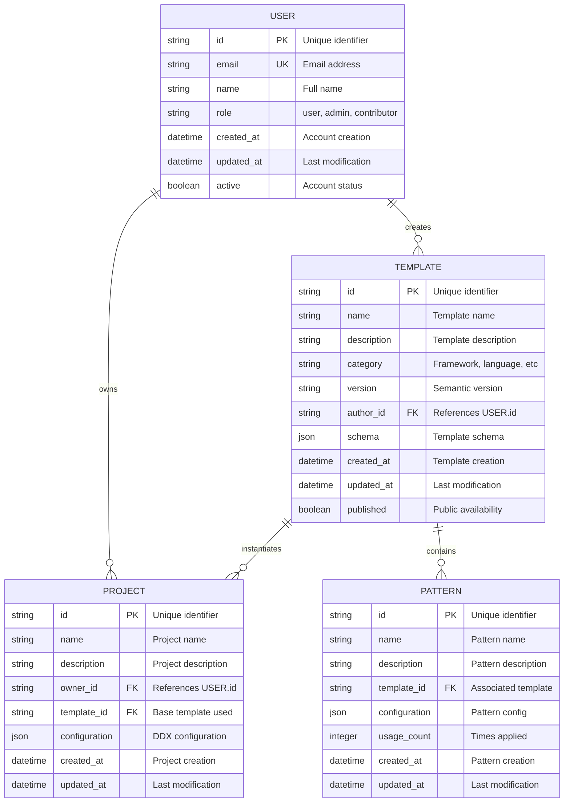

# Data Design Generation Prompt

Create comprehensive data architecture documentation that defines how data is structured, stored, accessed, and managed throughout the system lifecycle.

## Storage Location

Store data design documentation at: `docs/helix/02-design/data-design.md`

## Purpose

Data design provides:
- Clear understanding of data entities and relationships
- Database schema and structure decisions
- Data access patterns and optimization strategies
- Data integrity and consistency rules
- Migration and evolution strategies

## Key Requirements

### 1. Conceptual Data Model

Define business entities and their relationships:

#### Entity Identification


#### Relationship Analysis
- **One-to-Many**: User → Projects, User → Templates
- **Many-to-Many**: Projects → Patterns (via application history)
- **Hierarchical**: Template → Patterns, Project → Configurations
- **Temporal**: All entities have creation/modification timestamps

### 2. Logical Data Model

Transform conceptual model into implementable schema:

#### Database Schema Design
```sql
-- Users table with audit fields
CREATE TABLE users (
    id UUID PRIMARY KEY DEFAULT gen_random_uuid(),
    email VARCHAR(255) UNIQUE NOT NULL,
    name VARCHAR(255) NOT NULL,
    role VARCHAR(50) NOT NULL DEFAULT 'user',
    active BOOLEAN NOT NULL DEFAULT true,
    created_at TIMESTAMP WITH TIME ZONE NOT NULL DEFAULT NOW(),
    updated_at TIMESTAMP WITH TIME ZONE NOT NULL DEFAULT NOW(),

    -- Constraints
    CONSTRAINT users_email_check CHECK (email ~* '^[A-Za-z0-9._%+-]+@[A-Za-z0-9.-]+\.[A-Za-z]{2,}$'),
    CONSTRAINT users_role_check CHECK (role IN ('user', 'admin', 'contributor'))
);

-- Projects table with JSON configuration
CREATE TABLE projects (
    id UUID PRIMARY KEY DEFAULT gen_random_uuid(),
    name VARCHAR(255) NOT NULL,
    description TEXT,
    owner_id UUID NOT NULL REFERENCES users(id) ON DELETE CASCADE,
    template_id UUID REFERENCES templates(id) ON DELETE SET NULL,
    configuration JSONB NOT NULL DEFAULT '{}',
    created_at TIMESTAMP WITH TIME ZONE NOT NULL DEFAULT NOW(),
    updated_at TIMESTAMP WITH TIME ZONE NOT NULL DEFAULT NOW(),

    -- Indexes
    UNIQUE(owner_id, name)
);

-- Templates table with versioning
CREATE TABLE templates (
    id UUID PRIMARY KEY DEFAULT gen_random_uuid(),
    name VARCHAR(255) NOT NULL,
    description TEXT NOT NULL,
    category VARCHAR(100) NOT NULL,
    version VARCHAR(50) NOT NULL,
    author_id UUID NOT NULL REFERENCES users(id) ON DELETE CASCADE,
    schema JSONB NOT NULL DEFAULT '{}',
    published BOOLEAN NOT NULL DEFAULT false,
    created_at TIMESTAMP WITH TIME ZONE NOT NULL DEFAULT NOW(),
    updated_at TIMESTAMP WITH TIME ZONE NOT NULL DEFAULT NOW(),

    -- Constraints and indexes
    UNIQUE(name, version),
    CHECK (version ~ '^[0-9]+\.[0-9]+\.[0-9]+.*$')
);

-- Patterns table with usage tracking
CREATE TABLE patterns (
    id UUID PRIMARY KEY DEFAULT gen_random_uuid(),
    name VARCHAR(255) NOT NULL,
    description TEXT NOT NULL,
    template_id UUID NOT NULL REFERENCES templates(id) ON DELETE CASCADE,
    configuration JSONB NOT NULL DEFAULT '{}',
    usage_count INTEGER NOT NULL DEFAULT 0,
    created_at TIMESTAMP WITH TIME ZONE NOT NULL DEFAULT NOW(),
    updated_at TIMESTAMP WITH TIME ZONE NOT NULL DEFAULT NOW(),

    -- Constraints
    UNIQUE(template_id, name),
    CHECK (usage_count >= 0)
);
```

### 3. Data Patterns and Standards

#### Audit Trail Pattern
```sql
-- Audit log for all data changes
CREATE TABLE audit_log (
    id UUID PRIMARY KEY DEFAULT gen_random_uuid(),
    table_name VARCHAR(100) NOT NULL,
    record_id UUID NOT NULL,
    operation VARCHAR(10) NOT NULL, -- INSERT, UPDATE, DELETE
    old_values JSONB,
    new_values JSONB,
    changed_by UUID REFERENCES users(id),
    changed_at TIMESTAMP WITH TIME ZONE NOT NULL DEFAULT NOW()
);

-- Trigger function for audit logging
CREATE OR REPLACE FUNCTION audit_trigger()
RETURNS TRIGGER AS $$
BEGIN
    IF TG_OP = 'DELETE' THEN
        INSERT INTO audit_log (table_name, record_id, operation, old_values, changed_by)
        VALUES (TG_TABLE_NAME, OLD.id, TG_OP, row_to_json(OLD), OLD.updated_by);
        RETURN OLD;
    ELSIF TG_OP = 'UPDATE' THEN
        INSERT INTO audit_log (table_name, record_id, operation, old_values, new_values, changed_by)
        VALUES (TG_TABLE_NAME, NEW.id, TG_OP, row_to_json(OLD), row_to_json(NEW), NEW.updated_by);
        RETURN NEW;
    ELSIF TG_OP = 'INSERT' THEN
        INSERT INTO audit_log (table_name, record_id, operation, new_values, changed_by)
        VALUES (TG_TABLE_NAME, NEW.id, TG_OP, row_to_json(NEW), NEW.created_by);
        RETURN NEW;
    END IF;
    RETURN NULL;
END;
$$ LANGUAGE plpgsql;
```

#### Soft Delete Pattern
```sql
-- Add soft delete support
ALTER TABLE templates ADD COLUMN deleted_at TIMESTAMP WITH TIME ZONE;
ALTER TABLE patterns ADD COLUMN deleted_at TIMESTAMP WITH TIME ZONE;

-- Create view for active records
CREATE VIEW active_templates AS
SELECT * FROM templates WHERE deleted_at IS NULL;

CREATE VIEW active_patterns AS
SELECT * FROM patterns WHERE deleted_at IS NULL;

-- Soft delete function
CREATE OR REPLACE FUNCTION soft_delete(table_name TEXT, record_id UUID)
RETURNS VOID AS $$
BEGIN
    EXECUTE format('UPDATE %I SET deleted_at = NOW() WHERE id = $1', table_name)
    USING record_id;
END;
$$ LANGUAGE plpgsql;
```

#### Versioning Pattern
```sql
-- Template versioning with history
CREATE TABLE template_versions (
    id UUID PRIMARY KEY DEFAULT gen_random_uuid(),
    template_id UUID NOT NULL REFERENCES templates(id) ON DELETE CASCADE,
    version VARCHAR(50) NOT NULL,
    content JSONB NOT NULL,
    changelog TEXT,
    created_at TIMESTAMP WITH TIME ZONE NOT NULL DEFAULT NOW(),
    created_by UUID NOT NULL REFERENCES users(id),

    UNIQUE(template_id, version)
);

-- Function to create new version
CREATE OR REPLACE FUNCTION create_template_version(
    p_template_id UUID,
    p_version VARCHAR(50),
    p_content JSONB,
    p_changelog TEXT,
    p_created_by UUID
) RETURNS UUID AS $$
DECLARE
    v_version_id UUID;
BEGIN
    -- Insert new version
    INSERT INTO template_versions (template_id, version, content, changelog, created_by)
    VALUES (p_template_id, p_version, p_content, p_changelog, p_created_by)
    RETURNING id INTO v_version_id;

    -- Update main template record
    UPDATE templates
    SET version = p_version, updated_at = NOW()
    WHERE id = p_template_id;

    RETURN v_version_id;
END;
$$ LANGUAGE plpgsql;
```

### 4. Access Patterns and Optimization

#### Common Query Patterns
```sql
-- 1. User's projects with template information
SELECT
    p.id,
    p.name,
    p.description,
    t.name as template_name,
    t.category as template_category,
    p.created_at
FROM projects p
LEFT JOIN templates t ON p.template_id = t.id
WHERE p.owner_id = $1
    AND p.deleted_at IS NULL
ORDER BY p.updated_at DESC;

-- 2. Popular templates by category
SELECT
    t.id,
    t.name,
    t.description,
    t.category,
    COUNT(p.id) as project_count,
    AVG(pr.usage_count) as avg_pattern_usage
FROM templates t
LEFT JOIN projects p ON t.id = p.template_id
LEFT JOIN patterns pr ON t.id = pr.template_id
WHERE t.published = true
    AND t.deleted_at IS NULL
GROUP BY t.id, t.name, t.description, t.category
ORDER BY project_count DESC, avg_pattern_usage DESC;

-- 3. Template search with full-text search
SELECT
    t.id,
    t.name,
    t.description,
    t.category,
    ts_rank(
        to_tsvector('english', t.name || ' ' || t.description),
        to_tsquery('english', $1)
    ) as relevance
FROM templates t
WHERE to_tsvector('english', t.name || ' ' || t.description) @@ to_tsquery('english', $1)
    AND t.published = true
    AND t.deleted_at IS NULL
ORDER BY relevance DESC, t.name;
```

#### Performance Optimizations
```sql
-- Indexes for common access patterns
CREATE INDEX idx_projects_owner_id ON projects(owner_id);
CREATE INDEX idx_projects_template_id ON projects(template_id);
CREATE INDEX idx_projects_updated_at ON projects(updated_at DESC);

CREATE INDEX idx_templates_category ON templates(category);
CREATE INDEX idx_templates_published ON templates(published) WHERE published = true;
CREATE INDEX idx_templates_name_gin ON templates USING gin(to_tsvector('english', name));

CREATE INDEX idx_patterns_template_id ON patterns(template_id);
CREATE INDEX idx_patterns_usage_count ON patterns(usage_count DESC);

-- Partial indexes for soft deletes
CREATE INDEX idx_templates_active ON templates(id) WHERE deleted_at IS NULL;
CREATE INDEX idx_patterns_active ON patterns(id) WHERE deleted_at IS NULL;

-- Composite indexes for complex queries
CREATE INDEX idx_projects_owner_active ON projects(owner_id, updated_at) WHERE deleted_at IS NULL;
CREATE INDEX idx_templates_category_published ON templates(category, name) WHERE published = true AND deleted_at IS NULL;
```

### 5. Data Integrity and Validation

#### Constraint Definitions
```sql
-- Business rule constraints
ALTER TABLE projects ADD CONSTRAINT projects_name_length
CHECK (char_length(name) >= 2 AND char_length(name) <= 100);

ALTER TABLE templates ADD CONSTRAINT templates_description_required
CHECK (char_length(description) >= 10);

ALTER TABLE patterns ADD CONSTRAINT patterns_config_valid
CHECK (jsonb_typeof(configuration) = 'object');

-- Referential integrity with cascade rules
ALTER TABLE projects
DROP CONSTRAINT IF EXISTS projects_template_id_fkey,
ADD CONSTRAINT projects_template_id_fkey
    FOREIGN KEY (template_id) REFERENCES templates(id)
    ON DELETE SET NULL ON UPDATE CASCADE;

-- Custom validation functions
CREATE OR REPLACE FUNCTION validate_template_schema(schema JSONB)
RETURNS BOOLEAN AS $$
BEGIN
    -- Check required schema fields
    IF NOT (schema ? 'variables' AND schema ? 'files') THEN
        RETURN FALSE;
    END IF;

    -- Validate variables structure
    IF jsonb_typeof(schema->'variables') != 'array' THEN
        RETURN FALSE;
    END IF;

    RETURN TRUE;
END;
$$ LANGUAGE plpgsql;

ALTER TABLE templates ADD CONSTRAINT templates_schema_valid
CHECK (validate_template_schema(schema));
```

### 6. Migration Strategy

#### Schema Evolution
```sql
-- Migration versioning
CREATE TABLE schema_migrations (
    version VARCHAR(50) PRIMARY KEY,
    description TEXT NOT NULL,
    applied_at TIMESTAMP WITH TIME ZONE NOT NULL DEFAULT NOW(),
    checksum VARCHAR(64) NOT NULL
);

-- Example migration script structure
-- Migration: 20240115_001_add_template_tags.sql
BEGIN;

-- Add new column
ALTER TABLE templates ADD COLUMN tags TEXT[] DEFAULT '{}';

-- Create index for array operations
CREATE INDEX idx_templates_tags ON templates USING gin(tags);

-- Backfill existing data
UPDATE templates SET tags = ARRAY[category] WHERE tags = '{}';

-- Record migration
INSERT INTO schema_migrations (version, description, checksum)
VALUES ('20240115_001', 'Add tags array to templates', 'sha256_checksum_here');

COMMIT;
```

#### Data Migration Procedures
```sql
-- Safe data migration function
CREATE OR REPLACE FUNCTION migrate_data_safely(
    migration_name TEXT,
    migration_sql TEXT
) RETURNS VOID AS $$
DECLARE
    backup_table TEXT;
BEGIN
    -- Create backup
    backup_table := migration_name || '_backup_' || extract(epoch from now())::text;

    -- Log migration start
    INSERT INTO migration_log (migration_name, status, started_at)
    VALUES (migration_name, 'STARTED', NOW());

    -- Execute migration in transaction
    BEGIN
        EXECUTE migration_sql;

        -- Log success
        UPDATE migration_log
        SET status = 'COMPLETED', completed_at = NOW()
        WHERE migration_name = migration_name AND status = 'STARTED';

    EXCEPTION WHEN OTHERS THEN
        -- Log failure
        UPDATE migration_log
        SET status = 'FAILED', error_message = SQLERRM, completed_at = NOW()
        WHERE migration_name = migration_name AND status = 'STARTED';

        RAISE;
    END;
END;
$$ LANGUAGE plpgsql;
```

## Documentation Structure

### Data Design Document
```markdown
# Data Design

## Overview
[Data architecture summary and design principles]

## Conceptual Model
[Business entities and relationships]

## Logical Model
[Database schema and table structures]

## Data Patterns
[Audit trails, soft deletes, versioning]

## Access Patterns
[Common queries and optimizations]

## Data Quality
[Integrity constraints and validation]

## Migration Strategy
[Schema evolution and data migration approach]

## Performance Considerations
[Indexing, partitioning, caching strategies]

## Security and Privacy
[Data protection and access controls]
```

## Quality Checklist

Before data design is complete:
- [ ] All business entities identified
- [ ] Relationships clearly defined
- [ ] Database schema documented
- [ ] Data patterns implemented
- [ ] Access patterns optimized
- [ ] Integrity constraints defined
- [ ] Migration strategy planned
- [ ] Performance considerations addressed
- [ ] Security requirements met
- [ ] Documentation complete

Remember: Good data design is the foundation of a robust system. Take time to get the structure right, as data changes are often the most expensive to make later.