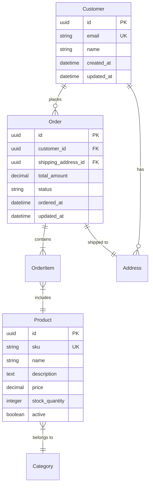

# Data Design

*Comprehensive data architecture and modeling for the system*

## Conceptual Data Model

### Core Business Concepts
Identify the key entities from the domain:



### Entity Descriptions

#### Entity: [Name]
- **Purpose**: [What this entity represents]
- **Key Attributes**: [Most important fields]
- **Business Rules**:
  - [Rule 1 about this entity]
  - [Rule 2 about this entity]
- **Volume**: [Expected number of records]
- **Growth Rate**: [How fast it grows]

## Logical Data Model

### Database Schema Design

#### Table: [table_name]
```sql
CREATE TABLE table_name (
    id UUID PRIMARY KEY DEFAULT gen_random_uuid(),
    field1 VARCHAR(255) NOT NULL,
    field2 INTEGER DEFAULT 0,
    field3 TIMESTAMP WITH TIME ZONE,
    created_at TIMESTAMP WITH TIME ZONE DEFAULT CURRENT_TIMESTAMP,
    updated_at TIMESTAMP WITH TIME ZONE DEFAULT CURRENT_TIMESTAMP,

    CONSTRAINT uk_table_field UNIQUE (field1),
    CONSTRAINT chk_field2_positive CHECK (field2 >= 0)
);

-- Indexes
CREATE INDEX idx_table_field1 ON table_name(field1);
CREATE INDEX idx_table_created ON table_name(created_at DESC);

-- Triggers
CREATE TRIGGER update_table_updated_at
    BEFORE UPDATE ON table_name
    FOR EACH ROW
    EXECUTE FUNCTION update_updated_at_column();
```

### Relationships

#### Relationship: [Entity1] to [Entity2]
- **Type**: [One-to-One | One-to-Many | Many-to-Many]
- **Cardinality**: [Required | Optional]
- **Referential Integrity**: [CASCADE | RESTRICT | SET NULL]
- **Business Rule**: [Why this relationship exists]

### Data Types and Constraints

| Entity | Attribute | Type | Constraints | Notes |
|--------|-----------|------|-------------|--------|
| User | email | VARCHAR(255) | NOT NULL, UNIQUE | Lowercase, validated |
| User | password_hash | VARCHAR(255) | NOT NULL | Bcrypt hash |
| Order | total | DECIMAL(10,2) | NOT NULL, >= 0 | Currency in cents |
| Product | sku | VARCHAR(50) | NOT NULL, UNIQUE | Format: XXX-000-000 |

## Data Patterns and Strategies

### Soft Deletes
Strategy for maintaining data history:
```sql
-- Instead of DELETE, use soft delete
ALTER TABLE entities ADD COLUMN deleted_at TIMESTAMP WITH TIME ZONE;
CREATE INDEX idx_entities_active ON entities(deleted_at) WHERE deleted_at IS NULL;
```

### Audit Trail
Track all changes to critical data:
```sql
CREATE TABLE audit_log (
    id BIGSERIAL PRIMARY KEY,
    table_name VARCHAR(50) NOT NULL,
    record_id UUID NOT NULL,
    action VARCHAR(10) NOT NULL, -- INSERT, UPDATE, DELETE
    changed_by UUID NOT NULL,
    changed_at TIMESTAMP WITH TIME ZONE DEFAULT CURRENT_TIMESTAMP,
    old_values JSONB,
    new_values JSONB
);
```

### Versioning Strategy
For entities that need version history:
- **Approach**: [Temporal tables | Version tables | Event sourcing]
- **Implementation**: [How versioning works]

## Data Access Patterns

### Common Queries

#### Query: [Get User Orders]
```sql
-- Optimized query with proper indexes
SELECT o.*,
       array_agg(
           json_build_object(
               'product_id', oi.product_id,
               'quantity', oi.quantity,
               'price', oi.price
           )
       ) as items
FROM orders o
JOIN order_items oi ON o.id = oi.order_id
WHERE o.customer_id = $1
  AND o.created_at >= $2
GROUP BY o.id
ORDER BY o.created_at DESC
LIMIT $3;
```

**Access Pattern**: [How often, by whom]
**Performance Target**: [< X ms]
**Index Support**: [Which indexes help]

### Caching Strategy

| Data Type | Cache Level | TTL | Invalidation |
|-----------|------------|-----|--------------|
| User profiles | Application | 1 hour | On update |
| Product catalog | CDN | 24 hours | Daily refresh |
| Session data | Redis | 30 min | On logout |
| Computed aggregates | Database | 5 min | Time-based |

## Data Validation Rules

### Field-Level Validation

| Entity.Field | Validation Rules | Error Message |
|--------------|------------------|---------------|
| User.email | RFC 5322 compliant | "Invalid email format" |
| User.password | Min 8 chars, 1 upper, 1 lower, 1 number | "Password too weak" |
| Product.price | > 0, max 2 decimal places | "Invalid price format" |

### Business Rule Validation

#### Rule: [Order Total Calculation]
```
Order.total = SUM(OrderItem.quantity * OrderItem.price) + Order.tax - Order.discount
```
**When Validated**: Before order confirmation
**Error Handling**: Recalculate and notify if mismatch

## Data Migration

### Migration Strategy
How to move from current state (if any) to new design:

1. **Phase 1**: [Initial migration steps]
2. **Phase 2**: [Data transformation]
3. **Phase 3**: [Validation and cutover]

### Migration Scripts
```sql
-- Example migration script
BEGIN;

-- Create new schema
CREATE TABLE new_table (...);

-- Migrate data with transformation
INSERT INTO new_table (col1, col2, computed_col)
SELECT
    old_col1,
    old_col2,
    CASE
        WHEN condition THEN value1
        ELSE value2
    END as computed_col
FROM old_table;

-- Verify migration
SELECT COUNT(*) FROM new_table;

-- Add constraints after data is migrated
ALTER TABLE new_table ADD CONSTRAINT ...;

COMMIT;
```

## Data Volume and Growth

### Current State (if applicable)
| Entity | Current Records | Daily Growth | Annual Growth |
|--------|----------------|--------------|---------------|
| Users | 10,000 | +50 | +18,000 |
| Orders | 100,000 | +500 | +180,000 |
| Products | 1,000 | +2 | +700 |

### Projected Growth
- **Year 1**: [Expected volumes]
- **Year 2**: [Expected volumes]
- **Year 3**: [Expected volumes]

### Scaling Considerations
- **Partitioning Strategy**: [By date, by tenant, etc.]
- **Archival Strategy**: [When and how to archive old data]
- **Read Replicas**: [When needed]

## Data Security

### Sensitive Data Classification

| Data Type | Classification | Protection Method |
|-----------|---------------|-------------------|
| Passwords | Critical | Bcrypt hash, never logged |
| PII | Sensitive | Encrypted at rest, PII vault |
| Payment info | Critical | Tokenized, PCI compliance |
| User content | Private | Encrypted, access controlled |

### Encryption Strategy
- **At Rest**: [AES-256, transparent encryption]
- **In Transit**: [TLS 1.3+]
- **Key Management**: [AWS KMS, HashiCorp Vault]

### Data Privacy
- **PII Handling**: [How personal data is protected]
- **Right to Delete**: [GDPR compliance strategy]
- **Data Retention**: [Policies and implementation]

## Backup and Recovery

### Backup Strategy
- **Frequency**: [How often]
- **Type**: [Full, incremental, differential]
- **Retention**: [How long to keep]
- **Location**: [Where backups are stored]

### Recovery Procedures
- **RPO**: [Recovery Point Objective - max data loss]
- **RTO**: [Recovery Time Objective - max downtime]
- **Test Frequency**: [How often recovery is tested]

## Data Quality

### Quality Rules
- **Completeness**: [Required fields, no nulls where not allowed]
- **Consistency**: [Cross-table validation]
- **Accuracy**: [Business rule compliance]
- **Timeliness**: [Data freshness requirements]

### Quality Monitoring
- **Automated Checks**: [What's monitored]
- **Alert Thresholds**: [When to notify]
- **Remediation Process**: [How to fix issues]

---
*This data design ensures the system's data architecture supports all functional requirements while maintaining performance, security, and scalability.*