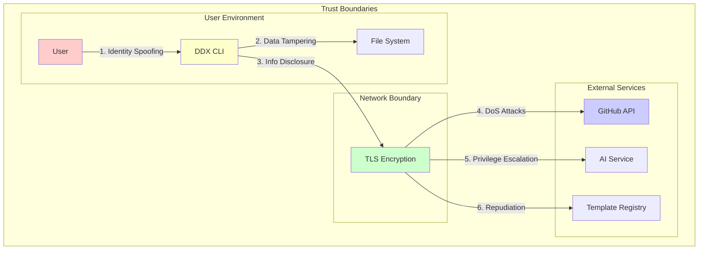
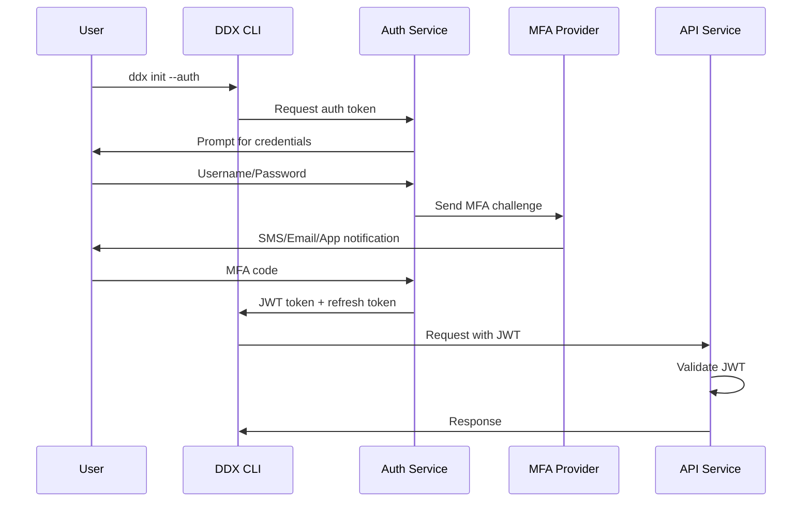

# Security Design Generation Prompt

Create comprehensive security architecture documentation that defines threat models, security controls, and protection mechanisms throughout the system.

## Storage Location

Store security design documentation at: `docs/helix/02-design/security.md`

## Purpose

Security design provides:
- Systematic threat analysis and mitigation strategies
- Authentication and authorization architecture
- Data protection and privacy measures
- Security controls and compliance requirements
- Incident response and monitoring plans

## Key Requirements

### 1. Threat Modeling (STRIDE Analysis)

Systematically analyze threats using the STRIDE methodology:

#### Threat Categories

**Spoofing Identity**
- Threat: Attackers impersonating legitimate users
- Assets at Risk: User accounts, API keys, certificates
- Mitigations:
  - Multi-factor authentication (MFA)
  - Certificate-based authentication
  - API key rotation and validation
  - Strong password policies

**Tampering with Data**
- Threat: Unauthorized modification of data
- Assets at Risk: Templates, configurations, user data
- Mitigations:
  - Digital signatures for templates
  - Checksums and integrity verification
  - Input validation and sanitization
  - Immutable audit logs

**Repudiation**
- Threat: Users denying performed actions
- Assets at Risk: Template modifications, system access
- Mitigations:
  - Comprehensive audit logging
  - Non-reputable signatures
  - Timestamped actions
  - User activity tracking

**Information Disclosure**
- Threat: Unauthorized access to sensitive information
- Assets at Risk: User data, API keys, system internals
- Mitigations:
  - Encryption at rest and in transit
  - Access controls and permissions
  - Data classification and handling
  - Secure secret management

**Denial of Service (DoS)**
- Threat: Making system unavailable
- Assets at Risk: API availability, user experience
- Mitigations:
  - Rate limiting and throttling
  - Resource quotas
  - Circuit breakers
  - Load balancing and scaling

**Elevation of Privilege**
- Threat: Gaining higher access levels
- Assets at Risk: System administration, sensitive operations
- Mitigations:
  - Principle of least privilege
  - Role-based access control (RBAC)
  - Regular permission audits
  - Secure privilege escalation

#### Threat Model Diagram


### 2. Authentication Architecture

#### Multi-Factor Authentication Flow


#### Authentication Methods
```yaml
authentication:
  methods:
    - type: "oauth2"
      providers: ["github", "google", "microsoft"]
      scopes: ["read:user", "user:email"]

    - type: "api_key"
      format: "ddx_[environment]_[32_char_random]"
      rotation_period: "90_days"
      encryption: "AES-256-GCM"

    - type: "jwt"
      algorithm: "RS256"
      expiry: "1_hour"
      refresh_token_expiry: "30_days"

  security_measures:
    - password_policy:
        min_length: 12
        require_uppercase: true
        require_lowercase: true
        require_numbers: true
        require_symbols: true
        prevent_reuse: 5

    - account_lockout:
        failed_attempts: 5
        lockout_duration: "15_minutes"
        progressive_delay: true

    - session_management:
        timeout: "30_minutes"
        concurrent_sessions: 3
        secure_cookies: true
```

### 3. Authorization Model

#### Role-Based Access Control (RBAC)
```yaml
roles:
  guest:
    permissions:
      - "templates:read:public"
      - "patterns:read:public"

  user:
    inherits: ["guest"]
    permissions:
      - "projects:create"
      - "projects:read:own"
      - "projects:update:own"
      - "templates:create"
      - "templates:read:own"
      - "patterns:apply"

  contributor:
    inherits: ["user"]
    permissions:
      - "templates:publish"
      - "templates:read:all"
      - "patterns:create"
      - "patterns:read:all"

  admin:
    inherits: ["contributor"]
    permissions:
      - "users:read"
      - "users:update"
      - "templates:moderate"
      - "system:configure"
```

#### Authorization Implementation
```go
// Permission checking middleware
type Permission struct {
    Resource string // templates, projects, users
    Action   string // create, read, update, delete
    Scope    string // own, all, public
}

func CheckPermission(userRoles []string, required Permission) bool {
    for _, role := range userRoles {
        if permissions := GetRolePermissions(role); permissions != nil {
            if hasPermission(permissions, required) {
                return true
            }
        }
    }
    return false
}

// Resource-based access control
func AuthorizeResource(userID string, resourceType string, resourceID string, action string) error {
    user, err := GetUser(userID)
    if err != nil {
        return err
    }

    resource, err := GetResource(resourceType, resourceID)
    if err != nil {
        return err
    }

    // Check ownership
    if resource.OwnerID == userID && action != "delete" {
        return nil
    }

    // Check role-based permissions
    required := Permission{
        Resource: resourceType,
        Action:   action,
        Scope:    DetermineScope(user, resource),
    }

    if CheckPermission(user.Roles, required) {
        return nil
    }

    return errors.New("access denied")
}
```

### 4. Data Protection

#### Encryption Strategy
```yaml
encryption:
  at_rest:
    database:
      engine: "AES-256-GCM"
      key_management: "AWS KMS" # or "HashiCorp Vault"
      column_encryption:
        - table: "users"
          columns: ["email", "phone"]
        - table: "api_keys"
          columns: ["key_hash"]

    files:
      templates:
        encryption: "AES-256-CTR"
        key_derivation: "PBKDF2"
      backups:
        encryption: "ChaCha20-Poly1305"
        compression: "before_encryption"

  in_transit:
    external_apis:
      tls_version: "1.3"
      cipher_suites: ["TLS_AES_256_GCM_SHA384"]
      certificate_pinning: true

    internal_communication:
      mutual_tls: true
      certificate_rotation: "30_days"

  key_management:
    rotation_schedule:
      database_keys: "quarterly"
      api_keys: "monthly"
      session_keys: "daily"

    storage:
      primary: "hardware_security_module"
      backup: "encrypted_key_escrow"
```

#### Data Classification
```yaml
data_classification:
  public:
    description: "Information that can be freely shared"
    examples: ["public templates", "documentation"]
    protection: ["integrity_checks"]

  internal:
    description: "Information for internal use"
    examples: ["user statistics", "usage metrics"]
    protection: ["access_controls", "audit_logging"]

  confidential:
    description: "Sensitive business information"
    examples: ["user emails", "api usage"]
    protection: ["encryption", "access_controls", "audit_logging"]

  restricted:
    description: "Highly sensitive information"
    examples: ["api_keys", "passwords", "personal_data"]
    protection: ["strong_encryption", "strict_access_controls", "detailed_audit_logging", "data_loss_prevention"]
```

### 5. Security Controls

#### Input Validation and Sanitization
```go
// Template validation
type TemplateValidator struct {
    MaxFileSize    int64
    AllowedExtensions []string
    ForbiddenPaths []string
}

func (v *TemplateValidator) ValidateTemplate(template *Template) error {
    // Size validation
    if template.Size > v.MaxFileSize {
        return errors.New("template exceeds maximum size")
    }

    // File extension validation
    for _, file := range template.Files {
        if !v.isAllowedExtension(file.Name) {
            return fmt.Errorf("forbidden file extension: %s", file.Name)
        }
    }

    // Path traversal prevention
    for _, file := range template.Files {
        if v.containsForbiddenPath(file.Path) {
            return fmt.Errorf("forbidden path detected: %s", file.Path)
        }
    }

    // Content scanning
    if err := v.scanForMaliciousContent(template); err != nil {
        return fmt.Errorf("security scan failed: %w", err)
    }

    return nil
}

// API input sanitization
func SanitizeUserInput(input string) string {
    // Remove dangerous characters
    input = html.EscapeString(input)

    // Limit length
    if len(input) > 1000 {
        input = input[:1000]
    }

    // Remove control characters
    input = regexp.MustCompile(`[[:cntrl:]]`).ReplaceAllString(input, "")

    return strings.TrimSpace(input)
}
```

#### Security Headers
```yaml
security_headers:
  content_security_policy:
    default_src: "'self'"
    script_src: "'self' 'unsafe-inline'"
    style_src: "'self' 'unsafe-inline'"
    img_src: "'self' data: https:"
    connect_src: "'self' https://api.github.com"
    frame_ancestors: "'none'"

  headers:
    strict_transport_security: "max-age=31536000; includeSubDomains"
    x_frame_options: "DENY"
    x_content_type_options: "nosniff"
    x_xss_protection: "1; mode=block"
    referrer_policy: "strict-origin-when-cross-origin"
    permissions_policy: "geolocation=(), microphone=(), camera=()"
```

### 6. Secure Development Practices

#### Security Code Review Checklist
```yaml
code_review_checklist:
  authentication:
    - "Password storage uses bcrypt/scrypt/Argon2"
    - "Session tokens are cryptographically random"
    - "JWT tokens include expiration times"
    - "Authentication failures are rate limited"

  authorization:
    - "All API endpoints check permissions"
    - "Default deny access control"
    - "Resource ownership verified"
    - "Admin functions require elevated privileges"

  input_validation:
    - "All inputs validated and sanitized"
    - "SQL injection prevention (parameterized queries)"
    - "XSS prevention (output encoding)"
    - "File upload restrictions enforced"

  cryptography:
    - "Strong encryption algorithms used"
    - "Secure random number generation"
    - "Proper key management"
    - "No hardcoded secrets"

  error_handling:
    - "No sensitive information in error messages"
    - "Generic error responses to users"
    - "Detailed errors logged securely"
    - "Fail securely on errors"
```

### 7. Monitoring and Incident Response

#### Security Monitoring
```yaml
security_monitoring:
  events_to_monitor:
    - authentication_failures
    - privilege_escalation_attempts
    - unusual_api_usage_patterns
    - file_access_violations
    - data_export_activities
    - configuration_changes

  alerting:
    immediate:
      - "Multiple failed login attempts"
      - "Admin privilege usage"
      - "Unusual data access patterns"

    daily:
      - "New user registrations"
      - "Permission changes"
      - "API key usage"

    weekly:
      - "Access pattern analysis"
      - "Security control effectiveness"
      - "Compliance status"

  metrics:
    - authentication_success_rate
    - authorization_denial_rate
    - api_response_times
    - error_rates_by_endpoint
    - data_access_frequency
```

#### Incident Response Plan
```yaml
incident_response:
  phases:
    preparation:
      - "Security team contact list"
      - "Incident classification matrix"
      - "Communication templates"
      - "Recovery procedures documented"

    identification:
      - "Automated alerting systems"
      - "Manual monitoring processes"
      - "Third-party vulnerability feeds"
      - "User reporting mechanisms"

    containment:
      - "Isolate affected systems"
      - "Disable compromised accounts"
      - "Block malicious IPs"
      - "Preserve evidence"

    eradication:
      - "Remove malware/backdoors"
      - "Patch vulnerabilities"
      - "Update security controls"
      - "Validate system integrity"

    recovery:
      - "Restore from backups"
      - "Gradually restore services"
      - "Monitor for anomalies"
      - "Update documentation"

    lessons_learned:
      - "Document timeline"
      - "Analyze root causes"
      - "Update procedures"
      - "Conduct training"
```

## Documentation Structure

### Security Design Document
```markdown
# Security Design

## Overview
[Security architecture summary and principles]

## Threat Model
[STRIDE analysis and threat landscape]

## Authentication Architecture
[Identity verification and MFA implementation]

## Authorization Model
[RBAC and permission framework]

## Data Protection
[Encryption, classification, and privacy]

## Security Controls
[Input validation, headers, and protective measures]

## Monitoring and Response
[Security monitoring and incident response]

## Compliance Requirements
[Regulatory and standard compliance]

## Security Testing
[Penetration testing and vulnerability assessment]
```

## Quality Checklist

Before security design is complete:
- [ ] Threat model completed using STRIDE
- [ ] Authentication mechanisms defined
- [ ] Authorization model implemented
- [ ] Data protection strategy established
- [ ] Security controls documented
- [ ] Monitoring and alerting configured
- [ ] Incident response plan created
- [ ] Compliance requirements addressed
- [ ] Security testing planned
- [ ] Documentation complete

Remember: Security is not a feature to be added later—it must be designed into the system from the beginning. Every design decision should consider its security implications.