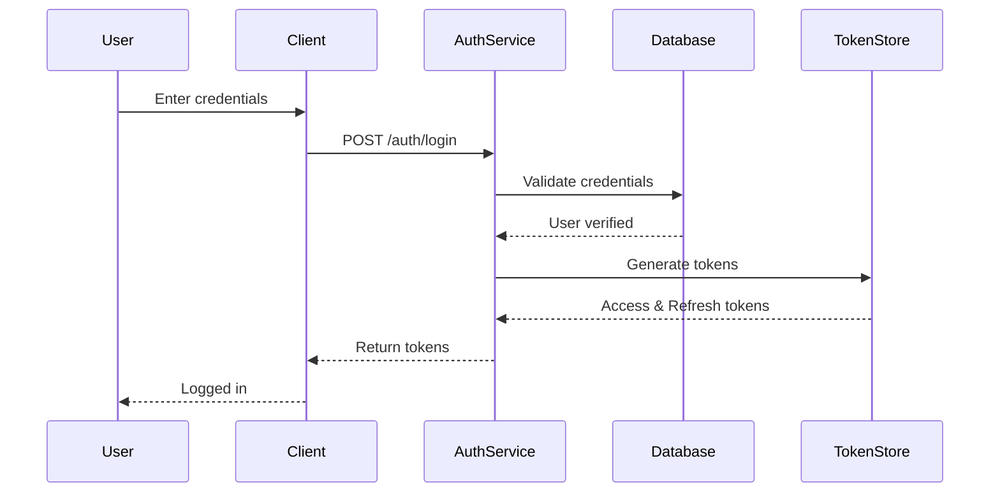
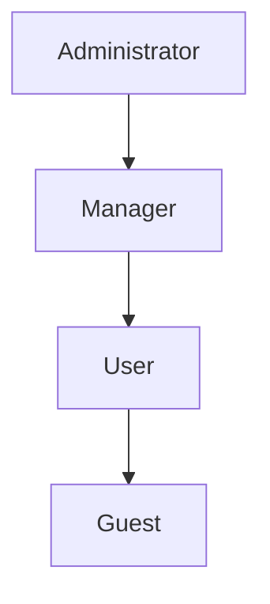

# Security Design

*Comprehensive security architecture and threat modeling for the system*

## Security Objectives

### Primary Security Goals
1. **Confidentiality**: [What data must be protected]
2. **Integrity**: [What data/processes must be tamper-proof]
3. **Availability**: [Uptime and resilience requirements]
4. **Non-repudiation**: [What actions need audit trails]

### Compliance Requirements
- [ ] **GDPR**: [Data privacy requirements]
- [ ] **PCI DSS**: [Payment card requirements]
- [ ] **HIPAA**: [Healthcare data requirements]
- [ ] **SOC 2**: [Security controls]
- [ ] **Other**: [Industry-specific requirements]

## Threat Model

### System Assets
Identify what needs protection:

| Asset | Value | Classification | Protection Priority |
|-------|-------|----------------|-------------------|
| User credentials | Critical | Confidential | Highest |
| Personal data | High | Sensitive | High |
| Session tokens | High | Confidential | High |
| Business logic | Medium | Internal | Medium |
| Public content | Low | Public | Low |

### Threat Analysis (STRIDE)

#### Spoofing
**Threat**: Attacker pretends to be another user
**Affected Components**: Authentication system
**Mitigations**:
- Multi-factor authentication
- Strong password requirements
- Session management
- Rate limiting on login attempts

#### Tampering
**Threat**: Unauthorized data modification
**Affected Components**: Database, API endpoints
**Mitigations**:
- Input validation
- Parameterized queries
- Audit logging
- Data integrity checks

#### Repudiation
**Threat**: User denies performing action
**Affected Components**: All state-changing operations
**Mitigations**:
- Comprehensive audit logging
- Digital signatures where critical
- Timestamp all actions
- Immutable log storage

#### Information Disclosure
**Threat**: Unauthorized access to sensitive data
**Affected Components**: Database, API responses, logs
**Mitigations**:
- Encryption at rest and in transit
- Proper access controls
- Data minimization in responses
- Log sanitization

#### Denial of Service
**Threat**: System becomes unavailable
**Affected Components**: All public endpoints
**Mitigations**:
- Rate limiting
- DDoS protection
- Resource quotas
- Circuit breakers

#### Elevation of Privilege
**Threat**: User gains unauthorized permissions
**Affected Components**: Authorization system
**Mitigations**:
- Principle of least privilege
- Role-based access control
- Regular permission audits
- Secure defaults

## Authentication Architecture

### Authentication Flow


### Authentication Methods
- **Primary**: [Username/password, SSO, etc.]
- **MFA Options**: [TOTP, SMS, Email, Hardware tokens]
- **Session Management**: [JWT, Server sessions]
- **Token Lifecycle**: [Expiry, refresh, revocation]

### Password Policy
- **Minimum Length**: 12 characters
- **Complexity**: At least 3 of: uppercase, lowercase, numbers, symbols
- **History**: Cannot reuse last 5 passwords
- **Expiry**: 90 days for privileged accounts
- **Lockout**: 5 failed attempts = 15 minute lockout

## Authorization Model

### Access Control Strategy
**Type**: [RBAC | ABAC | ACL | Hybrid]

### Role Hierarchy


### Permission Matrix

| Resource | Admin | Manager | User | Guest |
|----------|-------|---------|------|-------|
| User Management | CRUD | Read | - | - |
| Content | CRUD | CRUD | CR | R |
| Settings | CRUD | RU | R | - |
| Reports | CRUD | R | - | - |

### API Authorization
```yaml
endpoints:
  - path: /api/users
    methods:
      GET: [Admin, Manager]
      POST: [Admin]
      PUT: [Admin]
      DELETE: [Admin]

  - path: /api/users/{id}
    methods:
      GET: [Admin, Manager, Self]
      PUT: [Admin, Self]
      DELETE: [Admin]
```

## Data Protection

### Encryption Standards

#### Data at Rest
- **Database**: Transparent Data Encryption (TDE)
- **File Storage**: AES-256-GCM
- **Backups**: Encrypted with separate keys
- **Key Management**: [AWS KMS | Azure Key Vault | HSM]

#### Data in Transit
- **External Traffic**: TLS 1.3+ only
- **Internal Traffic**: mTLS between services
- **Certificate Management**: [Let's Encrypt | Internal CA]
- **Cipher Suites**: Only strong, forward-secret ciphers

### Sensitive Data Handling

| Data Type | Storage | Transmission | Access | Retention |
|-----------|---------|--------------|--------|-----------|
| Passwords | Bcrypt hash | Never | Write-only | Forever |
| Credit Cards | Tokenized | PCI compliant | Restricted | 7 years |
| SSN/PII | Encrypted | Encrypted | Audit logged | Per policy |
| API Keys | Vault | Secure channel | Need-to-know | Until revoked |

### Data Masking
```javascript
// Example masking rules
{
  email: "u***@example.com",
  phone: "***-***-1234",
  ssn: "***-**-1234",
  creditCard: "****-****-****-1234"
}
```

## Security Controls

### Input Validation

#### Validation Rules
| Input Type | Validation | Sanitization |
|------------|------------|--------------|
| Email | RFC 5322 | Lowercase, trim |
| URL | Valid URL format | Remove javascript: |
| HTML | Whitelist tags | DOMPurify |
| SQL | Parameterized only | Never concatenate |
| File Upload | Type, size, content | Virus scan |

### Output Encoding
- **HTML Context**: HTML entity encoding
- **JavaScript Context**: JavaScript encoding
- **URL Context**: URL encoding
- **CSS Context**: CSS encoding

### Security Headers
```
Strict-Transport-Security: max-age=31536000; includeSubDomains
Content-Security-Policy: default-src 'self'; script-src 'self' 'unsafe-inline'
X-Frame-Options: DENY
X-Content-Type-Options: nosniff
X-XSS-Protection: 1; mode=block
Referrer-Policy: strict-origin-when-cross-origin
```

## API Security

### Rate Limiting
| Endpoint Type | Authenticated | Anonymous |
|--------------|---------------|-----------|
| Login | 5/minute | 3/minute |
| Read API | 1000/hour | 100/hour |
| Write API | 100/hour | Not allowed |
| Search | 60/minute | 10/minute |

### API Key Management
- **Generation**: Cryptographically secure random
- **Format**: Prefix for identification (e.g., `sk_live_`)
- **Storage**: Hashed in database
- **Rotation**: Required every 90 days
- **Revocation**: Immediate effect

## Monitoring and Detection

### Security Events to Monitor
- [ ] Failed login attempts
- [ ] Privilege escalation attempts
- [ ] Unusual data access patterns
- [ ] API rate limit violations
- [ ] File integrity changes
- [ ] Configuration changes

### Alert Thresholds
| Event | Threshold | Action |
|-------|-----------|--------|
| Failed logins | 5 in 5 minutes | Alert + Lock |
| API abuse | 10x normal | Alert + Block |
| Data exfiltration | >1GB transfer | Alert + Investigate |
| Config change | Any | Log + Notify |

### Security Logging
```json
{
  "timestamp": "2024-01-01T12:00:00Z",
  "event_type": "auth_failure",
  "user_id": "user123",
  "ip_address": "192.168.1.1",
  "user_agent": "Mozilla/5.0...",
  "details": {
    "reason": "invalid_password",
    "attempt_count": 3
  }
}
```

## Incident Response

### Response Plan
1. **Detection**: Automated alerts or user reports
2. **Triage**: Assess severity and impact
3. **Containment**: Isolate affected systems
4. **Eradication**: Remove threat
5. **Recovery**: Restore normal operations
6. **Lessons Learned**: Post-incident review

### Severity Levels
- **Critical**: Data breach, system compromise
- **High**: Authentication bypass, data exposure
- **Medium**: Single account compromise
- **Low**: Policy violation, failed attack

## Security Testing

### Testing Requirements
- [ ] **Static Analysis**: On every commit
- [ ] **Dependency Scanning**: Daily
- [ ] **Dynamic Testing**: Before each release
- [ ] **Penetration Testing**: Annually
- [ ] **Security Review**: For major changes

### Security Test Cases
- SQL injection attempts
- XSS payload injection
- Authentication bypass
- Authorization violations
- Session hijacking
- File upload exploits

## Dependencies and Third-Party Security

### Dependency Management
- **Scanning Tool**: [Snyk | Dependabot | OWASP Dependency Check]
- **Update Policy**: Critical within 24h, High within 7d
- **License Compliance**: Automated checking
- **SBOM**: Software Bill of Materials maintained

### Third-Party Integrations
| Service | Data Shared | Security Review | Last Audit |
|---------|-------------|-----------------|------------|
| Payment Provider | Card tokens | PCI DSS | 2024-01 |
| Email Service | Email addresses | SOC 2 | 2023-12 |
| Analytics | Usage data | GDPR compliant | 2024-02 |

## Security Training and Awareness

### Developer Training
- Secure coding practices
- OWASP Top 10
- Security testing tools
- Incident response procedures

### Security Champions
- One per team
- Monthly security meetings
- First responders for incidents
- Security advocacy

---
*This security design ensures defense in depth with multiple layers of protection for all system assets.*