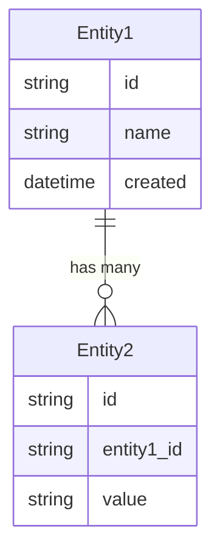
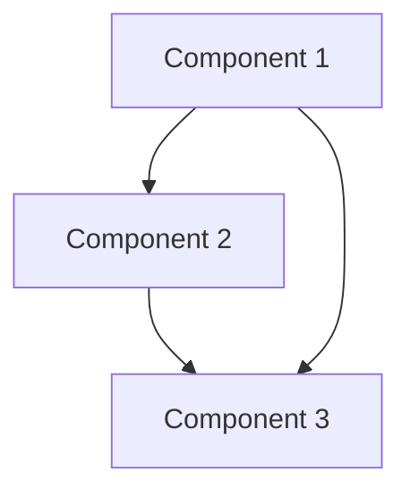

# Solution Design

*Bridge between business requirements and technical implementation*

## Requirements Analysis

### Functional Requirements Mapping
Map each functional requirement to technical capabilities:

| Requirement | Technical Capability | Component | Priority |
|------------|---------------------|-----------|----------|
| [Business requirement] | [Technical implementation] | [Component name] | P0/P1/P2 |
| | | | |

### Non-Functional Requirements Impact
How NFRs shape the architecture:

| NFR Category | Requirement | Architectural Impact | Design Decision |
|--------------|------------|---------------------|-----------------|
| Performance | [Specific metric] | [What this requires] | [How we'll achieve it] |
| Security | | | |
| Scalability | | | |
| Reliability | | | |
| Usability | | | |

## Solution Approaches

### Approach 1: [Name]
**Description**: [Brief overview of this approach]

**Pros**:
- [Advantage 1]
- [Advantage 2]

**Cons**:
- [Disadvantage 1]
- [Disadvantage 2]

**Evaluation**: [Why selected or rejected]

### Approach 2: [Name]
[Similar structure]

### Selected Approach
**Decision**: [Which approach and why]
**Rationale**: [Detailed reasoning based on requirements and constraints]

## Domain Model

### Core Entities
Identify the key business concepts:

### Business Rules
Critical domain logic to implement:
1. [Rule 1]: [Description and impact]
2. [Rule 2]: [Description and impact]

### Bounded Contexts (if applicable)
- **Context 1**: [Responsibility and entities]
- **Context 2**: [Responsibility and entities]

## System Decomposition

### Component Identification
Breaking down the system into manageable parts:

#### Component 1: [Name]
- **Purpose**: [What it does]
- **Responsibilities**:
  - [Responsibility 1]
  - [Responsibility 2]
- **Requirements Addressed**: [List of requirements]
- **Interfaces**: [How it communicates]

#### Component 2: [Name]
[Similar structure]

### Component Interactions

## Technology Selection Rationale

### Programming Language: [Language]
**Why**: [Reasoning based on requirements]
**Alternatives Considered**: [Other options and why rejected]

### Framework: [Framework]
**Why**: [Reasoning]
**Alternatives Considered**: [Other options]

### Database: [Database]
**Why**: [Reasoning based on data requirements]
**Alternatives Considered**: [Other options]

### Infrastructure: [Platform]
**Why**: [Reasoning based on deployment needs]
**Alternatives Considered**: [Other options]

## Requirements Traceability

### Coverage Check
Ensure all requirements are addressed:

| Requirement ID | Requirement | Component | Design Element | Test Strategy |
|---------------|-------------|-----------|----------------|---------------|
| FR-001 | [Requirement] | [Component] | [How addressed] | [How tested] |
| NFR-001 | [Requirement] | [Multiple] | [How achieved] | [How verified] |

### Gap Analysis
Requirements not fully addressed:
- [ ] [Requirement]: [Why not addressed and mitigation]

## Constraints and Assumptions

### Technical Constraints
- [Constraint 1]: [Impact on design]
- [Constraint 2]: [Impact on design]

### Assumptions
- [Assumption 1]: [What we're assuming and risk if wrong]
- [Assumption 2]: [What we're assuming and risk if wrong]

### Dependencies
- [External system/service]: [How it affects our design]
- [Library/framework]: [Version and compatibility requirements]

## Migration from Current State

### Current System Analysis (if applicable)
- **Existing functionality**: [What exists today]
- **Data migration needs**: [What needs to be moved]
- **Integration points**: [What needs to be maintained]

### Migration Strategy
1. **Phase 1**: [What gets migrated first]
2. **Phase 2**: [Next migration step]
3. **Compatibility period**: [How we maintain both]

## Risk Assessment

### Technical Risks
| Risk | Probability | Impact | Mitigation |
|------|------------|--------|------------|
| [Risk description] | High/Med/Low | High/Med/Low | [How to address] |

### Design Risks
| Risk | Probability | Impact | Mitigation |
|------|------------|--------|------------|
| [Complexity risk] | | | |
| [Performance risk] | | | |

## Success Criteria

### Design Validation
- [ ] All P0 requirements mapped to components
- [ ] All NFRs addressed in architecture
- [ ] Domain model captures all business rules
- [ ] Technology choices justified against requirements
- [ ] No single point of failure for critical paths
- [ ] Clear upgrade/migration path

### Handoff to Implementation
This design is ready when:
- [ ] Development team understands the architecture
- [ ] All technical decisions are documented
- [ ] Test strategy aligns with design
- [ ] Stakeholders approve approach

---
*This solution design bridges the gap between what the business needs and how we'll build it technically.*