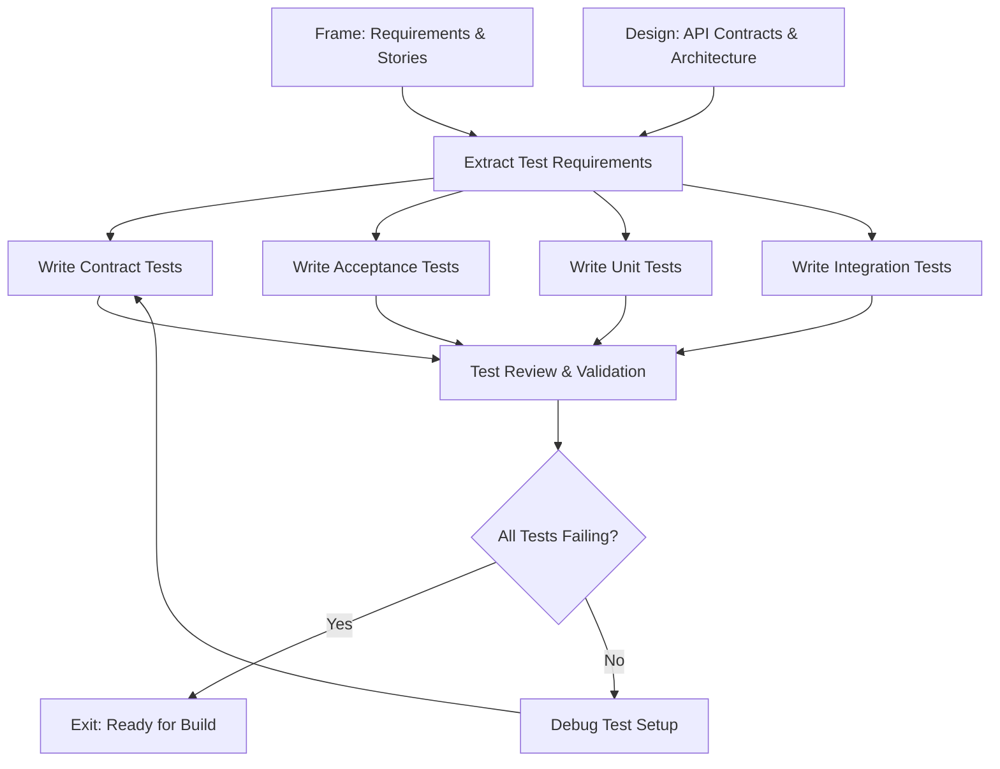

# Phase 03: Test

The specification phase where we define how the system will be verified through comprehensive test creation.

## Purpose

The Test phase transforms specifications from Frame and Design phases into executable tests that define system behavior. Following Specification-Driven Development (SDD) principles, this phase creates tests BEFORE implementation, establishing clear success criteria for the Build phase.

## Key Principle

**Tests Are Specifications**: Tests aren't afterthoughts—they're executable specifications that define exactly how the system should behave. Every test written here becomes a contract that implementation must fulfill.

## Workflow Principles

This phase operates under the HELIX workflow principles, emphasizing:

- **Test-First Development**: Tests precede implementation, defining behavior before code
- **Specification-Driven**: Tests are derived from Frame and Design specifications
- **Quality Gates**: Tests must fail initially (Red phase) before proceeding to Build
- **Human-AI Collaboration**: Humans define test strategy; AI generates comprehensive test suites
- **Iterative Refinement**: Tests evolve with specifications through the cycle

The test-first approach ensures that quality is built-in, not bolted-on, and that implementation exactly matches specifications.

## Input Gates

Prerequisites to enter this phase (defined in `input-gates.yml`):

1. **Design documents complete and approved**
   - Requirement: Architecture and API contracts fully specified
   - Validation: `ddx validate design-docs` or manual review checklist
   - Source: 02-design phase

2. **User stories have clear acceptance criteria**
   - Requirement: Each story has testable Given/When/Then scenarios
   - Validation: All stories in `docs/helix/01-frame/user-stories/` have criteria
   - Source: 01-frame phase

3. **Non-functional requirements defined**
   - Requirement: Performance, security, scalability metrics specified
   - Validation: NFRs documented with measurable targets
   - Source: 01-frame phase

4. **Security architecture completed**
   - Requirement: Security controls and architecture documented
   - Validation: Security architecture and threat model approved
   - Source: 02-design phase

These gates ensure we have complete specifications to derive comprehensive tests, including security test requirements.

## Process Flow



## Work Items

### Artifacts (Template-Based Outputs)

#### 1. Test Plan
**Artifact Location**: `artifacts/test-plan/`
**Output Location**: `docs/helix/03-test/test-plan.md`

Comprehensive testing strategy (follows IEEE 829):
- Test scope and objectives
- Test coverage targets and rationale
- Testing pyramid (unit, integration, e2e ratios)
- Test environment specifications
- Resource planning and responsibilities
- Risk analysis and mitigation
- Entry and exit criteria

#### 2. Test Procedures
**Artifact Location**: `artifacts/test-procedures/`
**Output Location**: `docs/helix/03-test/test-procedures.md`

Step-by-step test execution guide:
- Test writing procedures for each type
- Execution and validation procedures
- Environment setup instructions
- Test data management
- Quality checklists
- Troubleshooting guides

#### 3. Test Suites
**Artifact Location**: `artifacts/test-suites/`
**Output Location**: `tests/`

Test templates and generators:
- Contract test templates
- Integration test patterns
- Unit test scaffolds
- E2E test frameworks
- Acceptance test scenarios

#### 4. Security Test Suite
**Artifact Location**: `artifacts/security-tests/`
**Output Location**: `tests/security/`

Comprehensive security testing specifications:
- **Authentication and authorization test cases**
- **Input validation and injection prevention tests**
- **Data protection and encryption validation**
- **Session management and CSRF protection tests**
- **SAST/DAST integration and configuration**
- **Compliance validation test scenarios**

## Artifact Metadata

Each artifact directory can include a `meta.yml` file that defines:
- **Dependencies**: Links to Frame/Design artifacts that inform test creation
- **Test Coverage Requirements**: Minimum coverage levels for different test types
- **Validation Rules**: Quality checks for test completeness
- **Output Mappings**: Where generated tests should be placed
- **Variables**: Project-specific values for test generation

This metadata enables automated validation and ensures tests align with specifications.

### Actions (Prompt-Only Operations)

#### 1. Write Unit Tests
**Action Location**: `actions/write-unit-tests/`

Create granular tests for individual components:
- Pure function tests
- Class method tests
- Module interface tests
- Mock external dependencies
- Error condition handling

#### 2. Write Integration Tests
**Action Location**: `actions/write-integration-tests/`

Test component interactions:
- Service integration tests
- Database interaction tests
- API endpoint tests
- Message queue tests
- Real service dependencies (per SDD Article IX)

#### 3. Write End-to-End Tests
**Action Location**: `actions/write-e2e-tests/`

Complete user flow validation:
- Critical path scenarios
- Cross-browser testing setup
- Mobile responsiveness tests
- Performance under load
- Data persistence verification

#### 4. Write Performance Tests
**Action Location**: `actions/write-performance-tests/`

Validate non-functional requirements:
- Load testing (concurrent users)
- Stress testing (breaking points)
- Latency measurements
- Resource consumption monitoring
- Scalability verification

#### 5. Write Security Tests
**Action Location**: `actions/write-security-tests/`

Security validation testing:
- Authentication flow tests
- Authorization boundary tests
- Input validation tests
- SQL injection prevention
- XSS protection verification
- API rate limiting tests

## Alignment with Spec-Driven Development

This phase embodies SDD principles from `docs/resources/spec-driven.md`:

### Test-First Imperative (Article III)
- **No code before tests**: Tests must be written and approved first
- **Red-Green-Refactor**: Tests must fail initially (Red phase)
- **Behavior-driven**: Tests define behavior, not implementation

### Integration-First Testing (Article IX)
- **Real over mocked**: Use actual services where possible
- **Contract-first**: API contracts drive test creation
- **Production-like**: Test in environments matching production

### Specification Traceability
Every test traces to specifications:
- Frame requirements → acceptance tests
- Design contracts → contract tests
- User stories → e2e tests
- NFRs → performance/security tests

## Human vs AI Responsibilities

### Human Responsibilities
- **Test Strategy**: Decide coverage levels and priorities
- **Edge Case Identification**: Think of unusual scenarios
- **Test Review**: Validate test correctness and completeness
- **Performance Targets**: Set acceptable thresholds
- **Business Logic Validation**: Ensure tests match intent

### AI Assistant Responsibilities
- **Test Generation**: Create tests from specifications
- **Coverage Analysis**: Identify untested paths
- **Test Structure**: Organize tests properly
- **Assertion Writing**: Create comprehensive checks
- **Mock Generation**: Build necessary test doubles

## Quality Gates

Before proceeding to Build phase, ensure:

### Test Completeness
- [ ] All user stories have acceptance tests
- [ ] All API endpoints have contract tests
- [ ] Critical paths have e2e tests
- [ ] Edge cases documented and tested
- [ ] Error scenarios covered

### Test Quality
- [ ] Tests are readable and maintainable
- [ ] Tests follow AAA pattern (Arrange, Act, Assert)
- [ ] No implementation details in tests
- [ ] Tests are deterministic (no flaky tests)
- [ ] Performance benchmarks defined

### Test Infrastructure
- [ ] CI/CD pipeline configured
- [ ] Test runners working
- [ ] Coverage reporting enabled
- [ ] Test data management planned
- [ ] Environment configuration complete

## Common Pitfalls

### ❌ Avoid These Mistakes

1. **Testing Implementation Instead of Behavior**
   - Bad: Testing private methods or internal state
   - Good: Testing public interfaces and outcomes

2. **Over-Mocking**
   - Bad: Mocking everything, testing nothing real
   - Good: Integration tests with real dependencies

3. **Unclear Test Names**
   - Bad: `test1()`, `testUserFunction()`
   - Good: `should_reject_invalid_email_format()`

4. **Missing Edge Cases**
   - Bad: Only happy path tests
   - Good: Boundary conditions, error states, nulls

5. **Ignoring Non-Functional Requirements**
   - Bad: No performance or security tests
   - Good: Load tests, penetration tests, accessibility tests

## Exit Criteria

The Test phase is complete and Build phase can begin when:

1. **All Tests Written**: Tests exist for all requirements and scenarios
   - Validation: `npm test` or `go test ./...` shows tests exist
2. **Tests Are Failing**: Red phase of TDD confirmed
   - Validation: Test runner shows failures (no implementation yet)
3. **Coverage Plan Met**: Test coverage targets defined and achievable
   - Validation: Coverage report shows test structure in place
4. **Tests Reviewed**: Human validation of test correctness
   - Validation: Code review approved by team lead
5. **CI/CD Configured**: Automated test execution ready
   - Validation: Pipeline runs tests on commit
6. **Documentation Complete**: Test plan and strategies documented
   - Validation: `docs/helix/03-test/test-plan.md` exists and is complete

## Next Phase: Build

Once Test phase completes, proceed to Build where you'll:
- Implement code to make tests pass
- Follow TDD red-green-refactor cycle
- Achieve all coverage targets
- Refactor while keeping tests green

Remember: Build phase success is simple—make all these tests pass!

## Test Organization Best Practices

### File Structure
```
tests/
├── unit/                 # Fast, isolated component tests
│   ├── models/          # Data model tests
│   ├── services/        # Business logic tests
│   └── utils/           # Utility function tests
├── integration/         # Component interaction tests
│   ├── api/            # API endpoint tests
│   ├── database/       # Database operation tests
│   └── services/       # Service integration tests
├── contracts/          # API contract validation
│   ├── rest/           # REST API contracts
│   └── graphql/        # GraphQL schema tests
├── e2e/                # End-to-end user journeys
│   ├── critical/       # Critical path tests
│   └── features/       # Feature-specific flows
└── acceptance/         # Business requirement validation
    └── stories/        # User story tests
```

### Naming Conventions
- **Unit Tests**: `{component}.test.{ext}` (e.g., `user-model.test.ts`)
- **Integration Tests**: `{feature}.integration.test.{ext}`
- **E2E Tests**: `{journey}.e2e.test.{ext}`
- **Test Names**: Use descriptive names like `should_reject_invalid_email_when_creating_user()`

### Coverage Requirements
- **Unit Tests**: 80% code coverage minimum
- **Integration Tests**: All API endpoints and service boundaries
- **Contract Tests**: 100% of public APIs
- **E2E Tests**: Critical user paths and edge cases
- **Acceptance Tests**: All user stories from Frame phase

## Tips for Success

1. **Think Behavior, Not Code**: Write tests for what, not how
2. **Start with Contracts**: API contracts provide clear test targets
3. **Use Real Services**: Avoid mocks when possible (SDD Article IX)
4. **Test the Unhappy Path**: Errors and edge cases matter
5. **Keep Tests Simple**: Complex tests hide bugs
6. **Follow AAA Pattern**: Arrange, Act, Assert structure
7. **One Assertion Per Test**: Keep tests focused and clear

## Using AI Assistance

When working with AI assistants during Test:

```bash
# Generate test plan from specifications
ddx apply prompts/helix/test/test-plan

# Create contract tests from API design
ddx apply prompts/helix/test/contract-tests

# Generate acceptance tests from user stories
ddx apply prompts/helix/test/acceptance-tests

# Write comprehensive unit tests
ddx apply actions/helix/test/unit-tests
```

AI excels at generating comprehensive test suites from specifications, but human review ensures tests truly validate business requirements.

## File Organization

### Structure Overview
- **Test Definitions**: `workflows/helix/phases/03-test/`
  - Templates and prompts for test creation
  - Test planning documents

- **Generated Tests**: `tests/`
  - `tests/unit/` - Unit tests
  - `tests/integration/` - Integration tests
  - `tests/contracts/` - Contract tests
  - `tests/e2e/` - End-to-end tests
  - `tests/acceptance/` - Acceptance tests

This separation keeps test templates reusable while organizing actual tests logically in the project.

---

*The Test phase defines success. What follows in Build is simply making that definition reality.*