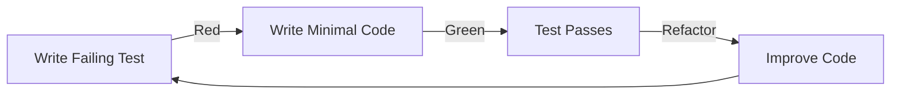

# Phase 04: Build

The execution phase where we transform designs and contracts into working code using test-driven development.

## Purpose

The Build phase is where code comes to life. Following the contracts and test specifications from Design, this phase emphasizes test-driven development (TDD), incremental delivery, and continuous validation. Every line of code is written to make a failing test pass.

## Key Principle

**Red-Green-Refactor**: Write failing tests first (Red), write minimal code to pass (Green), then improve code quality (Refactor). No production code exists without a failing test demanding it.

## Input Gate

Before starting Build phase, verify Test phase outputs:
- [ ] All test suites written and reviewed
- [ ] Tests are failing (Red phase of TDD)
- [ ] Test coverage plan approved
- [ ] CI/CD pipeline configured for tests
- [ ] Test procedures documented
- [ ] Test infrastructure operational
- [ ] Security test suite completed and failing
- [ ] SAST/DAST tools configured in CI/CD pipeline
- [ ] Security coding standards established

## Artifacts

### 1. Implementation Plan
**Location**: `artifacts/implementation-plan/`
**Output**: `docs/helix/04-build/implementation-plan.md`

Technical execution strategy:
- **Build Phases**: Incremental delivery approach
- **Component Order**: What to build first
- **Technology Setup**: Development environment
- **Coding Standards**: Conventions and patterns
- **Integration Points**: How components connect
- **Resource Planning**: Team assignments and timeline

### 2. Build Procedures
**Location**: `artifacts/build-procedures/`
**Output**: `docs/helix/04-build/build-procedures.md`

TDD implementation guide:
- **Red-Green-Refactor procedures**: Step-by-step TDD process
- **Implementation patterns**: Common coding patterns
- **Integration procedures**: How to connect components
- **Refactoring guidelines**: When and how to improve code
- **Quality checkpoints**: Code review and standards
- **Troubleshooting guide**: Common issues and solutions

### 3. Secure Coding Checklist
**Artifact Location**: `artifacts/secure-coding/`
**Output Location**: `docs/helix/04-build/secure-coding-checklist.md`

Security implementation validation:
- **Input validation and sanitization checks**
- **Authentication and session management verification**
- **Authorization and access control implementation**
- **Data protection and encryption validation**
- **Security testing integration and SAST/DAST execution**
- **Secrets management and configuration security**

## Core Workflow

### Test-Driven Development Cycle



### Build Order

1. **Contract Tests First**
   - Create test files for all external interfaces
   - Run tests - verify they fail
   - This defines what "done" looks like

2. **Integration Tests Second**
   - Create tests for component interactions
   - Run tests - verify they fail
   - This ensures components work together

3. **Implementation Last**
   - Write minimal code to pass first test
   - Refactor when green
   - Move to next failing test
   - Repeat until all tests pass

## Human vs AI Responsibilities

### Human Responsibilities
- **Code Review**: Ensure quality and maintainability
- **Architectural Integrity**: Maintain design decisions
- **Problem Solving**: Handle unexpected challenges
- **Performance Optimization**: Profile and optimize
- **Security Review**: Validate security practices

### AI Assistant Responsibilities
- **Code Generation**: Write code to pass tests
- **Test Implementation**: Create test files from specifications
- **Refactoring**: Improve code structure
- **Documentation**: Generate inline documentation
- **Pattern Application**: Apply consistent coding patterns

## Build Phases

### Phase 1: Foundation (Red)
**Goal**: All tests written and failing

Deliverables:
- [ ] Contract test files created
- [ ] Integration test files created
- [ ] Test runner configured
- [ ] All tests failing with clear messages
- [ ] CI/CD pipeline running tests

**Success Criteria**:
- 100% of specified tests exist
- 0% of tests passing
- Clear failure messages

### Phase 2: Core Build (Green)
**Goal**: Make tests pass incrementally

Deliverables:
- [ ] Core libraries implemented
- [ ] CLI interface functional
- [ ] Data persistence working
- [ ] Error handling complete
- [ ] All contract tests passing

**Success Criteria**:
- 100% contract tests passing
- 100% integration tests passing
- No implementation without test

### Phase 3: Quality (Refactor)
**Goal**: Improve code without breaking tests

Deliverables:
- [ ] Code refactored for clarity
- [ ] Performance optimized
- [ ] Documentation complete
- [ ] Security hardened
- [ ] Edge cases handled

**Success Criteria**:
- All tests still passing
- Code coverage meets targets
- Performance requirements met
- Security scan passing

## Quality Standards

### Code Quality Checklist
- [ ] **Single Responsibility**: Each function/class has one job
- [ ] **DRY**: No duplicated logic
- [ ] **YAGNI**: No speculative features
- [ ] **Readable**: Code explains itself
- [ ] **Testable**: Easy to test in isolation

### Test Quality Standards
- [ ] **Fast**: Tests run quickly
- [ ] **Independent**: Tests don't depend on each other
- [ ] **Repeatable**: Same result every time
- [ ] **Self-Validating**: Clear pass/fail
- [ ] **Timely**: Written before code

## Common Patterns

### Pattern: Contract Test First
```bash
# 1. Create contract test
test/contracts/cli_test.go

# 2. Run test - see it fail
make test  # FAIL: CLI not found

# 3. Create minimal implementation
cmd/cli.go

# 4. Run test - see it pass
make test  # PASS

# 5. Refactor if needed
# Improve structure while tests stay green
```

### Pattern: Integration Test Flow
```bash
# 1. Create integration test
test/integration/workflow_test.go

# 2. Test fails - components don't exist
make test  # FAIL: Components not found

# 3. Build components incrementally
internal/component1/
internal/component2/

# 4. Connect components
internal/workflow/

# 5. Test passes
make test  # PASS
```

## Build Guidelines

### Do's ✅
- Write the test first, always
- Make tests fail before making them pass
- Write minimal code to pass tests
- Refactor only when tests are green
- Commit after each passing test
- Keep build log for progress tracking

### Don'ts ❌
- Write code without a failing test
- Write multiple features at once
- Skip the refactor step
- Add features not in specifications
- Mock when you can use real dependencies
- Ignore failing tests

## Incremental Delivery

### Daily Progress Tracking
Track progress to maintain momentum:

| Day | Tests Written | Tests Passing | Coverage | Notes |
|-----|--------------|---------------|----------|--------|
| 1 | 10 | 0 | 0% | All contract tests written |
| 2 | 15 | 5 | 30% | CLI interface working |
| 3 | 20 | 15 | 60% | Core library complete |
| 4 | 20 | 20 | 85% | All tests passing |

### Continuous Integration
Every commit should:
1. Pass all existing tests
2. Not break previous functionality
3. Include its own tests
4. Update documentation
5. Pass linting and formatting

## Common Pitfalls

### ❌ Avoid These Mistakes

1. **Writing Code Without Tests**
   - Bad: "I'll add tests later"
   - Good: Test fails → Code written → Test passes

2. **Big Bang Integration**
   - Bad: Build everything then integrate
   - Good: Integrate continuously as you build

3. **Over-Engineering**
   - Bad: Adding features "just in case"
   - Good: Only what tests require

4. **Test After Development**
   - Bad: Code complete, now writing tests
   - Good: No code without failing test

5. **Ignoring Refactor Step**
   - Bad: Moving to next feature immediately
   - Good: Clean up before moving on

## Success Criteria

The Build phase is complete when:

1. **All Tests Pass**: 100% of specified tests green
2. **Coverage Met**: Contract coverage 100%, critical paths covered
3. **Performance Verified**: Meets requirements under load
4. **Security Validated**: Passes security scans
5. **Documentation Complete**: Code and API documented
6. **Code Review Done**: Approved by team

## Next Phase: Deploy

Once Build is complete, proceed to Deploy phase for:
- Production deployment
- Environment configuration
- Release management
- Monitoring setup
- Go-live activities

Remember: Build creates the "what" - Deploy makes it available to users.

## Tools and Commands

### Development Workflow
```bash
# Run tests continuously
make watch-test

# Run specific test
make test TEST=TestContractCLI

# Check coverage
make coverage

# Run linting
make lint

# Format code
make fmt
```

### TDD Rhythm
```bash
# 1. RED: Write failing test
echo "test_cli_accepts_input()" > test_cli.py
pytest  # FAIL

# 2. GREEN: Make it pass
echo "def accept_input(): pass" > cli.py
pytest  # PASS

# 3. REFACTOR: Improve
# Refactor cli.py while keeping tests green
pytest  # STILL PASS
```

## Build Artifacts

By the end of Build phase, you should have:

1. **Source Code**: All production code
2. **Test Suite**: Comprehensive test coverage
3. **Documentation**: API docs, README, comments
4. **Build Scripts**: Compilation and packaging
5. **CI/CD Config**: Automated testing pipeline
6. **Deployment Package**: Ready for deployment

## Tips for Success

1. **Small Steps**: One test, one feature at a time
2. **Frequent Commits**: Commit every passing test
3. **Pair Programming**: Two eyes catch more issues
4. **Continuous Integration**: Test on every push
5. **Refactor Courageously**: Tests are your safety net

## Using AI Assistance

When working with AI assistants during Build:

```bash
# Generate test implementation from spec
ddx apply prompts/helix/build/create-tests

# Generate code to pass specific test
ddx apply prompts/helix/build/implement-feature

# Refactor with confidence
ddx apply prompts/helix/build/refactor-code
```

AI excels at generating code to pass tests but human review ensures quality and security.

---

*"The only way to go fast is to go well." - Robert C. Martin*

*Build phase is where disciplined engineering practices pay off. Trust the process.*