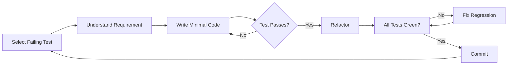

# Build Plan

**Project**: [Project Name]
**Version**: 1.0.0
**Date**: [Date]
**Status**: Draft
**Author**: [Author Name]

## Executive Summary

[Brief overview of the implementation approach, key architectural decisions, and expected delivery timeline based on the failing test suite from the Test phase]

## Current State

### Test Suite Status

| Test Category | Total Tests | Currently Failing | Priority |
|---------------|-------------|-------------------|----------|
| Contract Tests | [Number] | [Number] | P0 |
| Integration Tests | [Number] | [Number] | P0 |
| Unit Tests | [Number] | [Number] | P1 |
| E2E Tests | [Number] | [Number] | P1 |

**Total Tests to Pass**: [Number]
**Current Coverage**: 0%
**Target Coverage**: [Percentage]%

### Test Plan Reference

Using test plan from: `docs/test/test-plan.md`
- Test organization structure defined
- Coverage targets established
- Priority order determined
- Infrastructure ready

## Implementation Strategy

### Build Priority Order

#### Phase 1: Foundation (Tests 1-X)
**Goal**: Establish core data models and basic operations

| Test File | Component to Build | Estimated Time | Dependencies |
|-----------|-------------------|----------------|--------------|
| [test-file-1] | [Component] | [Time] | None |
| [test-file-2] | [Component] | [Time] | [Dependency] |

#### Phase 2: Business Logic (Tests X-Y)
**Goal**: Implement core business rules and workflows

| Test File | Component to Build | Estimated Time | Dependencies |
|-----------|-------------------|----------------|--------------|
| [test-file] | [Component] | [Time] | Phase 1 |

#### Phase 3: Integration (Tests Y-Z)
**Goal**: Connect components and external services

| Test File | Component to Build | Estimated Time | Dependencies |
|-----------|-------------------|----------------|--------------|
| [test-file] | [Component] | [Time] | Phase 2 |

#### Phase 4: User Interface (Tests Z-N)
**Goal**: Complete user-facing features

| Test File | Component to Build | Estimated Time | Dependencies |
|-----------|-------------------|----------------|--------------|
| [test-file] | [Component] | [Time] | Phase 3 |

### Architecture Decisions

**Design Patterns**:
- [Pattern 1]: [Where and why]
- [Pattern 2]: [Where and why]

**Code Organization**:
```
src/
├── domain/           # Business logic
├── application/      # Use cases
├── infrastructure/   # External interfaces
├── presentation/     # API/UI layer
└── shared/          # Common utilities
```

**Technology Stack**:
- Language: [Language and version]
- Framework: [Framework and version]
- Database: [Database choice]
- Testing: [Test framework]

## Test-to-Implementation Mapping

### Contract Tests → API Implementation

| Failing Test | Endpoint | Implementation Tasks | Effort |
|-------------|----------|---------------------|--------|
| POST /users test | /api/users | 1. Create controller<br>2. Add validation<br>3. Connect to service | 2h |
| GET /users/:id test | /api/users/:id | 1. Add route<br>2. Implement handler<br>3. Error handling | 1h |

### Integration Tests → Service Layer

| Failing Test | Service | Implementation Tasks | Effort |
|-------------|---------|---------------------|--------|
| UserService.create | UserService | 1. Create service class<br>2. Add database operations<br>3. Implement business rules | 3h |
| EmailService.send | EmailService | 1. Create email client<br>2. Add templates<br>3. Queue integration | 2h |

### Unit Tests → Business Logic

| Failing Test | Module | Implementation Tasks | Effort |
|-------------|--------|---------------------|--------|
| validateEmail | Validators | 1. Create validation function<br>2. Add regex patterns<br>3. Error messages | 30m |
| calculateTax | Calculators | 1. Implement formula<br>2. Handle edge cases<br>3. Precision handling | 1h |

## Development Workflow

### Daily Development Cycle

**Morning**:
1. Review test failures from previous day
2. Select next batch of tests (3-5 tests)
3. Plan implementation approach
4. Create feature branch

**Development**:
1. Run failing test to see error
2. Write minimal code to pass
3. Verify test passes
4. Refactor if needed
5. Run all related tests
6. Commit with descriptive message

**End of Day**:
1. Push completed work
2. Update progress tracking
3. Note blockers or issues
4. Plan tomorrow's tests

### TDD Cycle Execution



### Code Review Checkpoints

**Review Triggers**:
- [ ] Component complete (all related tests passing)
- [ ] End of each development phase
- [ ] Before major refactoring
- [ ] Complex implementation complete

**Review Checklist**:
- [ ] Tests are passing
- [ ] Code follows standards
- [ ] No unnecessary code
- [ ] Documentation updated
- [ ] Performance acceptable

## Refactoring Plan

### Refactoring Schedule

| Week | Focus Area | Refactoring Goals |
|------|------------|-------------------|
| Week 1 | Foundation | Extract common patterns |
| Week 2 | Services | Reduce duplication |
| Week 3 | API Layer | Improve error handling |
| Week 4 | Overall | Performance optimization |

### Refactoring Patterns

**Code Smells to Address**:
- [ ] Duplicated code → Extract method/class
- [ ] Long methods → Break into smaller functions
- [ ] Large classes → Split responsibilities
- [ ] Complex conditionals → Simplify logic
- [ ] Poor naming → Improve clarity

**Safety Measures**:
- Run full test suite before refactoring
- Refactor in small steps
- Commit after each successful refactoring
- Performance benchmarks remain met

## Progress Tracking

### Velocity Metrics

| Metric | Target | Week 1 | Week 2 | Week 3 | Week 4 |
|--------|--------|--------|--------|--------|--------|
| Tests Passing | 100% | [%] | [%] | [%] | [%] |
| Tests/Day | 10 | [Actual] | [Actual] | [Actual] | [Actual] |
| Coverage | 80% | [%] | [%] | [%] | [%] |

### Milestone Schedule

| Milestone | Target Date | Success Criteria | Status |
|-----------|-------------|------------------|--------|
| Foundation Complete | [Date] | All model tests passing | ⏳ Pending |
| API Layer Complete | [Date] | All contract tests passing | ⏳ Pending |
| Services Complete | [Date] | All integration tests passing | ⏳ Pending |
| Business Logic Complete | [Date] | All unit tests passing | ⏳ Pending |
| E2E Complete | [Date] | All journey tests passing | ⏳ Pending |

### Daily Progress Log

| Date | Tests Passed | Total Passing | Coverage | Notes |
|------|--------------|---------------|----------|-------|
| [Date] | [Number] | [Running Total] | [%] | [Issues/Blockers] |

## Quality Assurance

### Definition of Done

A test is considered "done" when:
- [ ] Test passes consistently (no flakiness)
- [ ] Implementation is minimal but complete
- [ ] Code is clean and readable
- [ ] Documentation is updated
- [ ] Code review is approved
- [ ] Performance is acceptable
- [ ] No regression in other tests

### Quality Gates

**Before Moving to Next Test**:
- Current test passes ✓
- Related tests still pass ✓
- Code coverage increased ✓
- No linting errors ✓
- Build succeeds ✓

**Before Phase Completion**:
- All phase tests passing ✓
- Integration tests pass ✓
- Documentation complete ✓
- Performance benchmarks met ✓
- Security scan passed ✓

## Risk Management

### Technical Risks

| Risk | Impact | Mitigation | Owner |
|------|--------|------------|-------|
| Complex integration failing | High | Spike solution early | [Name] |
| Performance requirements not met | Medium | Profile and optimize continuously | [Name] |
| Test understanding unclear | Medium | Clarify with test author | [Name] |
| Third-party API limitations | Low | Mock initially, integrate later | [Name] |

### Blockers and Dependencies

**Current Blockers**:
- [Blocker 1]: [Impact and resolution plan]
- [Blocker 2]: [Impact and resolution plan]

**External Dependencies**:
- [Service/API]: [Status and fallback plan]
- [Library/Framework]: [Version and compatibility]

## Resource Allocation

### Team Assignments

| Developer | Focus Area | Tests Assigned | Target Completion |
|-----------|------------|----------------|-------------------|
| [Name] | API Layer | Tests 1-20 | [Date] |
| [Name] | Services | Tests 21-40 | [Date] |
| [Name] | Business Logic | Tests 41-60 | [Date] |

### Pair Programming Schedule

| Day | Pair | Focus | Goal |
|-----|------|-------|------|
| Monday | [Dev1 + Dev2] | Complex integration | Pass tests X-Y |
| Tuesday | [Dev2 + Dev3] | Performance optimization | Improve test execution time |

## Documentation Plan

### Documentation Deliverables

| Document | When Created | Owner | Status |
|----------|--------------|-------|--------|
| API Documentation | With each endpoint | [Name] | ⏳ In Progress |
| Developer Guide | End of Phase 2 | [Name] | ⏳ Not Started |
| Architecture Diagram | After Phase 1 | [Name] | ⏳ Not Started |
| Deployment Guide | Before Deploy phase | [Name] | ⏳ Not Started |

### Code Documentation Standards

**Required Comments**:
- Complex algorithms
- Business rule implementations
- Non-obvious design decisions
- Performance optimizations
- Known limitations

## Handoff to Deploy Phase

### Deployment Readiness Criteria

- [ ] All tests passing (100%)
- [ ] Code coverage target met (≥80%)
- [ ] Performance benchmarks passed
- [ ] Security scan completed
- [ ] Documentation complete
- [ ] Code review approved
- [ ] No critical bugs
- [ ] Deployment guide ready

### Deliverables for Deploy Team

1. **Working Application**
   - All features implemented
   - All tests passing
   - Performance optimized

2. **Documentation Package**
   - API documentation
   - Configuration guide
   - Deployment instructions
   - Monitoring setup

3. **Quality Report**
   - Test coverage report
   - Performance metrics
   - Security scan results
   - Known issues list

## Appendices

### A. Test Priority Matrix

| Test ID | Business Value | Technical Risk | Implementation Order |
|---------|---------------|----------------|---------------------|
| [ID] | High/Medium/Low | High/Medium/Low | [Order Number] |

### B. Technology Decision Log

| Decision | Options Considered | Choice | Rationale |
|----------|-------------------|--------|-----------|
| [Area] | [Option 1, 2, 3] | [Choice] | [Why] |

### C. Performance Benchmarks

| Operation | Target | Current | Status |
|-----------|--------|---------|--------|
| API Response | <200ms | [Actual] | ✓/✗ |
| Database Query | <50ms | [Actual] | ✓/✗ |
| Test Suite | <5min | [Actual] | ✓/✗ |

---

**Sign-off**: This build plan has been reviewed and approved by:

- Technical Lead: _________________ Date: _______
- Team Lead: _________________ Date: _______
- Product Owner: _________________ Date: _______