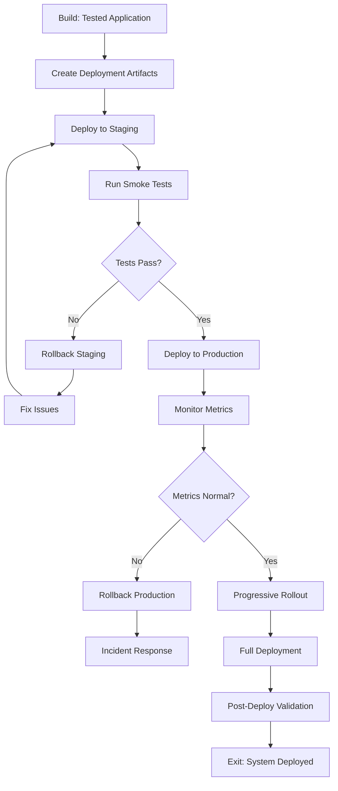

# Phase 05: Deploy

The release phase where tested and validated code is deployed to production with proper monitoring, documentation, and rollback procedures.

## Purpose

The Deploy phase takes the thoroughly tested application from the Build phase and releases it to production environments. This phase emphasizes automation, observability, and reliability, ensuring smooth deployments with minimal downtime and quick recovery options.

## Key Principle

**Deployment is Repeatable**: Every deployment should be automated, monitored, and reversible. The same process that deploys to staging must deploy to production, ensuring consistency and reliability.

## Workflow Principles

This phase operates under the HELIX workflow principles, emphasizing:

- **Automated Deployment**: Infrastructure as code, CI/CD pipelines, zero-downtime deployments
- **Progressive Rollout**: Canary deployments, feature flags, gradual traffic shifting
- **Observability First**: Comprehensive monitoring before, during, and after deployment
- **Human-AI Collaboration**: Humans make go/no-go decisions; AI assists with automation and analysis
- **Iterative Improvement**: Each deployment teaches lessons for the next cycle

Deployment is not just about moving code to production—it's about doing so safely, observably, and repeatably.

## Input Gates

Prerequisites to enter this phase (defined in `input-gates.yml`):

1. **All tests passing**
   - Requirement: Unit, integration, and E2E tests all green
   - Validation: `npm test` or `go test ./...` shows 100% pass rate
   - Source: 04-build phase

2. **Performance validated**
   - Requirement: Performance tests meet defined thresholds
   - Validation: Load test results within SLA requirements
   - Source: 04-build phase

3. **Security scan completed**
   - Requirement: No critical or high vulnerabilities
   - Validation: Security audit passes (`npm audit`, SAST tools)
   - Source: 04-build phase

4. **Documentation updated**
   - Requirement: API docs, README, and changelog current
   - Validation: Documentation review completed
   - Source: 04-build phase

These gates ensure only production-ready code proceeds to deployment.

## Process Flow



## Work Items

### Artifacts (Template-Based Outputs)

#### 1. Deployment Checklist
**Artifact Location**: `artifacts/deployment-checklist/`
**Output Location**: `docs/helix/05-deploy/deployment-checklist.md`

Comprehensive pre-flight checklist:
- Code readiness verification
- Configuration validation
- Dependency checks
- Communication plan
- Rollback procedures
- Go/no-go decision criteria

#### 2. Monitoring Setup
**Artifact Location**: `artifacts/monitoring-setup/`
**Output Location**: `docs/helix/05-deploy/monitoring-setup.md`

Observability configuration:
- Metrics and dashboards
- Alert rules and thresholds
- Log aggregation setup
- Distributed tracing
- SLI/SLO definitions
- On-call procedures

#### 3. Security Monitoring Setup
**Artifact Location**: `artifacts/security-monitoring/`
**Output Location**: `docs/helix/05-deploy/security-monitoring.md`

Production security monitoring configuration:
- **SIEM integration and security event collection**
- **Real-time security alerts and threat detection**
- **Compliance monitoring and audit trail setup**
- **Incident response procedures and escalation**
- **Vulnerability monitoring and patch management**
- **Access monitoring and suspicious activity detection**

#### 4. Runbook
**Artifact Location**: `artifacts/runbook/`
**Output Location**: `docs/helix/05-deploy/runbook.md`

Operational procedures:
- Deployment steps
- Rollback procedures
- Common issues and fixes
- Escalation paths
- Emergency contacts
- Disaster recovery

## Artifact Metadata

Each artifact can include a `meta.yml` file that defines:
- **Dependencies**: Links to Build artifacts that inform deployment
- **Environment Variables**: Configuration needed for deployment
- **Validation Rules**: Checks for deployment readiness
- **Rollback Triggers**: Conditions that trigger automatic rollback
- **Monitoring Thresholds**: Metrics that indicate health

### Actions (Prompt-Only Operations)

#### 1. Deploy to Staging
**Action Location**: `actions/deploy-to-staging/`

Execute staging deployment:
- Build and package application
- Deploy to staging environment
- Run smoke tests
- Verify monitoring
- Load test if needed

#### 2. Deploy to Production
**Action Location**: `actions/deploy-to-production/`

Execute production deployment:
- Blue-green or canary deployment
- Progressive traffic shifting
- Health check validation
- Metrics monitoring
- Rollback if needed

#### 3. Configure Monitoring
**Action Location**: `actions/configure-monitoring/`

Set up observability:
- Deploy monitoring agents
- Configure dashboards
- Set up alerts
- Test alert channels
- Document escalation

#### 4. Rollback Deployment
**Action Location**: `actions/rollback-deployment/`

Emergency rollback procedures:
- Identify rollback point
- Execute rollback
- Verify system stability
- Document incident
- Post-mortem preparation

#### 5. Smoke Test
**Action Location**: `actions/smoke-test/`

Post-deployment validation:
- Critical path testing
- API endpoint checks
- Database connectivity
- External service integration
- Performance baseline

## Deployment Strategies

### Blue-Green Deployment
- Maintain two identical environments
- Deploy to inactive environment
- Switch traffic after validation
- Keep old environment for quick rollback

### Canary Deployment
- Deploy to small percentage of servers
- Monitor error rates and performance
- Gradually increase traffic
- Full rollout or rollback based on metrics

### Rolling Deployment
- Update servers incrementally
- Maintain service availability
- Monitor each batch
- Pause or rollback on issues

### Feature Flags
- Deploy code with features disabled
- Enable features progressively
- A/B testing capabilities
- Quick feature rollback without deployment

## Human vs AI Responsibilities

### Human Responsibilities
- **Go/No-Go Decisions**: Final deployment approval
- **Risk Assessment**: Evaluate deployment timing and impact
- **Incident Response**: Handle production issues
- **Stakeholder Communication**: Coordinate with teams
- **Business Validation**: Verify features work as intended

### AI Assistant Responsibilities
- **Automation Scripts**: Generate deployment scripts
- **Configuration Management**: Manage environment configs
- **Monitoring Setup**: Configure dashboards and alerts
- **Documentation**: Generate runbooks and procedures
- **Pattern Recognition**: Identify deployment risks

## Quality Gates

Before marking deployment complete:

### Pre-Deployment Checks
- [ ] All tests passing in CI/CD
- [ ] Security scans completed
- [ ] Performance benchmarks met
- [ ] Documentation updated
- [ ] Rollback plan tested

### Deployment Validation
- [ ] Staging deployment successful
- [ ] Smoke tests passing
- [ ] Monitoring active
- [ ] Alerts configured
- [ ] Load tests passing (if required)

### Post-Deployment Verification
- [ ] Production smoke tests passing
- [ ] Key metrics within normal range
- [ ] No critical alerts firing
- [ ] User journeys working
- [ ] Rollback tested and ready

## Common Pitfalls

### ❌ Avoid These Mistakes

1. **Deploying Without Monitoring**
   - Bad: Deploy first, add monitoring later
   - Good: Monitoring ready before deployment

2. **No Rollback Plan**
   - Bad: Figure out rollback when needed
   - Good: Test rollback procedure in staging

3. **Big Bang Deployments**
   - Bad: Deploy everything at once
   - Good: Progressive rollout with monitoring

4. **Manual Deployment Steps**
   - Bad: Follow wiki for deployment
   - Good: Fully automated deployment pipeline

5. **Ignoring Non-Functional Requirements**
   - Bad: Focus only on features
   - Good: Validate performance, security, accessibility

## Exit Criteria

The Deploy phase is complete and Iterate phase can begin when:

1. **Application Deployed**: Code running in production
   - Validation: Health checks passing
2. **Monitoring Active**: All dashboards and alerts configured
   - Validation: Test alert fired and received
3. **Documentation Complete**: Runbooks and procedures updated
   - Validation: Team review completed
4. **Performance Validated**: Meets SLA requirements
   - Validation: Load test results acceptable
5. **Rollback Ready**: Can quickly revert if needed
   - Validation: Rollback tested in staging
6. **Stakeholders Notified**: Release communicated
   - Validation: Release notes published

## Next Phase: Iterate

Once Deploy phase completes, proceed to Iterate where you'll:
- Collect user feedback
- Analyze production metrics
- Identify improvements
- Plan next iteration
- Update documentation

Remember: Deployment is not the end—it's the beginning of learning from real users!

## Infrastructure as Code

### Configuration Management
```yaml
# deployment.yml
environments:
  staging:
    replicas: 2
    resources:
      cpu: 500m
      memory: 512Mi
    autoscaling:
      min: 2
      max: 4

  production:
    replicas: 4
    resources:
      cpu: 1000m
      memory: 1Gi
    autoscaling:
      min: 4
      max: 20
```

### CI/CD Pipeline
```yaml
# .github/workflows/deploy.yml
deploy:
  staging:
    - build
    - test
    - deploy-staging
    - smoke-test
    - approval-gate

  production:
    - deploy-canary (10%)
    - monitor (5m)
    - deploy-canary (50%)
    - monitor (10m)
    - deploy-full
    - smoke-test
```

## Monitoring and Observability

### Key Metrics
- **Availability**: Uptime percentage
- **Latency**: Response time percentiles
- **Traffic**: Requests per second
- **Errors**: Error rate and types
- **Saturation**: Resource utilization

### Alert Priorities
- **P1 (Critical)**: Service down, data loss risk
- **P2 (High)**: Degraded performance, partial outage
- **P3 (Medium)**: Non-critical errors, approaching limits
- **P4 (Low)**: Informational, trends

## Tips for Success

1. **Automate Everything**: Manual steps lead to errors
2. **Monitor Before Deploy**: Observability first
3. **Practice Rollbacks**: Test them regularly
4. **Communicate Clearly**: Keep stakeholders informed
5. **Learn from Incidents**: Blameless post-mortems
6. **Progressive Rollout**: Start small, expand gradually
7. **Feature Flags**: Separate deployment from release

## Using AI Assistance

When working with AI assistants during Deploy:

```bash
# Generate deployment scripts
ddx apply prompts/helix/deploy/deployment-scripts

# Create monitoring configuration
ddx apply prompts/helix/deploy/monitoring-setup

# Generate runbook
ddx apply prompts/helix/deploy/runbook

# Create rollback procedures
ddx apply actions/helix/deploy/rollback-procedures
```

AI excels at generating deployment automation, monitoring configurations, and documentation, but human judgment is critical for go/no-go decisions and incident response.

## File Organization

### Structure Overview
- **Deployment Definitions**: `workflows/helix/phases/05-deploy/`
  - Templates and prompts for deployment artifacts
  - Action definitions for deployment tasks

- **Generated Artifacts**: `docs/`
  - `docs/deployment/` - Deployment checklists and procedures
  - `docs/monitoring/` - Monitoring setup and dashboards
  - `docs/operations/` - Runbooks and operational docs

This separation keeps deployment templates reusable while organizing operational documentation logically.

---

*Deployment is where preparation meets production. Do it right, and users never notice. Do it wrong, and everyone knows.*