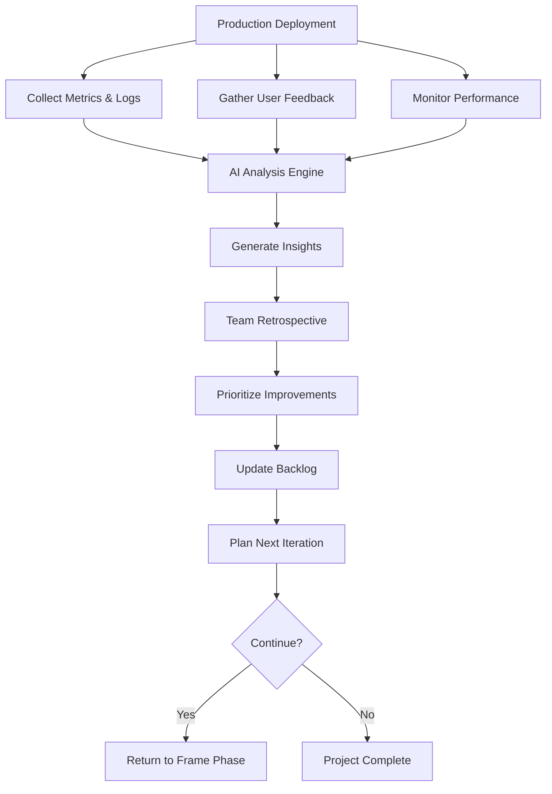

# Phase 06: Iterate

The continuous learning phase where production insights, user feedback, and team experiences transform into actionable improvements for the next cycle.

## Purpose

The Iterate phase closes the HELIX loop by systematically capturing learnings from production deployment and user interaction. This phase emphasizes data-driven decision making, AI-assisted pattern recognition, and continuous improvement. Every iteration makes the next cycle more efficient, higher quality, and better aligned with user needs.

## Key Principle

**Learn, Adapt, Evolve**: Every deployment teaches valuable lessons. Through AI-powered analysis of metrics, feedback, and experiences, we identify patterns, predict issues, and continuously improve both the product and the process.

## Workflow Principles

This phase embodies the HELIX workflow's commitment to:

- **Continuous Learning**: Every data point contributes to organizational knowledge
- **AI-Powered Insights**: Machine learning identifies patterns humans might miss
- **Predictive Improvement**: Anticipate issues before they become problems
- **Human-AI Synthesis**: Combine human intuition with AI analysis
- **Feedback Loop Closure**: Learnings directly influence the next Frame phase

The Iterate phase transforms HELIX from a linear process into a true spiral of continuous improvement.

## Input Gates

Prerequisites to enter this phase (defined in `input-gates.yml`):

1. **System deployed to production**
   - Requirement: Application running in production environment
   - Validation: Health checks passing, monitoring active
   - Source: 05-deploy phase

2. **Monitoring and observability active**
   - Requirement: Metrics, logs, and traces being collected
   - Validation: Dashboards populated with real data
   - Source: 05-deploy phase

3. **Initial user interaction**
   - Requirement: Sufficient usage to generate meaningful data
   - Validation: Minimum threshold of user actions/time passed
   - Source: Production environment

4. **Team availability for retrospective**
   - Requirement: Core team members available for review
   - Validation: Retrospective scheduled and confirmed
   - Source: Team calendar

These gates ensure meaningful data exists for analysis and learning extraction.

## Process Flow



## Work Items

### Artifacts (Template-Based Outputs)

All artifacts for this phase are located in the `artifacts/` directory. Each artifact includes:
- **Templates**: Structure for capturing and organizing learnings
- **Prompts**: AI assistance for analysis and insight generation
- **Examples**: Reference implementations demonstrating best practices

#### 1. Metrics Dashboard
**Artifact Location**: `artifacts/metrics-dashboard/`
**Output Location**: `docs/helix/06-iterate/metrics-dashboard.md`

Real-time KPI tracking with AI anomaly detection:
- Business metrics vs. targets
- Technical performance indicators
- User engagement analytics
- Cost and efficiency metrics
- Anomaly detection and alerts
- Trend analysis and predictions

**AI Capabilities**:
- Automatic anomaly detection
- Correlation analysis between metrics
- Predictive trend forecasting
- Alert threshold optimization

#### 2. Feedback Analysis
**Artifact Location**: `artifacts/feedback-analysis/`
**Output Location**: `docs/helix/06-iterate/feedback-analysis.md`

Synthesized user feedback with sentiment analysis:
- User feedback aggregation
- Sentiment scoring and trends
- Feature request patterns
- Pain point identification
- User journey insights
- Competitive feedback analysis

**AI Capabilities**:
- Natural language processing for feedback
- Sentiment trend analysis
- Topic clustering and categorization
- Priority scoring based on impact

#### 3. Performance Insights
**Artifact Location**: `artifacts/performance-insights/`
**Output Location**: `docs/helix/06-iterate/performance-insights.md`

System performance analysis and optimization opportunities:
- Response time analysis
- Resource utilization patterns
- Scalability bottlenecks
- Database query performance
- API endpoint analysis
- Infrastructure cost optimization

**AI Capabilities**:
- Performance regression detection
- Capacity planning predictions
- Optimization recommendations
- Cost-performance trade-off analysis

#### 4. Lessons Learned
**Artifact Location**: `artifacts/lessons-learned/`
**Output Location**: `docs/helix/06-iterate/lessons-learned.md`

Knowledge capture and pattern recognition:
- What worked well
- What didn't work
- Unexpected discoveries
- Process improvements
- Technical debt identified
- Team skill gaps discovered

**AI Capabilities**:
- Pattern recognition across iterations
- Success factor analysis
- Risk prediction for future work
- Knowledge graph construction

#### 5. Improvement Backlog
**Artifact Location**: `artifacts/improvement-backlog/`
**Output Location**: `docs/helix/06-iterate/improvement-backlog.md`

Prioritized list of improvements with impact analysis:
- Feature enhancements
- Bug fixes and issues
- Technical debt items
- Process improvements
- Infrastructure upgrades
- Documentation updates

**AI Capabilities**:
- Impact vs. effort analysis
- Dependency identification
- Risk assessment
- ROI prediction

#### 6. Retrospective
**Artifact Location**: `artifacts/retrospective/`
**Output Location**: `docs/helix/06-iterate/retrospective.md`

Team reflection and process improvement:
- Sprint/iteration review
- Team health metrics
- Process effectiveness
- Communication assessment
- Tool and technology review
- Action items for improvement

**AI Capabilities**:
- Meeting transcript analysis
- Sentiment tracking over time
- Action item tracking
- Team dynamics insights

#### 7. Incident Review
**Artifact Location**: `artifacts/incident-review/`
**Output Location**: `docs/helix/06-iterate/incidents/INC-XXX-[title].md`

Post-incident analysis and prevention:
- Incident timeline
- Root cause analysis (5 Whys)
- Impact assessment
- Response effectiveness
- Prevention measures
- Process improvements

**AI Capabilities**:
- Pattern matching with past incidents
- Root cause suggestion
- Prevention strategy generation
- Risk scoring for recurrence

#### 8. Iteration Planning
**Artifact Location**: `artifacts/iteration-planning/`
**Output Location**: `docs/helix/06-iterate/next-iteration.md`

Strategic planning for the next cycle:
- Priority features for next iteration
- Technical improvements needed
- Process changes to implement
- Team capacity and allocation
- Success metrics for next cycle
- Risk mitigation strategies

**AI Capabilities**:
- Capacity planning optimization
- Risk-adjusted prioritization
- Success probability scoring
- Resource allocation recommendations

#### 9. Security Metrics and Analysis
**Artifact Location**: `artifacts/security-metrics/`
**Output Location**: `docs/helix/06-iterate/security-metrics.md`

Security posture monitoring and improvement tracking:
- **Security incident response metrics (MTTD, MTTR)**
- **Vulnerability management and remediation tracking**
- **Compliance monitoring and audit findings analysis**
- **Security training effectiveness and awareness metrics**
- **Threat landscape analysis and defense effectiveness**
- **Security improvement backlog prioritization and planning**

**AI Capabilities**:
- Security trend analysis and pattern recognition
- Threat correlation and risk assessment
- Automated compliance monitoring and reporting
- Security control effectiveness measurement

## Artifact Metadata

Each artifact directory includes a `meta.yml` file that defines:
- **Data Sources**: Metrics, logs, feedback channels
- **Analysis Frequency**: Real-time, daily, weekly, per-iteration
- **AI Models Used**: Specific ML models for analysis
- **Automation Level**: Full, semi, or manual processing
- **Integration Points**: How insights feed back into workflow


## Human vs AI Responsibilities

### Human Responsibilities
- **Strategic Decisions**: Determine product direction
- **Stakeholder Communication**: Manage expectations and relationships
- **Creative Problem Solving**: Innovate solutions to complex issues
- **Team Morale**: Maintain team health and motivation
- **Final Prioritization**: Make trade-off decisions

### AI Assistant Responsibilities
- **Data Analysis**: Process large volumes of metrics and logs
- **Pattern Recognition**: Identify trends and correlations
- **Anomaly Detection**: Alert on unusual patterns
- **Prediction**: Forecast future issues and opportunities
- **Report Generation**: Synthesize insights into actionable reports
- **Recommendation Engine**: Suggest improvements based on data

## Quality Gates

Before proceeding to the next Frame phase, ensure:

### Analysis Completeness
- [ ] All production metrics analyzed
- [ ] User feedback synthesized
- [ ] Performance baselines established
- [ ] Incidents reviewed and documented
- [ ] Team retrospective completed

### Learning Extraction
- [ ] Patterns identified across data sources
- [ ] Lessons learned documented
- [ ] Success factors understood
- [ ] Failure modes analyzed
- [ ] Knowledge base updated

### Planning Readiness
- [ ] Improvement backlog prioritized
- [ ] Next iteration goals defined
- [ ] Resource allocation planned
- [ ] Risk mitigation strategies identified
- [ ] Success metrics established

## Common Pitfalls

### ❌ Avoid These Mistakes

1. **Analysis Paralysis**
   - Bad: Endless analysis without action
   - Good: Time-boxed analysis with clear decisions

2. **Ignoring Negative Feedback**
   - Bad: Cherry-picking positive metrics
   - Good: Honest assessment of all feedback

3. **Skipping Retrospectives**
   - Bad: Moving to next iteration without reflection
   - Good: Dedicated time for team learning

4. **Over-Reacting to Anomalies**
   - Bad: Major pivots based on outliers
   - Good: Statistical significance before changes

5. **Knowledge Silos**
   - Bad: Learnings stay with individuals
   - Good: Documented, shared knowledge base

## Success Criteria

The Iterate phase is complete when:

1. **Data Analyzed**: All metrics, logs, and feedback processed
2. **Insights Generated**: Clear learnings extracted from data
3. **Improvements Identified**: Prioritized backlog of enhancements
4. **Team Aligned**: Retrospective completed with action items
5. **Next Cycle Planned**: Clear goals for next iteration
6. **Knowledge Captured**: Learnings documented for future reference

## Continuous Improvement Metrics

Track these metrics across iterations to measure improvement:

### Product Metrics
- **User Satisfaction**: NPS, CSAT trends
- **Performance**: Response time improvements
- **Quality**: Defect rates, incident frequency
- **Adoption**: User growth, feature usage

### Process Metrics
- **Velocity**: Story points per iteration
- **Cycle Time**: Frame to Deploy duration
- **Defect Escape Rate**: Bugs found in production
- **Automation Coverage**: % of automated tests/deployments

### Team Metrics
- **Team Health**: Satisfaction and engagement
- **Knowledge Sharing**: Documentation quality
- **Skill Development**: New capabilities acquired
- **Collaboration**: Cross-functional effectiveness

## AI-Powered Analysis Tools

Leverage these AI capabilities during Iterate:

### Automated Analysis
```bash
# Generate comprehensive metrics analysis
ddx apply prompts/helix/iterate/metrics-analysis

# Synthesize user feedback with sentiment
ddx apply prompts/helix/iterate/feedback-synthesis

# Identify performance optimization opportunities
ddx apply prompts/helix/iterate/performance-optimization

# Extract lessons learned from iteration
ddx apply prompts/helix/iterate/lessons-extraction
```

### Predictive Insights
```bash
# Predict potential issues in next iteration
ddx apply prompts/helix/iterate/risk-prediction

# Forecast capacity needs
ddx apply prompts/helix/iterate/capacity-planning

# Identify technical debt impact
ddx apply prompts/helix/iterate/debt-analysis
```

## Integration with Next Cycle

The Iterate phase outputs directly influence the next Frame phase:

### Feedback → Requirements
- User feedback becomes new user stories
- Performance issues become NFRs
- Feature requests become product requirements

### Learnings → Design
- Technical lessons inform architecture decisions
- Performance insights guide optimization
- Security findings strengthen design

### Metrics → Success Criteria
- Current baselines become future targets
- Trend analysis sets realistic goals
- Cost data influences scope decisions

## Tips for Success

1. **Automate Data Collection**: Set up comprehensive monitoring before deployment
2. **Regular Analysis Cadence**: Don't wait until iteration end to analyze
3. **Cross-Functional Participation**: Include all roles in retrospectives
4. **Action-Oriented Insights**: Every learning should have an action
5. **Celebrate Successes**: Recognize what worked well
6. **Fail Fast, Learn Faster**: Treat failures as learning opportunities
7. **Document Everything**: Future you will thank current you

## Using AI Assistance

When working with AI assistants during Iterate:

```bash
# Comprehensive iteration analysis
ddx workflow iterate analyze --comprehensive

# Generate improvement recommendations
ddx workflow iterate recommend --priority high

# Create next iteration plan
ddx workflow iterate plan --based-on learnings

# Update knowledge base
ddx workflow iterate knowledge --update
```

The AI excels at pattern recognition and data synthesis but human judgment is essential for strategic decisions and priority setting.


## File Organization

### Structure Overview
- **Analysis Artifacts**: `workflows/helix/phases/06-iterate/artifacts/`
  - Templates for capturing and analyzing learnings
  - Prompts for AI-assisted insight generation

- **Generated Insights**: `docs/helix/06-iterate/`
  - Completed analyses and reports
  - Lessons learned documentation
  - Planning documents for next iteration

This separation keeps analysis templates reusable while organizing insights where they're most valuable for the team.

---

*The Iterate phase transforms each ending into a new beginning, ensuring every cycle builds on the learnings of the last. This is where the HELIX spiral ascends.*