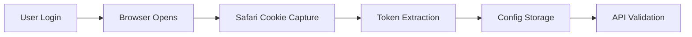
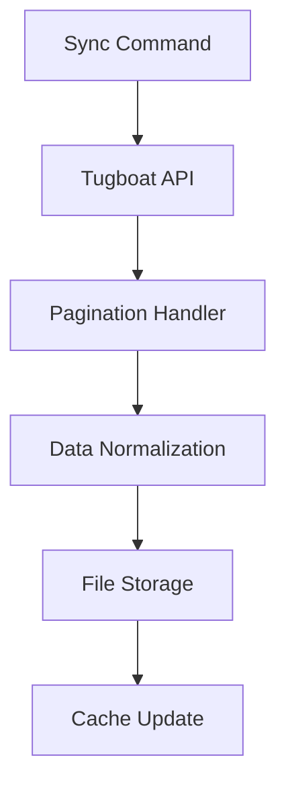
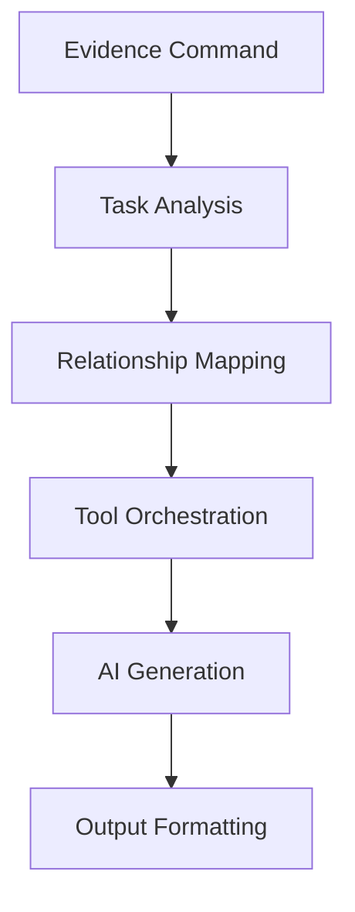
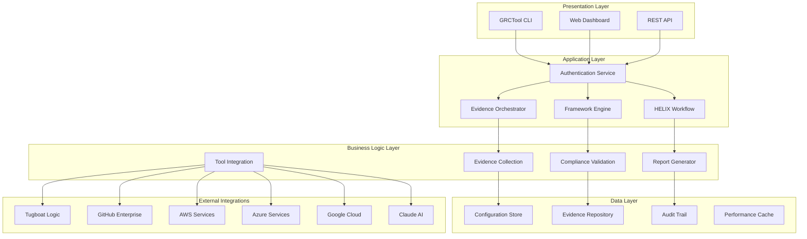

# System Architecture and Design

## Architecture Overview

GRCTool is a Go-based CLI application designed for SOC2 compliance evidence collection and management. The system follows a modular, layered architecture with clear separation of concerns and security-first design principles.

### High-Level Architecture

```
┌─────────────────────────────────────────────────────────────┐
│                     CLI Interface (Cobra)                   │
├─────────────────────────────────────────────────────────────┤
│                    Command Layer (cmd/)                     │
├─────────────────────────────────────────────────────────────┤
│              Application Services (internal/)               │
│  ┌─────────────┐ ┌─────────────┐ ┌─────────────┐          │
│  │   Domain    │ │  Evidence   │ │   Config    │          │
│  │   Models    │ │ Generation  │ │ Management  │          │
│  └─────────────┘ └─────────────┘ └─────────────┘          │
├─────────────────────────────────────────────────────────────┤
│                Infrastructure Layer                         │
│  ┌─────────────┐ ┌─────────────┐ ┌─────────────┐          │
│  │   Storage   │ │   External  │ │   Logging   │          │
│  │   Layer     │ │    APIs     │ │ & Security  │          │
│  └─────────────┘ └─────────────┘ └─────────────┘          │
└─────────────────────────────────────────────────────────────┘
```

## Technology Stack

### Core Technologies
- **Language**: Go 1.24+
- **CLI Framework**: [Cobra](https://cobra.dev/) for command structure and flags
- **Configuration**: [Viper](https://github.com/spf13/viper) with YAML + environment variables
- **HTTP Client**: Standard `net/http` with custom transport layer
- **Logging**: [zerolog](https://github.com/rs/zerolog) for structured logging

### Key Libraries
```go
// Core dependencies
github.com/spf13/cobra         // CLI commands and flags
github.com/spf13/viper         // Configuration management
github.com/rs/zerolog          // Structured logging
github.com/google/uuid         // ID generation
gopkg.in/yaml.v3              // YAML parsing

// Testing and quality
github.com/stretchr/testify    // Testing framework
go.uber.org/goleak            // Goroutine leak detection
```

## Project Structure

### Directory Organization

```
grctool/
├── cmd/                      # CLI commands
│   ├── root.go              # Root command and global flags
│   ├── auth/                # Authentication commands
│   ├── sync/                # Data synchronization
│   ├── evidence/            # Evidence collection
│   ├── config/              # Configuration management
│   └── debug/               # Debug and diagnostics
├── internal/                # Private application code
│   ├── auth/                # Authentication providers
│   ├── claude/              # AI integration
│   ├── config/              # Configuration management
│   ├── domain/              # Domain models
│   ├── evidence/            # Evidence orchestration
│   ├── formatters/          # Output formatting
│   ├── logger/              # Logging infrastructure
│   ├── storage/             # Data persistence
│   ├── tools/               # Evidence collection tools
│   ├── tugboat/            # Tugboat API client
│   └── vcr/                # HTTP recording for tests
├── configs/                 # Configuration examples
├── docs/                   # Documentation
└── test/                   # Test infrastructure
```

### Package Responsibilities

#### Command Layer (`cmd/`)
- **Purpose**: CLI interface and user interaction
- **Responsibilities**:
  - Command definition and parsing
  - Flag validation and help text
  - Input/output formatting
  - Error handling and user feedback

#### Domain Layer (`internal/domain/`, `internal/models/`)
- **Purpose**: Core business entities and rules
- **Key Models**:
  ```go
  type EvidenceTask struct {
      ID               string    `json:"id"`
      Name             string    `json:"name"`
      Description      string    `json:"description"`
      FrameworkID      string    `json:"framework_id"`
      Controls         []Control `json:"controls"`
      Status           string    `json:"status"`
      CollectionMethod string    `json:"collection_method"`
      Evidence         []Evidence `json:"evidence"`
  }

  type Control struct {
      ID          string   `json:"id"`
      Name        string   `json:"name"`
      Framework   string   `json:"framework"`
      Description string   `json:"description"`
      Policies    []Policy `json:"policies"`
  }

  type Policy struct {
      ID          string `json:"id"`
      Name        string `json:"name"`
      Description string `json:"description"`
      Content     string `json:"content"`
  }
  ```

#### Application Services (`internal/services/`)
- **Evidence Service**: Orchestrates evidence collection workflows
- **Config Service**: Manages application configuration
- **Validation Service**: Validates data integrity and business rules

## Design Patterns

### Repository Pattern
```go
type EvidenceRepository interface {
    GetTask(id string) (*models.EvidenceTask, error)
    SaveTask(task *models.EvidenceTask) error
    ListTasks(filter TaskFilter) ([]*models.EvidenceTask, error)
}

type FileEvidenceRepository struct {
    basePath string
    cache    map[string]*models.EvidenceTask
}
```

### Factory Pattern
```go
type ToolFactory interface {
    CreateTool(toolType string, config ToolConfig) (Tool, error)
}

type Tool interface {
    Execute(context.Context, ToolRequest) (*ToolResponse, error)
    Validate(ToolRequest) error
    GetMetadata() ToolMetadata
}
```

### Strategy Pattern
```go
type AuthProvider interface {
    Authenticate(ctx context.Context) (*AuthResult, error)
    IsAuthenticated() bool
    GetToken() (string, error)
}

type GitHubAuthProvider struct{ /* implementation */ }
type TugboatAuthProvider struct{ /* implementation */ }
```

### Command Pattern
```go
type Command interface {
    Execute(ctx context.Context) error
    Validate() error
    GetName() string
}

type SyncCommand struct {
    tugboatClient *tugboat.Client
    storage       storage.Repository
}
```

## Data Flow Architecture

### 1. Authentication Flow


### 2. Sync Flow


### 3. Evidence Generation Flow


## Infrastructure Layer

### Storage Architecture (`internal/storage/`)
- **File Storage**: JSON-based document storage
- **Cache Management**: Raw data caching for performance
- **Directory Structure**:
  ```
  docs/
  ├── evidence_tasks/      # ET-####-######-name.json
  ├── controls/           # XX-##[_#]-######-name.json
  ├── policies/           # POL-####-######-name.json
  └── evidence_prompts/   # Generated prompts

  docs/.cache/            # Raw API responses
  ├── tugboat/           # Tugboat API cache
  └── vcr_cassettes/     # Test recordings
  ```

### External APIs (`internal/tugboat/`, `internal/claude/`)
- **Tugboat Client**: SOC2 compliance platform integration
- **Claude Client**: AI-powered evidence generation
- **HTTP Layer**: Retry logic, rate limiting, authentication

### Authentication (`internal/auth/`)
- **Browser-based Auth**: Safari cookie capture for Tugboat
- **Token Management**: GitHub and Claude API tokens
- **Security**: Credential storage and validation

## Security Architecture

### Security Design Principles
1. **Zero Trust**: Assume no implicit trust; verify everything
2. **Least Privilege**: Grant minimum necessary permissions
3. **Defense in Depth**: Multiple layers of security controls
4. **Fail Secure**: Default to secure state on failures
5. **Security by Design**: Build security in from the start

### Authentication Security
- **No Stored API Keys**: Browser-based authentication preferred
- **Token Rotation**: Automatic refresh when possible
- **Credential Isolation**: Separate storage per service

### Data Security
- **Local Storage**: No cloud data transmission unless required
- **Log Redaction**: Sensitive fields automatically masked
- **URL Sanitization**: Remove auth parameters from logs

### Supply Chain Security
- **Dependency Scanning**: Regular `go mod` vulnerability checks
- **Pre-commit Hooks**: Code quality and security validation
- **Minimal Dependencies**: Prefer standard library when possible

## Performance Architecture

### Caching Strategy
- **File-based Cache**: Raw API responses for offline development
- **In-memory Cache**: Frequently accessed configuration
- **TTL Management**: Configurable expiration policies

### Concurrency Patterns
```go
// Worker pool for concurrent operations
func processItemsConcurrently(items []Item, workers int) error {
    semaphore := make(chan struct{}, workers)
    var wg sync.WaitGroup

    for _, item := range items {
        wg.Add(1)
        go func(item Item) {
            defer wg.Done()
            semaphore <- struct{}{}
            defer func() { <-semaphore }()

            processItem(item)
        }(item)
    }

    wg.Wait()
    return nil
}
```

### Memory Management
- **Streaming**: Process large files without loading into memory
- **Pooling**: Reuse expensive objects
- **Garbage Collection**: Minimize allocations in hot paths

## Error Handling Architecture

### Error Types
```go
type AppError struct {
    Code    string `json:"code"`
    Message string `json:"message"`
    Details map[string]interface{} `json:"details,omitempty"`
    Cause   error  `json:"-"`
}

func (e *AppError) Error() string {
    return fmt.Sprintf("[%s] %s", e.Code, e.Message)
}
```

### Error Categories
- **ConfigError**: Configuration validation failures
- **AuthError**: Authentication/authorization issues
- **NetworkError**: API connectivity problems
- **ValidationError**: Data validation failures
- **StorageError**: File system operations

### Error Propagation
1. **Capture Context**: Wrap errors with relevant information
2. **Log Appropriately**: Different levels based on severity
3. **User-Friendly**: Convert technical errors to actionable messages
4. **Recovery**: Graceful degradation when possible

## Extension Points

### Tool Plugin Architecture
```go
type ToolPlugin interface {
    Tool
    GetSchema() ToolSchema
    ValidateConfig(config map[string]interface{}) error
}

type ToolRegistry struct {
    tools map[string]ToolPlugin
}

func (r *ToolRegistry) Register(name string, tool ToolPlugin) {
    r.tools[name] = tool
}
```

### Output Formatters
```go
type OutputFormatter interface {
    Format(data interface{}) ([]byte, error)
    GetMimeType() string
    GetFileExtension() string
}

// Implementations: JSONFormatter, CSVFormatter, MarkdownFormatter
```

### Authentication Providers
```go
type AuthProviderFactory func(config AuthConfig) (AuthProvider, error)

var authProviders = map[string]AuthProviderFactory{
    "github":  NewGitHubProvider,
    "tugboat": NewTugboatProvider,
}
```

## Monitoring and Observability

### Structured Logging
```go
log.Info().
    Str("component", "tugboat").
    Str("operation", "sync").
    Int("records", count).
    Dur("duration", elapsed).
    Msg("Sync completed successfully")
```

### Metrics Collection
- **Performance Metrics**: Request duration, memory usage
- **Business Metrics**: Evidence collection counts, error rates
- **System Metrics**: File sizes, cache hit rates

### Health Checks
```go
type HealthChecker interface {
    Check(ctx context.Context) HealthStatus
}

type HealthStatus struct {
    Service string `json:"service"`
    Status  string `json:"status"`
    Details map[string]interface{} `json:"details"`
}
```

## Future Architecture Considerations

### Planned Enhancements
1. **Plugin System**: External tool integrations
2. **Event System**: Pub/sub for workflow orchestration
3. **API Server**: REST API for programmatic access
4. **Database Support**: Optional database backend for large deployments

### Scalability Patterns
1. **Horizontal Scaling**: Multiple worker instances
2. **Caching Layer**: Redis/Memcached for shared cache
3. **Queue System**: Background job processing
4. **Load Balancing**: Distribute evidence generation workload

### Technology Evolution
1. **Go Modules**: Keep dependencies current
2. **Cloud Native**: Container and Kubernetes support
3. **Observability**: OpenTelemetry integration
4. **Security**: Regular security audits and updates

## GRC Compliance Tool Reference Architecture

### Enterprise Compliance Architecture Pattern

#### Multi-Tenant GRC Platform Architecture


#### Component Integration Patterns

##### Pattern 1: Evidence Collection Hub
```go
// Central evidence orchestration pattern
type EvidenceHub struct {
    collectors map[string]EvidenceCollector
    validators []EvidenceValidator
    storage    EvidenceStorage
    scheduler  TaskScheduler
}

type EvidenceCollector interface {
    CollectEvidence(ctx context.Context, task EvidenceTask) (*Evidence, error)
    GetCapabilities() CollectorCapabilities
    ValidateConfiguration() error
}

// Example implementation for infrastructure evidence
type TerraformCollector struct {
    scanner    *terraform.Scanner
    validator  *terraform.Validator
    formatter  *terraform.Formatter
}

func (tc *TerraformCollector) CollectEvidence(ctx context.Context, task EvidenceTask) (*Evidence, error) {
    // 1. Scan infrastructure configuration
    resources, err := tc.scanner.ScanDirectory(task.SourcePath)
    if err != nil {
        return nil, fmt.Errorf("terraform scan failed: %w", err)
    }

    // 2. Validate against security policies
    violations, err := tc.validator.ValidateResources(resources, task.Policies)
    if err != nil {
        return nil, fmt.Errorf("validation failed: %w", err)
    }

    // 3. Format evidence for compliance framework
    evidence := &Evidence{
        TaskID:       task.ID,
        CollectedAt:  time.Now(),
        Resources:    resources,
        Violations:   violations,
        Compliance:   tc.assessCompliance(violations),
    }

    return evidence, nil
}
```

##### Pattern 2: Multi-Framework Compliance Engine
```go
// Framework-agnostic compliance validation
type ComplianceEngine struct {
    frameworks map[string]ComplianceFramework
    mappings   ControlMappingRegistry
    evaluator  ComplianceEvaluator
}

type ComplianceFramework interface {
    GetControls() []Control
    ValidateEvidence(evidence Evidence, control Control) ComplianceResult
    GenerateReport(results []ComplianceResult) Report
}

// SOC2 framework implementation
type SOC2Framework struct {
    trustCriteria  []TrustServicesCriteria
    controlMatrix  ControlMatrix
    evidenceRules  EvidenceRules
}

func (f *SOC2Framework) ValidateEvidence(evidence Evidence, control Control) ComplianceResult {
    result := ComplianceResult{
        ControlID:   control.ID,
        Framework:   "SOC2",
        EvidenceID:  evidence.ID,
        Timestamp:   time.Now(),
    }

    // Apply SOC2-specific validation rules
    for _, rule := range f.evidenceRules.GetRulesForControl(control.ID) {
        if violation := rule.Evaluate(evidence); violation != nil {
            result.Violations = append(result.Violations, *violation)
        }
    }

    result.Status = f.determineComplianceStatus(result.Violations)
    return result
}
```

##### Pattern 3: Secure Tool Integration
```go
// Secure external tool integration pattern
type SecureToolClient struct {
    httpClient   *http.Client
    auth        AuthProvider
    rateLimiter RateLimiter
    circuitBreaker CircuitBreaker
    logger      Logger
}

func NewSecureToolClient(config ToolConfig) (*SecureToolClient, error) {
    // Configure TLS with certificate pinning
    tlsConfig := &tls.Config{
        MinVersion: tls.VersionTLS13,
        CipherSuites: []uint16{
            tls.TLS_AES_256_GCM_SHA384,
            tls.TLS_CHACHA20_POLY1305_SHA256,
        },
        // Certificate pinning for known services
        VerifyPeerCertificate: validateKnownCertificate,
    }

    transport := &http.Transport{
        TLSClientConfig: tlsConfig,
        // Connection pooling and timeouts
        MaxIdleConns:        10,
        IdleConnTimeout:     30 * time.Second,
        DisableCompression:  true,
    }

    client := &http.Client{
        Transport: transport,
        Timeout:   config.RequestTimeout,
    }

    return &SecureToolClient{
        httpClient:     client,
        auth:          config.AuthProvider,
        rateLimiter:   NewTokenBucketLimiter(config.RateLimit),
        circuitBreaker: NewCircuitBreaker(config.FailureThreshold),
        logger:        config.Logger,
    }, nil
}

func (c *SecureToolClient) ExecuteSecureRequest(ctx context.Context, req *ToolRequest) (*ToolResponse, error) {
    // 1. Rate limiting
    if err := c.rateLimiter.Wait(ctx); err != nil {
        return nil, fmt.Errorf("rate limit exceeded: %w", err)
    }

    // 2. Circuit breaker protection
    if !c.circuitBreaker.Allow() {
        return nil, ErrCircuitBreakerOpen
    }

    // 3. Authentication
    token, err := c.auth.GetToken(ctx)
    if err != nil {
        return nil, fmt.Errorf("authentication failed: %w", err)
    }

    // 4. Secure request execution
    httpReq, err := c.buildSecureRequest(req, token)
    if err != nil {
        return nil, fmt.Errorf("request build failed: %w", err)
    }

    // 5. Execute with audit logging
    resp, err := c.executeWithAuditTrail(ctx, httpReq)
    if err != nil {
        c.circuitBreaker.RecordFailure()
        return nil, err
    }

    c.circuitBreaker.RecordSuccess()
    return resp, nil
}
```

#### Production Deployment Architectures

##### Single Organization Deployment
```yaml
# Production deployment for single organization
apiVersion: apps/v1
kind: Deployment
metadata:
  name: grctool-api
  namespace: compliance
spec:
  replicas: 3
  selector:
    matchLabels:
      app: grctool-api
  template:
    metadata:
      labels:
        app: grctool-api
    spec:
      securityContext:
        runAsNonRoot: true
        runAsUser: 65534
        fsGroup: 65534
      containers:
      - name: grctool
        image: grctool:v1.0.0
        ports:
        - containerPort: 8080
        env:
        - name: GRCTOOL_CONFIG
          value: "/etc/grctool/config.yaml"
        - name: CLAUDE_API_KEY
          valueFrom:
            secretKeyRef:
              name: ai-credentials
              key: claude-api-key
        volumeMounts:
        - name: config
          mountPath: /etc/grctool
        - name: evidence-storage
          mountPath: /data/evidence
        resources:
          requests:
            memory: "256Mi"
            cpu: "250m"
          limits:
            memory: "512Mi"
            cpu: "500m"
        livenessProbe:
          httpGet:
            path: /health
            port: 8080
          initialDelaySeconds: 30
          periodSeconds: 10
        readinessProbe:
          httpGet:
            path: /ready
            port: 8080
          initialDelaySeconds: 5
          periodSeconds: 5
      volumes:
      - name: config
        configMap:
          name: grctool-config
      - name: evidence-storage
        persistentVolumeClaim:
          claimName: evidence-pvc
```

##### Multi-Tenant SaaS Architecture
```go
// Multi-tenant evidence isolation pattern
type TenantManager struct {
    tenants     map[string]*TenantConfig
    isolation   IsolationStrategy
    resources   ResourceManager
    security    SecurityManager
}

type TenantConfig struct {
    ID              string
    Name            string
    ComplianceReqs  []ComplianceFramework
    StoragePath     string
    ResourceLimits  ResourceLimits
    SecurityPolicy  SecurityPolicy
}

func (tm *TenantManager) ExecuteEvidenceCollection(ctx context.Context, tenantID string, task EvidenceTask) error {
    // 1. Validate tenant access
    tenant, err := tm.validateTenantAccess(ctx, tenantID)
    if err != nil {
        return fmt.Errorf("tenant validation failed: %w", err)
    }

    // 2. Apply resource limits
    resourceCtx, err := tm.resources.ApplyLimits(ctx, tenant.ResourceLimits)
    if err != nil {
        return fmt.Errorf("resource limit application failed: %w", err)
    }

    // 3. Isolated execution environment
    isolatedEnv, err := tm.isolation.CreateEnvironment(tenant)
    if err != nil {
        return fmt.Errorf("isolation environment creation failed: %w", err)
    }
    defer isolatedEnv.Cleanup()

    // 4. Execute with tenant-specific configuration
    collector := NewTenantAwareCollector(tenant)
    evidence, err := collector.CollectEvidence(resourceCtx, task)
    if err != nil {
        return fmt.Errorf("evidence collection failed: %w", err)
    }

    // 5. Store with tenant isolation
    return tm.storeEvidenceSecurely(tenant, evidence)
}
```

#### Security Architecture Patterns

##### Zero-Trust Evidence Collection
```go
// Zero-trust security model for evidence collection
type ZeroTrustCollector struct {
    identity       IdentityVerifier
    authorization  AuthorizationEngine
    encryption     EncryptionService
    auditLogger    AuditLogger
    riskAssessment RiskAssessment
}

func (ztc *ZeroTrustCollector) CollectSecureEvidence(ctx context.Context, request EvidenceRequest) (*SecureEvidence, error) {
    // 1. Verify identity
    identity, err := ztc.identity.VerifyIdentity(ctx, request.Credentials)
    if err != nil {
        ztc.auditLogger.LogSecurityEvent("identity_verification_failed", request)
        return nil, fmt.Errorf("identity verification failed: %w", err)
    }

    // 2. Risk assessment
    risk := ztc.riskAssessment.AssessRequest(request, identity)
    if risk.Level > AcceptableRiskThreshold {
        ztc.auditLogger.LogSecurityEvent("high_risk_request_blocked", request)
        return nil, fmt.Errorf("request blocked due to high risk: %s", risk.Reason)
    }

    // 3. Authorization check
    authorized, err := ztc.authorization.Authorize(identity, request.Resource)
    if err != nil || !authorized {
        ztc.auditLogger.LogSecurityEvent("authorization_failed", request)
        return nil, fmt.Errorf("authorization failed: %w", err)
    }

    // 4. Collect evidence with monitoring
    evidence, err := ztc.collectWithMonitoring(ctx, request)
    if err != nil {
        return nil, fmt.Errorf("evidence collection failed: %w", err)
    }

    // 5. Encrypt and sign evidence
    secureEvidence, err := ztc.encryption.EncryptAndSign(evidence, identity.PublicKey)
    if err != nil {
        return nil, fmt.Errorf("evidence encryption failed: %w", err)
    }

    // 6. Audit successful collection
    ztc.auditLogger.LogSuccessfulCollection(request, evidence.Metadata)

    return secureEvidence, nil
}
```

##### Compliance Data Protection
```go
// Data classification and protection for compliance evidence
type ComplianceDataProtector struct {
    classifier    DataClassifier
    encryptor     FieldLevelEncryption
    tokenizer     DataTokenizer
    retentionMgr  RetentionManager
}

type DataClassification struct {
    Level        ClassificationLevel // Public, Internal, Confidential, Restricted
    Framework    string             // SOC2, ISO27001, HIPAA, etc.
    Sensitivity  SensitivityLevel   // Low, Medium, High, Critical
    Retention    RetentionPolicy    // How long to keep the data
    Jurisdiction string             // Data residency requirements
}

func (cdp *ComplianceDataProtector) ProtectEvidenceData(evidence *Evidence) (*ProtectedEvidence, error) {
    // 1. Classify evidence data
    classification, err := cdp.classifier.ClassifyEvidence(evidence)
    if err != nil {
        return nil, fmt.Errorf("data classification failed: %w", err)
    }

    // 2. Apply field-level encryption for sensitive data
    protectedFields := make(map[string]EncryptedField)
    for field, value := range evidence.SensitiveFields {
        if classification.RequiresEncryption(field) {
            encrypted, err := cdp.encryptor.EncryptField(value, classification)
            if err != nil {
                return nil, fmt.Errorf("field encryption failed for %s: %w", field, err)
            }
            protectedFields[field] = encrypted
        }
    }

    // 3. Tokenize PII data
    tokenizedData, err := cdp.tokenizer.TokenizePII(evidence.PersonalData)
    if err != nil {
        return nil, fmt.Errorf("PII tokenization failed: %w", err)
    }

    // 4. Set retention policy
    retentionDate, err := cdp.retentionMgr.CalculateRetentionDate(classification)
    if err != nil {
        return nil, fmt.Errorf("retention calculation failed: %w", err)
    }

    return &ProtectedEvidence{
        ID:               evidence.ID,
        Classification:   classification,
        ProtectedFields:  protectedFields,
        TokenizedData:    tokenizedData,
        RetentionDate:    retentionDate,
        ProtectionMetadata: ProtectionMetadata{
            EncryptionAlgorithm: "AES-256-GCM",
            TokenizationMethod: "Format-Preserving",
            ClassificationDate:  time.Now(),
        },
    }, nil
}
```

#### Performance and Scalability Patterns

##### Distributed Evidence Processing
```go
// Distributed processing for large-scale evidence collection
type DistributedProcessor struct {
    workers      WorkerPool
    coordinator  TaskCoordinator
    storage      DistributedStorage
    loadBalancer LoadBalancer
}

func (dp *DistributedProcessor) ProcessEvidenceAtScale(ctx context.Context, tasks []EvidenceTask) error {
    // 1. Partition tasks by characteristics
    partitions := dp.partitionTasks(tasks)

    // 2. Distribute across worker nodes
    results := make(chan ProcessingResult, len(tasks))

    for _, partition := range partitions {
        go func(partition TaskPartition) {
            worker := dp.loadBalancer.SelectWorker(partition.Requirements)
            result := worker.ProcessPartition(ctx, partition)
            results <- result
        }(partition)
    }

    // 3. Collect and aggregate results
    var allResults []ProcessingResult
    for i := 0; i < len(partitions); i++ {
        select {
        case result := <-results:
            allResults = append(allResults, result)
        case <-ctx.Done():
            return ctx.Err()
        }
    }

    // 4. Consolidate evidence
    return dp.consolidateEvidence(allResults)
}

type WorkerNode struct {
    id          string
    capabilities WorkerCapabilities
    currentLoad ResourceUsage
    client      WorkerClient
}

func (w *WorkerNode) ProcessPartition(ctx context.Context, partition TaskPartition) ProcessingResult {
    startTime := time.Now()

    // Process tasks with progress tracking
    progress := NewProgressTracker(len(partition.Tasks))
    evidence := make([]*Evidence, 0, len(partition.Tasks))

    for _, task := range partition.Tasks {
        taskEvidence, err := w.processTask(ctx, task)
        if err != nil {
            progress.RecordError(task.ID, err)
            continue
        }

        evidence = append(evidence, taskEvidence)
        progress.RecordCompletion(task.ID)
    }

    return ProcessingResult{
        WorkerID:    w.id,
        Evidence:    evidence,
        Duration:    time.Since(startTime),
        Progress:    progress.GetSummary(),
        Errors:      progress.GetErrors(),
    }
}
```

## Architecture Decision Records (ADRs)

### ADR-001: CLI-First Architecture
**Status**: Accepted
**Date**: 2025-01-10

**Context**: Choose primary interface for GRCTool (CLI vs Web vs API)

**Decision**: CLI-first with optional API server

**Rationale**:
- Compliance teams prefer command-line automation
- Better CI/CD integration
- Simpler deployment and maintenance
- Local-first approach reduces data exposure

**Consequences**:
- Enhanced scriptability and automation
- Lower barrier to adoption for technical teams
- Requires good CLI UX design
- Web interface will be secondary priority

### ADR-002: File-Based Storage
**Status**: Accepted
**Date**: 2025-01-10

**Context**: Choose data storage approach (files vs database)

**Decision**: JSON files with optional database backend

**Rationale**:
- Human-readable evidence storage
- Version control integration
- No external dependencies for basic operation
- Audit trail through git history

**Consequences**:
- Excellent developer experience
- Built-in backup through version control
- Performance limitations for very large datasets
- Future database integration path preserved

### ADR-003: Zero-Trust Security Model
**Status**: Accepted
**Date**: 2025-01-10

**Context**: Security architecture for handling sensitive compliance data

**Decision**: Implement zero-trust principles throughout

**Rationale**:
- Compliance data is highly sensitive
- Multiple external integrations increase attack surface
- Regulatory requirements demand strong security
- Future multi-tenant support requires isolation

**Consequences**:
- Enhanced security posture
- Compliance with strict regulatory requirements
- Additional complexity in implementation
- Performance overhead from security checks

## References

- [[api-design]] - REST API and integration patterns
- [[security-architecture]] - Detailed security implementation
- [[data-architecture]] - Data models and storage design
- [[testing-strategy]] - Testing architecture and patterns
- [[deployment-guide]] - Production deployment patterns
- [[performance-benchmarks]] - Scalability and performance metrics
- [[adr-registry]] - Complete architecture decision records

---

*This reference architecture provides proven patterns for building enterprise-grade GRC compliance tools with emphasis on security, scalability, and maintainability. The patterns can be adapted for various deployment scenarios from single-organization CLI tools to multi-tenant SaaS platforms.*
