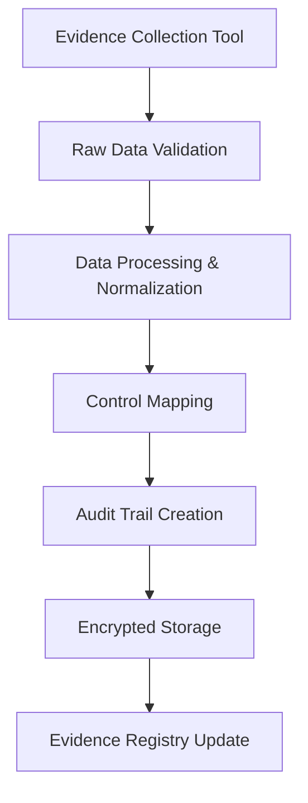
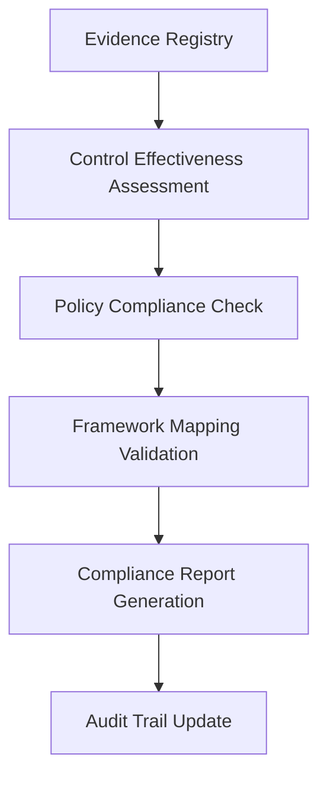

# Data Design - NEEDS CLARIFICATION

<!-- NEEDS CLARIFICATION: Design database schema and data flow diagrams -->
<!-- CONTEXT: Phase 2 exit criteria requires data models designed for compliance requirements -->
<!-- PRIORITY: High - Required for storage implementation and compliance validation -->

## Missing Information Required

### Data Architecture Design
- [ ] **Storage Strategy**: Local file storage vs. database design decisions
- [ ] **Data Models**: Core entity models for evidence, policies, controls, and audit trails
- [ ] **Data Relationships**: Entity relationships and referential integrity requirements
- [ ] **Data Flow**: Information flow through evidence collection and compliance workflows

### Compliance Data Requirements
- [ ] **Evidence Data Model**: Structure for compliance evidence with metadata and audit trail
- [ ] **Control Data Model**: Compliance controls with mappings and effectiveness tracking
- [ ] **Policy Data Model**: Organizational policies with versioning and approval workflow
- [ ] **Audit Trail Model**: Immutable audit logging with integrity protection

### Data Security and Governance
- [ ] **Data Classification**: Sensitivity levels and protection requirements
- [ ] **Encryption Strategy**: At-rest and in-transit data protection design
- [ ] **Data Retention**: Retention policies and automated data lifecycle management
- [ ] **Data Sovereignty**: Geographic location and jurisdictional requirements

## Template Structure Needed

```
data-design/
├── data-architecture.md       # Overall data architecture and storage strategy
├── entity-models/
│   ├── evidence-model.md      # Evidence data structure and relationships
│   ├── control-model.md       # Compliance control data model
│   ├── policy-model.md        # Policy and procedure data model
│   └── audit-trail-model.md   # Audit logging and trail data model
├── data-flows/
│   ├── evidence-collection-flow.md # Evidence collection data flow
│   ├── compliance-workflow-flow.md # Compliance validation data flow
│   └── audit-reporting-flow.md     # Audit and reporting data flow
├── schemas/
│   ├── json-schemas/          # JSON schema definitions
│   ├── database-schemas/      # Database DDL scripts (if applicable)
│   └── validation-schemas.md  # Data validation rules and constraints
└── data-governance.md         # Data classification, retention, and security
```

## Data Architecture Questions

### Storage Design Decisions
1. **What is our data storage approach?**
   - Local JSON files for simplicity and offline capability
   - Embedded database (SQLite) for query capability
   - External database for multi-user scenarios
   - Hybrid approach with different storage for different data types

2. **How do we handle data relationships?**
   - Evidence linking to controls and policies
   - Control effectiveness tracking over time
   - Policy versioning and approval workflows
   - Audit trail connections to all entities

3. **What are the performance requirements?**
   - Expected data volumes and growth patterns
   - Query performance requirements
   - Concurrent access patterns
   - Backup and recovery requirements

### Compliance Data Modeling

#### Evidence Data Model
```yaml
Evidence:
  id: string                    # Unique identifier
  type: string                  # Evidence type (document, screenshot, config, etc.)
  title: string                 # Human-readable title
  description: string           # Detailed description

  collection:
    collected_at: datetime      # Collection timestamp
    collected_by: string        # User or system that collected
    tool: string                # Collection tool used
    method: string              # Collection method

  content:
    raw_data: object            # Original collected data
    processed_data: object      # Normalized/processed data
    file_attachments: array     # File references
    metadata: object            # Additional metadata

  compliance:
    control_mappings: array     # Mapped compliance controls
    policy_references: array    # Related policies
    frameworks: array           # Applicable frameworks (SOC2, ISO27001)
    effectiveness: string       # Control effectiveness assessment

  audit:
    chain_of_custody: array     # Audit trail entries
    integrity_hash: string      # Content integrity verification
    digital_signatures: array  # Digital signatures for authenticity
    retention_until: datetime   # Data retention expiration
```

#### Control Data Model
```yaml
Control:
  id: string                    # Control identifier (CC-01, AC-01, etc.)
  framework: string             # Source framework (SOC2, ISO27001, NIST)
  title: string                 # Control title
  description: string           # Control description

  implementation:
    status: string              # Implementation status
    responsible_party: string   # Owner/responsible party
    implementation_date: datetime
    last_reviewed: datetime
    next_review: datetime

  testing:
    test_frequency: string      # Testing frequency (quarterly, annual)
    last_tested: datetime
    test_results: array         # Historical test results
    effectiveness: string       # Current effectiveness rating

  evidence:
    required_evidence: array    # Types of evidence required
    collected_evidence: array   # Links to actual evidence
    evidence_adequacy: string   # Evidence adequacy assessment

  relationships:
    parent_controls: array      # Parent control relationships
    child_controls: array       # Sub-controls
    related_policies: array     # Related organizational policies
```

## Data Flow Diagrams Needed

### Evidence Collection Flow


### Compliance Validation Flow


## Questions for Data Architecture Team

1. **What are our data volume expectations?**
   - Number of evidence items per compliance cycle
   - Size of individual evidence files and attachments
   - Retention periods for different data types
   - Growth projections and scalability requirements

2. **How do we ensure data integrity?**
   - Hash-based integrity verification for evidence
   - Digital signatures for authenticity
   - Immutable audit trail implementation
   - Backup and recovery procedures

3. **What are the query and reporting requirements?**
   - Evidence search and filtering capabilities
   - Compliance status reporting and dashboards
   - Audit trail queries and investigation support
   - Performance requirements for data access

4. **How do we handle data security and privacy?**
   - Encryption at rest and in transit
   - Access control and authorization
   - Data classification and handling procedures
   - Geographic and jurisdictional requirements

## Data Security Requirements

### Encryption Design
- **At Rest**: AES-256 encryption for all stored data
- **In Transit**: TLS 1.3 for all data transmission
- **Key Management**: Secure key storage and rotation procedures

### Access Control
- **Authentication**: Multi-factor authentication for data access
- **Authorization**: Role-based access control with least privilege
- **Audit Logging**: All data access logged and monitored

### Data Classification
- **Public**: Non-sensitive system metadata
- **Internal**: Business data requiring access control
- **Confidential**: Compliance evidence requiring encryption
- **Restricted**: Audit trails requiring immutability

## Next Steps

1. **Finalize storage architecture** decisions and document rationale
2. **Create detailed entity models** with relationships and constraints
3. **Design data flow diagrams** for all major workflows
4. **Establish data governance** policies and procedures
5. **Create database schemas** or JSON schema definitions

---

**Status**: PLACEHOLDER - Requires immediate attention
**Owner**: Data Architecture Team + Development Team
**Target Completion**: Before Phase 2 exit criteria review