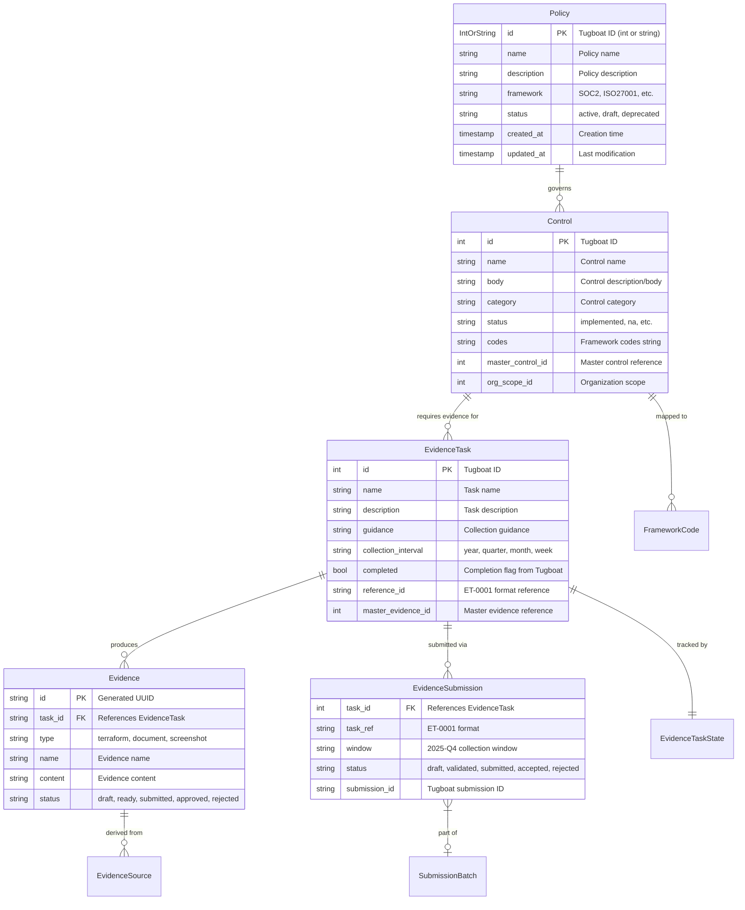

# Data Design

This document defines the data architecture for GRCTool, including core domain entities, storage schema, data flow, evidence lifecycle states, and caching strategy.

## Overview

GRCTool uses a file-based data architecture with JSON as the primary storage format for domain entities and YAML for configuration and state management. There is no external database; all data resides on the local filesystem, making the system offline-first and git-friendly for audit trails.

### Design Principles

- **Human-readable storage**: All data files are JSON or YAML, directly inspectable by auditors
- **Git-friendly**: File naming and structure support meaningful diffs and version tracking
- **Offline-first**: All synced data is available locally; no network required for reads
- **Convention over configuration**: Deterministic naming and directory layout with configurable overrides
- **Separation of concerns**: Synced data (from Tugboat), generated data (evidence), and state (lifecycle tracking) live in separate directory trees

---

## Conceptual Data Model

### Core Business Entities



### Entity Descriptions

#### Policy
- **Purpose**: High-level governance documents defining organizational security posture
- **Source**: Synced from Tugboat Logic API
- **Key Attributes**: id (IntOrString for API compatibility), name, framework, controls list
- **Business Rules**: Policies are read-only after sync; interpolation variables substitute `{{organization.name}}` in content
- **Volume**: ~40 policies per organization
- **Growth Rate**: Stable; changes primarily during framework updates

#### Control
- **Purpose**: Specific security requirements that implement policies, mapped to compliance frameworks
- **Source**: Synced from Tugboat Logic API with embedded framework codes and assignees
- **Key Attributes**: id, name, body, category, status, framework_codes, org_scope
- **Business Rules**: Controls map to one or more framework codes (e.g., CC6.8, AC-01); status tracks implementation progress
- **Volume**: ~85 controls per organization
- **Growth Rate**: Stable; grows when new frameworks are adopted

#### EvidenceTask
- **Purpose**: Specific evidence that must be collected to prove controls are implemented
- **Source**: Synced from Tugboat Logic API
- **Key Attributes**: id, name, description, guidance, collection_interval, completed, reference_id
- **Business Rules**: Tasks have collection intervals (year, quarter, month, week) that determine priority; `reference_id` (ET-NNNN) is the primary user-facing identifier; `completed` flag syncs from Tugboat
- **Volume**: ~104 evidence tasks per organization
- **Growth Rate**: Moderate; grows as controls are refined

#### Evidence (Generated)
- **Purpose**: AI-generated or tool-collected evidence artifacts for a specific task
- **Source**: Generated locally by GRCTool tools and Claude AI
- **Key Attributes**: task_id, type, content, sources_used, reasoning, quality_score, completeness
- **Business Rules**: Evidence goes through a generation pipeline (tool execution -> context assembly -> AI generation -> output formatting); must include source attribution and reasoning transparency
- **Volume**: Multiple evidence files per task per collection window
- **Growth Rate**: Proportional to evidence task count and collection frequency

#### EvidenceSubmission
- **Purpose**: Tracks the submission lifecycle of evidence to Tugboat Logic
- **Source**: Created locally during submission workflow
- **Key Attributes**: task_ref, window, status, evidence_files, validation_status, completeness_score
- **Business Rules**: Submissions are window-scoped (e.g., 2025-Q4); must pass validation before submission; collector URL must be configured per task; supports batch submission via SubmissionBatch
- **Volume**: One submission per task per window
- **Growth Rate**: Proportional to evidence tasks x collection frequency

---

## Logical Data Model

### Domain Entity Structures

The following structures are defined in `internal/models/` and represent the canonical data shapes used throughout the application.

#### EvidenceTask (from `evidence_task.go`)

| Field | Type | JSON Key | Constraints | Notes |
|-------|------|----------|-------------|-------|
| ID | int | `id` | Required, from Tugboat | Numeric Tugboat ID |
| Name | string | `name` | Required | Human-readable task name |
| Description | string | `description` | Required | Task description |
| Guidance | string | `guidance` | Optional | Collection guidance text |
| CollectionInterval | string | `collection_interval` | year/quarter/month/week | Determines priority |
| Completed | bool | `completed` | Required | Tugboat completion status |
| MasterEvidenceID | int | `master_evidence_id` | Required | Links to master evidence |
| ReferenceID | string | `reference_id` | Format: ET-NNNN | User-facing identifier |
| Status | string | `status` | Derived from Completed | pending/completed |
| Priority | string | `priority` | Derived from interval | low/medium/high |

#### Control (from `policy.go`)

| Field | Type | JSON Key | Constraints | Notes |
|-------|------|----------|-------------|-------|
| ID | int | `id` | Required | Tugboat ID |
| Name | string | `name` | Required | Control name |
| Body | string | `body` | Required | Control description |
| Category | string | `category` | Required | Control category |
| Status | string | `status` | implemented/na/etc. | Implementation status |
| Codes | string | `codes` | Optional | Framework code string |
| FrameworkCodes | []FrameworkCode | `framework_codes` | Optional | Structured framework mappings |
| OrgScope | *OrgScope | `org_scope` | Optional | Organization scope |
| Assignees | []ControlAssignee | `assignees` | Optional | Control owners |

#### EvidenceSubmission (from `submission.go`)

| Field | Type | JSON/YAML Key | Constraints | Notes |
|-------|------|---------------|-------------|-------|
| TaskID | int | `task_id` | Required | Tugboat task ID |
| TaskRef | string | `task_ref` | Format: ET-NNNN | User-facing reference |
| Window | string | `window` | Format: YYYY-QN | Collection window |
| Status | string | `status` | draft/validated/submitted/accepted/rejected | Lifecycle state |
| SubmissionID | string | `submission_id` | Set after submission | Tugboat response ID |
| EvidenceFiles | []EvidenceFileRef | `evidence_files` | Required | File inventory |
| CompletenessScore | float64 | `completeness_score` | 0.0-1.0 | Quality metric |
| ValidationErrors | []ValidationError | `validation_errors` | Optional | Failed checks |

#### EvidenceTaskState (from `evidence_state.go`)

| Field | Type | JSON/YAML Key | Constraints | Notes |
|-------|------|---------------|-------------|-------|
| TaskRef | string | `task_ref` | Format: ET-NNNN | Primary key in state cache |
| TaskID | int | `task_id` | Required | Numeric Tugboat ID |
| TugboatStatus | string | `tugboat_status` | pending/in_progress/completed | Remote status |
| LocalState | LocalEvidenceState | `local_state` | Enum (see lifecycle) | Aggregated local state |
| Windows | map[string]WindowState | `windows` | Keyed by window string | Per-window evidence state |
| AutomationLevel | AutomationCapability | `automation_level` | Enum | Tool automation assessment |
| ApplicableTools | []string | `applicable_tools` | Tool names | Which tools can generate evidence |

### Relationships Model (from `relationships.go`)

```go
type Relationships struct {
    PolicyToProcedures map[string][]string  // policy ID -> procedure IDs
    PolicyToControls   map[string][]string  // policy ID -> control IDs
    ProcedureToTasks   map[string][]string  // procedure ID -> task IDs
    ControlToTasks     map[string][]string  // control ID -> task IDs
    TaskToEvidence     map[string][]string  // task ID -> evidence IDs
}
```

This relationship model enables traversal from any entity to related entities, supporting the evidence context assembly pipeline.

---

## Storage Schema

### File Layout

```
{data_dir}/
|
+-- docs/                              # Synced data from Tugboat Logic
|   +-- policies/
|   |   +-- json/                      # Raw policy JSON (one file per policy)
|   |   +-- markdown/                  # Rendered policy markdown
|   +-- controls/
|   |   +-- json/                      # Raw control JSON (one file per control)
|   |   +-- markdown/                  # Rendered control markdown
|   +-- evidence_tasks/
|   |   +-- json/                      # Raw task JSON (one file per task)
|   |   +-- markdown/                  # Rendered task markdown
|   +-- evidence_prompts/              # Generated prompts for AI evidence generation
|
+-- evidence/                          # Generated evidence artifacts
|   +-- {task_ref}/                    # e.g., ET-0001/
|   |   +-- {window}/                 # e.g., 2025-Q4/
|   |   |   +-- 01_terraform_iam.md   # Numbered evidence files
|   |   |   +-- 02_github_perms.md
|   |   |   +-- .generation/
|   |   |   |   +-- metadata.yaml     # How evidence was generated
|   |   |   +-- .submission/
|   |   |       +-- submission.yaml   # Submission lifecycle state
|   |   +-- {window}/                 # Previous windows preserved
|
+-- .cache/                            # Performance cache (safe to delete)
|   +-- prompts/                       # Cached assembled prompts
|   +-- summaries/                     # Cached AI-generated summaries
|   +-- tool_outputs/                  # Cached tool execution results
|   +-- relationships/                 # Cached entity relationship maps
|   +-- validations/                   # Cached validation results
|   +-- auth/                          # Cached auth state
|
+-- .state/                            # State tracking
|   +-- evidence_state.yaml            # Aggregated task state cache (StateCache)
|
+-- prompts/                           # Custom prompt templates
```

### Naming Conventions

| Convention | Pattern | Example | Notes |
|------------|---------|---------|-------|
| Evidence Task Ref | `ET-{NNNN}` | `ET-0047` | 4-digit zero-padded, user-facing |
| Policy Ref | `POL-{NNNN}` | `POL-0001` | 4-digit zero-padded |
| Control Code | `{prefix}-{NN}[.{N}]` | `CC6.8`, `AC-01`, `SO-19` | Varies by framework |
| Collection Window | `{YYYY}-Q{N}` | `2025-Q4` | Year and quarter |
| Evidence File | `{NN}_{source}_{desc}.{ext}` | `01_terraform_iam_roles.md` | Numbered for ordering |
| File Slug | lowercase, underscores | `access_control_policy` | Filesystem-safe |

---

## Data Flow

### Sync Flow (Tugboat -> Local Storage)

```
Tugboat Logic API
    |
    v
[Pagination Handler]          Follows next/previous cursors until exhausted
    |
    v
[Data Normalization]          Map API response fields to domain models
    |                          Derive reference_id (ET-NNNN) from sequence
    |                          Derive status from completed flag
    v
[JSON Serialization]          Marshal to JSON with consistent field ordering
    |
    v
[File Storage]                Write to docs/{type}/json/{ref}-{id}-{slug}.json
    |
    v
[Markdown Rendering]          Generate human-readable markdown versions
    |                          Apply template variable interpolation
    v
[Cache Invalidation]          Clear stale relationship and summary caches
```

### Evidence Generation Flow (Local Data -> Evidence Files)

```
grctool evidence generate ET-0047
    |
    v
[Task Analysis]               Load task from docs/evidence_tasks/json/
    |                          Parse task requirements, guidance, controls
    v
[Relationship Mapping]        Traverse Relationships to find:
    |                          - Related controls (ControlToTasks)
    |                          - Governing policies (PolicyToControls)
    |                          - Framework codes (FrameworkCodes)
    v
[Tool Orchestration]          Select applicable tools based on task analysis
    |                          Execute tools in parallel (goroutine workers)
    |                          Terraform: scan HCL files for security configs
    |                          GitHub: query permissions, workflows, reviews
    v
[Context Assembly]            Build EvidenceContext:
    |                          - Task details + controls + policies
    |                          - Control summaries (cached or generated)
    |                          - Policy summaries (cached or generated)
    |                          - Security control mappings
    |                          - Tool outputs
    v
[AI Generation]               Send EvidenceContext to Claude API
    |                          Claude uses tools to gather additional data
    |                          Claude generates evidence content + reasoning
    v
[Output Formatting]           Format as CSV or Markdown per configuration
    |                          Include source attribution
    |                          Include reasoning (if configured)
    v
[File Storage]                Write to evidence/{task_ref}/{window}/
    |                          Write .generation/metadata.yaml
    v
[State Update]                Update EvidenceTaskState in .state/evidence_state.yaml
                              LocalState = "generated"
```

### Submission Flow (Evidence Files -> Tugboat)

```
grctool evidence submit ET-0047
    |
    v
[Load Submission State]       Read .submission/submission.yaml if exists
    |
    v
[Validate Evidence]           Check completeness against task requirements
    |                          Verify file checksums
    |                          Score completeness (0.0-1.0)
    |                          Generate ValidationResult
    v
[Resolve Collector URL]       Look up collector_urls[ET-0047] in config
    |                          Fail if not configured
    v
[Package Evidence]            Assemble multipart/form-data payload
    |                          Include evidence files as attachments
    |                          Include metadata
    v
[Submit to Tugboat]           POST to collector URL with HTTP Basic Auth
    |                          Parse TugboatSubmissionResponse
    v
[Record Submission]           Write .submission/submission.yaml
    |                          Update SubmissionHistory
    |                          Record submission_id from Tugboat
    v
[State Update]                Update EvidenceTaskState
                              LocalState = "submitted"
                              SubmissionStatus = response.status
```

---

## Evidence Lifecycle States

Evidence for a task progresses through a linear lifecycle tracked in `EvidenceTaskState.LocalState`:

```
no_evidence --> generated --> validated --> submitted --> accepted
                    |                          |
                    |                          v
                    |                      rejected
                    |                          |
                    +<-------------------------+
                          (rework cycle)
```

### State Definitions

| State | LocalEvidenceState | Description | Trigger |
|-------|-------------------|-------------|---------|
| No Evidence | `no_evidence` | No evidence files exist locally for any window | Initial state; cache cleared |
| Generated | `generated` | Evidence files exist but have not been validated | `evidence generate` completes |
| Validated | `validated` | Evidence passes validation checks, ready for submission | `evidence validate` passes |
| Submitted | `submitted` | Evidence has been submitted to Tugboat Logic | `evidence submit` succeeds |
| Accepted | `accepted` | Tugboat/auditors accepted the evidence | Tugboat status callback |
| Rejected | `rejected` | Evidence was rejected and needs rework | Tugboat status callback |

### Window-Level State

Each evidence task tracks state per collection window (e.g., 2025-Q4):

```yaml
# WindowState structure
window: "2025-Q4"
file_count: 3
total_bytes: 45200
oldest_file: "2025-10-15T10:00:00Z"
newest_file: "2025-10-15T10:05:00Z"
has_generation_meta: true
generation_method: "tool_coordination"
generated_by: "claude-code-assisted"
tools_used: ["terraform-security-indexer", "github-permissions"]
has_submission_meta: true
submission_status: "submitted"
submitted_at: "2025-10-22T14:30:00Z"
submission_id: "sub_abc123"
```

### Automation Capability Assessment

Each task is classified by automation level based on applicable tools:

| Level | AutomationCapability | Criteria |
|-------|---------------------|----------|
| Fully Automated | `fully_automated` | 2+ applicable tools available |
| Partially Automated | `partially_automated` | 1 applicable tool available |
| Manual Only | `manual_only` | No applicable tools; requires manual collection |
| Unknown | `unknown` | Assessment not yet performed |

### State Cache (`.state/evidence_state.yaml`)

The `StateCache` aggregates all task states for efficient querying:

```yaml
last_scan: "2025-10-22T14:00:00Z"
tasks:
  ET-0001:
    task_ref: "ET-0001"
    task_id: 327992
    task_name: "GitHub Repository Access Controls"
    tugboat_status: "pending"
    tugboat_completed: false
    local_state: "generated"
    automation_level: "fully_automated"
    applicable_tools: ["github-permissions", "github-security-features"]
    windows:
      2025-Q4:
        file_count: 2
        total_bytes: 23400
        submission_status: "draft"
  ET-0047:
    task_ref: "ET-0047"
    task_id: 328041
    local_state: "submitted"
    # ...
```

---

## Caching Strategy

### Cache Layers

| Cache | Location | TTL | Invalidation | Purpose |
|-------|----------|-----|--------------|---------|
| Prompt Cache | `.cache/prompts/` | Until next sync | `grctool sync` clears | Assembled evidence prompts |
| Summary Cache | `.cache/summaries/` | Until next sync | `grctool sync` clears | AI-generated control/policy summaries |
| Tool Output Cache | `.cache/tool_outputs/` | Configurable | Manual or time-based | Cached tool execution results |
| Relationship Cache | `.cache/relationships/` | Until next sync | `grctool sync` clears | Entity relationship maps |
| Validation Cache | `.cache/validations/` | Until evidence changes | File modification check | Validation results |
| Auth Cache | `.cache/auth/` | Session-based | `grctool auth logout` | Authentication state |
| State Cache | `.state/evidence_state.yaml` | Until scan | `evidence scan` refreshes | Aggregated task states |

### Cache Key Strategy

Summary caches use composite keys to ensure cache hits are relevant to the specific task context:

```go
type AIControlSummary struct {
    ControlID int       // Control being summarized
    TaskID    int       // Task context (summaries are task-specific)
    CacheKey  string    // Composite: "{control_id}_{task_id}_{hash}"
    // ...
}
```

### Cache Invalidation Rules

1. **Sync invalidation**: `grctool sync` clears prompt, summary, and relationship caches because underlying data may have changed
2. **Generation invalidation**: Generating new evidence invalidates validation cache for that task/window
3. **Time-based expiration**: Tool output caches have configurable TTL (default: no expiration, manual invalidation)
4. **Safe deletion**: The entire `.cache/` directory can be deleted without data loss; it will be rebuilt on next access

### Performance Targets

| Operation | Cold (no cache) | Warm (cached) | Target |
|-----------|-----------------|---------------|--------|
| Load single evidence task | < 50ms | < 10ms | < 100ms |
| List all evidence tasks | < 500ms | < 50ms | < 1s |
| Assemble evidence context | < 2s | < 200ms | < 5s |
| Query Terraform security index | < 1s | < 100ms | < 100ms |

---

## Data Integrity

### File-Level Integrity

- Evidence files include SHA256 checksums in `EvidenceFileRef.ChecksumSHA256`
- Submission payloads verify checksums before sending
- File permissions are set to prevent accidental modification (0644 for evidence, 0600 for credentials)

### Referential Integrity

Since the storage is file-based, referential integrity is enforced at the application level:

- `EvidenceTask.ReferenceID` must match the `ET-NNNN` pattern in the filename
- `EvidenceSubmission.TaskRef` must correspond to an existing task in synced data
- `Relationships` maps are rebuilt from synced data and cached; inconsistencies are detected during relationship traversal

### Data Validation

Validation is performed at multiple levels:

1. **Schema validation**: JSON files must parse into their respective Go structs
2. **Business rule validation**: `EvidenceTaskValidator` checks ID format, name constraints, status values
3. **Submission validation**: `ValidationResult` checks completeness, file existence, checksum integrity, and control coverage before submission
4. **Configuration validation**: `Config.Validate()` checks all required fields and value ranges

---

## Data Security

### Sensitive Data Classification

| Data Type | Classification | Storage | Protection |
|-----------|---------------|---------|------------|
| Session cookies | Critical | Config file or env var | Not stored in git; env var substitution |
| API tokens (GitHub) | Critical | Config file or `gh` CLI | Env var substitution; redacted in logs |
| Evidence content | Sensitive | Local JSON/Markdown files | File permissions; .gitignore |
| Policy content | Internal | Local JSON files | File permissions |
| Collector URLs | Internal | Config file | Not committed to git |
| VCR cassettes | Internal | Test fixtures | Sensitive data scrubbed before commit |

### Log Redaction

The following fields are automatically redacted from all log output:

```yaml
redact_fields: [password, token, key, secret, api_key, cookie]
```

URLs containing authentication parameters are sanitized before logging (`sanitize_urls: true`).

---

## Data Volume and Growth

### Current State

| Entity | Records | Files | Avg File Size | Total Size |
|--------|---------|-------|---------------|------------|
| Policies | ~40 | 80 (JSON + MD) | ~5KB | ~400KB |
| Controls | ~85 | 170 (JSON + MD) | ~3KB | ~510KB |
| Evidence Tasks | ~104 | 208 (JSON + MD) | ~2KB | ~416KB |
| Generated Evidence | Varies | ~3 per task/window | ~15KB | ~5MB/quarter |
| Cache | N/A | ~500 | ~2KB | ~1MB |

### Scaling Considerations

- **Current design**: Suitable for organizations with < 500 evidence tasks
- **Performance boundary**: > 10,000 files may degrade glob-based queries; mitigated by caching and state aggregation
- **Migration path**: If scale exceeds file-system performance, ADR-004 preserves the option to add a database backend while keeping JSON as the audit-visible format

---

## System of Record Architecture

GRCTool is evolving from a Tugboat Logic data aggregator to the **system of record** for compliance data. This section describes the data architecture that supports this transition.

### Master Index Design

The master index is the canonical registry of all compliance artifacts. Each entity — policy, control, control mapping, evidence task — has a GRCTool-native identity that is independent of any external system.

#### Identity Model

Every entity in the master index carries two identity layers:

| Layer | Purpose | Example |
|-------|---------|---------|
| **GRCTool ID** | Canonical, stable identifier owned by GRCTool | `ET-0047`, `POL-0012`, `CTRL-CC6.8` |
| **External IDs** | Map to identifiers in external systems | `tugboat:328041`, `github:issue/142` |

The GRCTool ID is the primary key used in all local operations, relationship maps, and file naming. External IDs are stored as metadata for integration purposes and are never used as primary keys internally.

#### Master Index Storage

The master index extends the existing file-based storage (ADR-004) with an explicit registry:

```
{data_dir}/
+-- .index/                              # Master index (system of record)
|   +-- policies.yaml                    # Canonical policy registry
|   +-- controls.yaml                    # Canonical control registry
|   +-- control_mappings.yaml            # Cross-framework control mappings
|   +-- evidence_tasks.yaml              # Canonical evidence task registry
|   +-- integrations.yaml                # External system ID mappings
```

Each registry file maps GRCTool IDs to their metadata, external ID mappings, and sync state:

```yaml
# Example: evidence_tasks.yaml
tasks:
  ET-0047:
    grctool_id: "ET-0047"
    name: "GitHub Repository Access Controls"
    external_ids:
      tugboat: 328041
    sync_state:
      tugboat:
        last_synced: "2026-01-15T10:00:00Z"
        direction: "bidirectional"
        conflict_policy: "local_wins"
    owner: "security-team"
    created_at: "2025-06-01T00:00:00Z"
    updated_at: "2026-01-15T10:00:00Z"
```

### Integration Point Contracts

Each external system integration implements a standard adapter contract with three operations:

#### Import (Inbound)

Pull artifacts from an external system into the master index. On import, GRCTool assigns a canonical ID (or matches to an existing one via external ID mapping) and stores the artifact locally.

```
External System --> [Import Adapter] --> Master Index
                                          |
                                          v
                                    Local File Storage
```

#### Export (Outbound)

Push artifacts from the master index to an external system. GRCTool serializes the artifact in the target system's format and records the resulting external ID.

```
Master Index --> [Export Adapter] --> External System
                                          |
                                          v
                                    External ID recorded
```

#### Bidirectional Sync

Reconcile state between GRCTool and an external system. Sync compares timestamps and content hashes to detect changes on both sides, then applies a configurable conflict resolution policy:

| Policy | Behavior |
|--------|----------|
| `local_wins` | GRCTool's version is authoritative; remote changes are overwritten |
| `remote_wins` | External system's version is authoritative; local changes are overwritten |
| `manual` | Conflicts are flagged for human resolution; no automatic merge |
| `newest_wins` | The most recently modified version is kept |

Sync state is tracked per-entity per-integration in the master index registry files.

### Data Ownership Model

Under the system-of-record architecture, data ownership is clear:

| Aspect | Owner | Rationale |
|--------|-------|-----------|
| Policy definitions | GRCTool (master index) | Policies are organizational artifacts, not platform artifacts |
| Control definitions | GRCTool (master index) | Controls span frameworks and platforms |
| Control mappings | GRCTool (master index) | Cross-framework mappings are organization-specific |
| Evidence tasks | GRCTool (master index) | Task definitions drive the compliance program |
| Generated evidence | GRCTool (local storage) | Evidence is produced locally by tools and AI |
| Submission state | Shared (GRCTool + external) | Submission status requires acknowledgment from the receiving platform |
| External platform state | External system | Platform-specific state (e.g., Tugboat UI status) is informational, not authoritative |

External systems are **mirrors and consumers** of GRCTool data. They receive data through export/sync adapters and may provide status feedback (e.g., submission acceptance), but they do not define the canonical record.

### Migration Path: Tugboat-as-Source to GRCTool-as-Source

For existing deployments where Tugboat Logic is currently the source of truth, the migration follows a phased approach:

#### Phase 1: Shadow Index (Current + Near-term)

- GRCTool continues to sync from Tugboat as the primary source.
- The master index is built as a shadow: populated from Tugboat sync data, with GRCTool IDs assigned and external ID mappings recorded.
- No behavioral change for users; the index is read-only and observational.

#### Phase 2: Dual-Write (Transition)

- GRCTool begins accepting local edits to policies, controls, and evidence tasks.
- Local edits are written to the master index AND pushed to Tugboat via the export adapter.
- Tugboat sync continues, but conflicts are detected and flagged.
- Users can choose conflict resolution policy per entity or globally.

#### Phase 3: GRCTool-as-Source (Target State)

- GRCTool is the authoritative source for all compliance artifacts.
- Tugboat Logic is one integration target: it receives data from GRCTool, not the other way around.
- Tugboat sync becomes an export/status-check operation, not an import.
- New compliance platforms can be added as additional integration targets without architectural changes.

---

## References

- [System Architecture](/home/erik/Projects/grctool/docs/helix/02-design/architecture/system-design.md)
- [Interface Contracts](/home/erik/Projects/grctool/docs/helix/02-design/contracts/contracts.md)
- [ADR-004: JSON-Based Local Storage](/home/erik/Projects/grctool/docs/helix/02-design/adr/adr-index.md#adr-004-json-based-local-storage-for-evidence-data)
- [ADR-010: System of Record Architecture](/home/erik/Projects/grctool/docs/helix/02-design/adr/adr-index.md#adr-010-system-of-record-architecture)
- [Models Source](/home/erik/Projects/grctool/internal/models/)
- [Config Source](/home/erik/Projects/grctool/internal/config/config.go)
