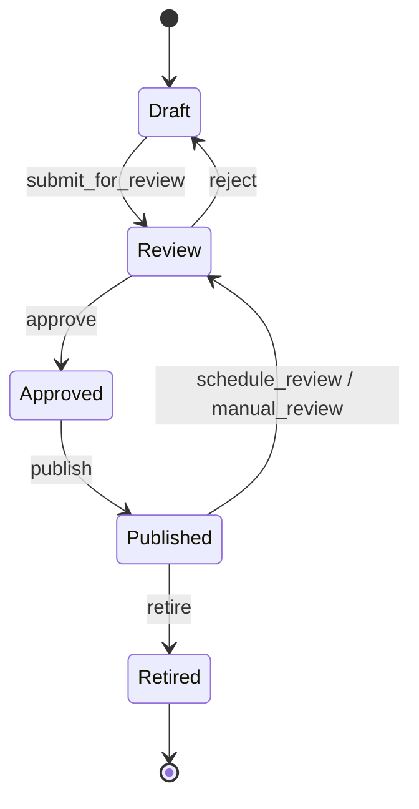
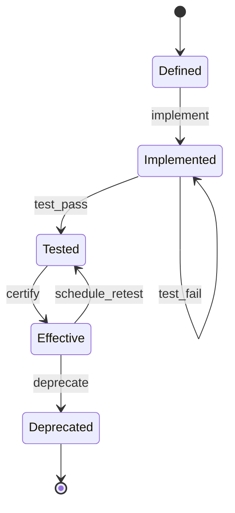
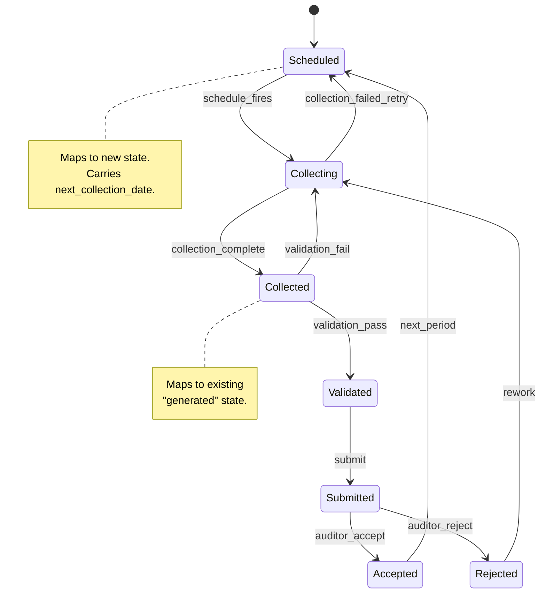
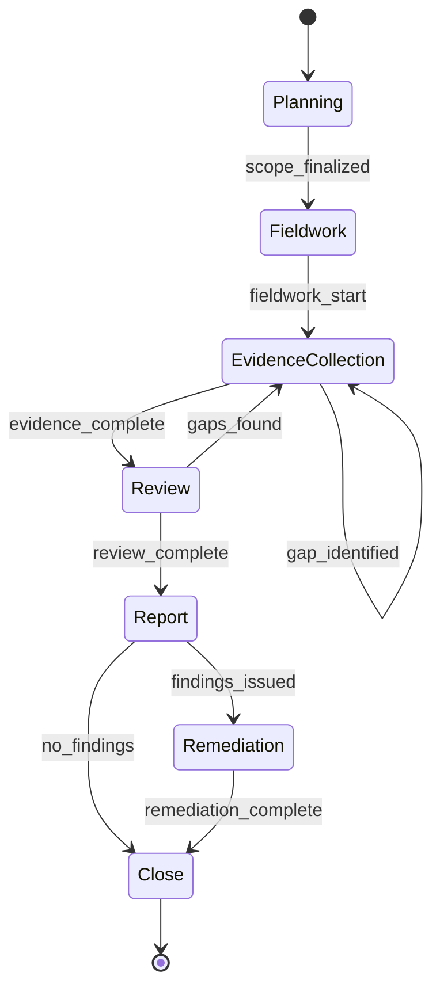

# SD-003: Audit Lifecycle Scheduler

## Overview

This solution design defines the implementation of lifecycle state machines and a cron-based task scheduler for evidence collection orchestration in GRCTool. The design covers four interconnected state machines (policy, control, evidence task, audit period), a YAML-configured scheduler, evidence collection orchestration with task-to-tool mapping, and the CLI commands that expose these capabilities.

The scheduler is CLI-based -- it is not a daemon. It is designed to be invoked by external scheduling infrastructure (cron, systemd timers, GitHub Actions, CI pipelines). The `grctool schedule run` command is idempotent and safe to call repeatedly.

---

## 1. Lifecycle State Machines

### 1.1 Policy Lifecycle



**State definitions:**

| State | Description | Persisted Fields |
|-------|-------------|------------------|
| `draft` | Policy is being authored or revised | `version_draft`, `author`, `created_at` |
| `review` | Under stakeholder review | `reviewer`, `review_requested_at` |
| `approved` | Approved by governance body | `approved_by`, `approved_at`, `version` |
| `published` | Active and in effect | `published_at`, `review_due_date`, `effective_date` |
| `retired` | No longer in effect | `retired_at`, `retired_by`, `superseded_by` |

**Transition rules:**

| From | To | Trigger | Validation |
|------|-----|---------|------------|
| draft | review | `submit_for_review` | Content must be non-empty |
| review | draft | `reject` | Rejection reason required |
| review | approved | `approve` | Approver must differ from author |
| approved | published | `publish` | Review interval must be set |
| published | review | `schedule_review` | Triggered when `now >= review_due_date - reminder_threshold` |
| published | retired | `retire` | Retirement reason required |

**Go type:**

```go
type PolicyLifecycleState string

const (
    PolicyDraft     PolicyLifecycleState = "draft"
    PolicyReview    PolicyLifecycleState = "review"
    PolicyApproved  PolicyLifecycleState = "approved"
    PolicyPublished PolicyLifecycleState = "published"
    PolicyRetired   PolicyLifecycleState = "retired"
)
```

### 1.2 Control Lifecycle



**State definitions:**

| State | Description | Persisted Fields |
|-------|-------------|------------------|
| `defined` | Control requirement documented | `defined_at`, `owner`, `control_ref` |
| `implemented` | Control is operational | `implemented_at`, `implementation_notes` |
| `tested` | Control validated as effective | `tested_at`, `tested_by`, `test_result` |
| `effective` | Operating effectively, in monitoring | `effective_since`, `next_test_date` |
| `deprecated` | No longer applicable | `deprecated_at`, `deprecation_reason` |

**Transition rules:**

| From | To | Trigger | Validation |
|------|-----|---------|------------|
| defined | implemented | `implement` | Implementation evidence required |
| implemented | tested | `test_pass` | Test result must be recorded |
| implemented | implemented | `test_fail` | Failure reason logged; remains in implemented |
| tested | effective | `certify` | Testing period must be set |
| effective | tested | `schedule_retest` | Triggered when `now >= next_test_date` |
| effective | deprecated | `deprecate` | Deprecation reason required |

### 1.3 Evidence Task Lifecycle

This extends the existing `LocalEvidenceState` in `internal/models/evidence_state.go`. The new states (`scheduled`, `collecting`) are prepended to the existing state machine.

> **NOTE: Per FEAT-004/SD-004, all entity IDs will be `string` type after the ID migration. The existing `EvidenceTaskState.TaskID int` field in `evidence_state.go` will become `string`. Any `int` ID types shown here or in the referenced existing code will become `string`.**



**Mapping to existing `LocalEvidenceState`:**

| New Phase | Existing State | Notes |
|-----------|---------------|-------|
| Scheduled | (new) | New state: `scheduled` |
| Collecting | (new) | New state: `collecting` |
| Collected | `generated` | Rename for clarity; backward-compatible alias |
| Validated | `validated` | Unchanged |
| Submitted | `submitted` | Unchanged |
| Accepted | `accepted` | Unchanged |
| Rejected | `rejected` | Unchanged |

**Extended Go type:**

```go
const (
    // New states (prepended to existing enum)
    StateScheduled  LocalEvidenceState = "scheduled"
    StateCollecting LocalEvidenceState = "collecting"

    // Existing states (unchanged)
    StateNoEvidence LocalEvidenceState = "no_evidence"
    StateGenerated  LocalEvidenceState = "generated"   // alias: "collected"
    StateValidated  LocalEvidenceState = "validated"
    StateSubmitted  LocalEvidenceState = "submitted"
    StateAccepted   LocalEvidenceState = "accepted"
    StateRejected   LocalEvidenceState = "rejected"
)
```

### 1.4 Audit Period Lifecycle



**State definitions:**

| State | Description | Persisted Fields |
|-------|-------------|------------------|
| `planning` | Scope, timeline, and ownership defined | `period_id`, `framework`, `start_date`, `end_date`, `owner` |
| `fieldwork` | Auditors actively requesting evidence | `fieldwork_start`, `auditor_contact` |
| `evidence_collection` | Organization gathering and submitting | `tasks_in_scope[]`, `collection_progress` |
| `review` | Auditor reviewing submitted evidence | `review_start`, `reviewer` |
| `report` | Audit report being drafted | `report_draft_date` |
| `remediation` | Addressing findings | `findings[]`, `remediation_plans[]` |
| `close` | Audit complete | `closed_at`, `report_url`, `opinion` |

---

## 2. Scheduler Design

### 2.1 Schedule Definition Format

Schedules are defined in `.grctool.yaml` using a declarative YAML structure. Each schedule has a name, a trigger type, and a set of tasks or task selectors.

```yaml
schedules:
  quarterly-evidence:
    description: "Collect evidence for SOC 2 quarterly review"
    trigger:
      type: periodic
      cron: "0 6 1 1,4,7,10 *"    # 6 AM on first day of each quarter
      timezone: "America/New_York"
    tasks:
      - selector: "framework:soc2"
      - selector: "cadence:quarterly"
    options:
      parallel: true
      max_parallel: 4
      retry_count: 2
      retry_delay: "5m"

  annual-policy-review:
    description: "Trigger policy review reminders"
    trigger:
      type: periodic
      cron: "0 9 1 * *"           # 9 AM on the first of each month
    tasks:
      - selector: "type:policy"
        action: check_review_due
    options:
      parallel: false

  on-sync-validate:
    description: "Validate evidence freshness after sync"
    trigger:
      type: event
      event: post_sync
    tasks:
      - selector: "state:generated"
        action: validate

  continuous-github:
    description: "Continuously collect GitHub evidence"
    trigger:
      type: periodic
      cron: "0 */6 * * *"         # Every 6 hours
    tasks:
      - refs: ["ET-0047", "ET-0048", "ET-0049"]
    options:
      parallel: true
      max_parallel: 2
```

### 2.2 Schedule Types

| Type | Trigger | Use Case |
|------|---------|----------|
| `periodic` | Cron expression evaluated at `schedule run` time | Quarterly evidence collection, monthly policy reviews, continuous monitoring |
| `event` | Emitted by another GRCTool command (e.g., `post_sync`, `post_generate`) | Re-validate after sync, notify after generation |
| `manual` | Explicit `grctool schedule run <name>` invocation | Ad-hoc collection, testing, one-off runs |

All schedule types ultimately execute through the same `schedule run` code path. The difference is how the trigger is initiated:
- **Periodic**: External cron calls `grctool schedule run --due` which evaluates all periodic schedules and runs those that are due.
- **Event**: GRCTool commands emit events internally; the event handler checks for matching event-triggered schedules.
- **Manual**: The user or CI pipeline calls `grctool schedule run <schedule-name>` directly.

### 2.3 Execution Model

GRCTool is a CLI tool, not a daemon. The scheduler does not run continuously. Instead:

1. **External trigger** (cron, systemd timer, CI schedule) calls `grctool schedule run --due`.
2. The command loads schedule configuration from `.grctool.yaml`.
3. For each periodic schedule, it compares the cron expression against the current time and the `last_run` timestamp from `.state/schedule_state.yaml`.
4. Schedules that are due are executed. Schedules that are not due are skipped.
5. Results are written to `.state/schedule_state.yaml` and to stdout (JSON).

**Catch-up behavior**: If a schedule was missed (e.g., the machine was off), it runs on the next invocation of `schedule run --due`. The `--no-catchup` flag skips missed schedules and only runs if the current time falls within the schedule window.

### 2.4 Schedule State Persistence

```yaml
# .state/schedule_state.yaml
schedules:
  quarterly-evidence:
    last_run: "2026-01-01T06:00:00Z"
    last_result: success
    next_due: "2026-04-01T06:00:00Z"
    tasks_run: 47
    tasks_succeeded: 45
    tasks_failed: 2
    duration_seconds: 342
  continuous-github:
    last_run: "2026-03-17T12:00:00Z"
    last_result: success
    next_due: "2026-03-17T18:00:00Z"
    tasks_run: 3
    tasks_succeeded: 3
    tasks_failed: 0
    duration_seconds: 28
```

---

## 3. Evidence Collection Orchestration

### 3.1 Task-to-Tool Mapping

Each evidence task maps to one or more tools that collect evidence for it. This mapping is defined in `.grctool.yaml` and can be auto-discovered from the existing `ApplicableTools` field in `EvidenceTaskState`.

```yaml
task_tool_mappings:
  ET-0047:
    tools:
      - name: github-permissions
        params:
          repository: "org/repo"
          output-format: matrix
      - name: github-security-features
        params:
          repository: "org/repo"
    description: "GitHub repository access controls"

  ET-0001:
    tools:
      - name: terraform-security-analyzer
        params:
          security-domain: access_control
      - name: terraform-evidence-query
        params:
          query-type: control_mapping
    description: "Infrastructure access controls (Terraform)"

  # Wildcard mapping: all tasks tagged with a control family
  _defaults:
    framework:soc2:
      tools:
        - name: prompt-assembler
        - name: evidence-generator
```

### 3.2 Collection Plan

A collection plan is the ordered list of operations for an audit period. It is computed from the schedule, task-tool mappings, and current evidence state.

```go
// CollectionPlan represents the full set of work for a schedule run.
type CollectionPlan struct {
    ScheduleName string            `json:"schedule_name"`
    AuditPeriod  string            `json:"audit_period"`
    Window       string            `json:"window"`
    Tasks        []PlannedTask     `json:"tasks"`
    CreatedAt    time.Time         `json:"created_at"`
}

// PlannedTask represents a single task in the collection plan.
type PlannedTask struct {
    TaskRef       string            `json:"task_ref"`
    TaskName      string            `json:"task_name"`
    CurrentState  LocalEvidenceState `json:"current_state"`
    TargetState   LocalEvidenceState `json:"target_state"`
    Tools         []PlannedToolRun  `json:"tools"`
    Dependencies  []string          `json:"dependencies,omitempty"` // Task refs that must complete first
    Priority      int               `json:"priority"`               // Lower = higher priority
}

// PlannedToolRun represents a single tool execution within a task.
type PlannedToolRun struct {
    ToolName string                 `json:"tool_name"`
    Params   map[string]interface{} `json:"params"`
    Order    int                    `json:"order"` // Execution order within the task
}
```

### 3.3 Parallel Execution with Dependency Awareness

The orchestrator executes tasks using a worker pool pattern:

```
                    +-------------------+
                    | Collection Plan   |
                    +--------+----------+
                             |
                    +--------v----------+
                    | Dependency Graph  |
                    | (topological sort)|
                    +--------+----------+
                             |
              +--------------+--------------+
              |              |              |
        +-----v----+  +-----v----+  +-----v----+
        | Worker 1  |  | Worker 2  |  | Worker 3  |
        | ET-0001   |  | ET-0047   |  | ET-0048   |
        +-----+----+  +-----+----+  +-----+----+
              |              |              |
        +-----v----+        |              |
        | ET-0002   |       |              |
        | (depends  |       |              |
        |  on 0001) |       |              |
        +----------+        |              |
              |              |              |
              +--------------+--------------+
                             |
                    +--------v----------+
                    | Results Collector |
                    +-------------------+
```

**Execution rules:**

1. Tasks with no dependencies are eligible for immediate parallel execution.
2. The `max_parallel` setting caps concurrent tool executions (default: 4).
3. Each task runs its tools sequentially (order matters within a task).
4. Task-level failures are isolated; other tasks continue.
5. Failed tasks are retried up to `retry_count` times with `retry_delay` between attempts.

### 3.4 Retry and Partial Collection Handling

```go
// CollectionResult captures the outcome of a single task collection.
type CollectionResult struct {
    TaskRef      string             `json:"task_ref"`
    Status       string             `json:"status"` // success, partial, failed
    ToolResults  []ToolResult       `json:"tool_results"`
    NewState     LocalEvidenceState `json:"new_state"`
    ErrorMessage string             `json:"error_message,omitempty"`
    Duration     time.Duration      `json:"duration"`
    RetryCount   int                `json:"retry_count"`
}

// ToolResult captures the outcome of a single tool execution.
type ToolResult struct {
    ToolName     string        `json:"tool_name"`
    Success      bool          `json:"success"`
    OutputPath   string        `json:"output_path,omitempty"`
    ErrorMessage string        `json:"error_message,omitempty"`
    Duration     time.Duration `json:"duration"`
}
```

**Partial collection**: If some tools succeed and others fail for a task, the task moves to `collected` with a `partial` quality flag. The failed tools are recorded so they can be retried independently.

---

## 4. Audit Period Management

### 4.1 Period Definition

Audit periods are defined in `.grctool.yaml` or created via CLI:

```yaml
audit_periods:
  soc2-annual-2026:
    framework: soc2
    type: annual
    start_date: "2026-01-01"
    end_date: "2026-12-31"
    owner: "compliance-team"
    state: evidence_collection
    schedules:
      - quarterly-evidence
      - continuous-github

  iso27001-surveillance-2026:
    framework: iso27001
    type: surveillance
    start_date: "2026-06-01"
    end_date: "2026-06-30"
    owner: "security-team"
    state: planning
    schedules:
      - quarterly-evidence
```

### 4.2 Window-Based Evidence Organization

Audit periods map to evidence collection windows. This extends the existing `WindowState` in `evidence_state.go`:

| Period Type | Window Format | Example |
|-------------|---------------|---------|
| Annual | `YYYY` | `2026` |
| Quarterly | `YYYY-QN` | `2026-Q1` |
| Monthly | `YYYY-MM` | `2026-03` |
| Custom | `YYYY-MM-DD--YYYY-MM-DD` | `2026-06-01--2026-06-30` |

Evidence files are stored under `evidence/{task_ref}/{window}/` following the existing directory convention.

### 4.3 Period Status Tracking and Reporting

```go
// AuditPeriodStatus provides a summary of an audit period's progress.
type AuditPeriodStatus struct {
    PeriodID         string                    `json:"period_id"`
    Framework        string                    `json:"framework"`
    State            AuditLifecycleState       `json:"state"`
    StartDate        time.Time                 `json:"start_date"`
    EndDate          time.Time                 `json:"end_date"`
    TasksTotal       int                       `json:"tasks_total"`
    TasksCollected   int                       `json:"tasks_collected"`
    TasksValidated   int                       `json:"tasks_validated"`
    TasksSubmitted   int                       `json:"tasks_submitted"`
    TasksAccepted    int                       `json:"tasks_accepted"`
    TasksRejected    int                       `json:"tasks_rejected"`
    TasksPending     int                       `json:"tasks_pending"`
    CompletionPct    float64                   `json:"completion_pct"`
    ByControlFamily  map[string]FamilyProgress `json:"by_control_family"`
}
```

---

## 5. Configuration Schema

### 5.1 Full Schema Addition to `.grctool.yaml`

> **NOTE: The `schedules`, `task_tool_mappings`, `audit_periods`, and `lifecycle` config keys proposed below are schema extensions to `.grctool.yaml`. Config schema extension is tracked as a separate implementation task and will be validated against the existing `Config` struct in `internal/config/config.go`.**

The following sections are added to the existing `.grctool.yaml` schema:

```yaml
# --- Scheduler Configuration ---
schedules:
  <schedule-name>:
    description: string            # Human-readable description
    enabled: bool                  # Default: true
    trigger:
      type: string                 # periodic | event | manual
      cron: string                 # Cron expression (periodic only)
      timezone: string             # IANA timezone (default: UTC)
      event: string                # Event name (event type only)
    tasks:
      - refs: [string]             # Explicit task refs (ET-0001, ET-0002)
        selector: string           # Tag-based selector (framework:soc2, cadence:quarterly)
        action: string             # collect (default) | validate | check_review_due
    options:
      parallel: bool               # Default: true
      max_parallel: int            # Default: 4
      retry_count: int             # Default: 1
      retry_delay: duration        # Default: 5m
      dry_run: bool                # Default: false

# --- Task-Tool Mappings ---
task_tool_mappings:
  <task-ref>:
    tools:
      - name: string               # Registered tool name
        params: map[string]any     # Tool-specific parameters
    description: string            # Optional description

# --- Audit Periods ---
audit_periods:
  <period-id>:
    framework: string              # soc2 | iso27001
    type: string                   # annual | quarterly | surveillance | custom
    start_date: date               # ISO-8601 date
    end_date: date                 # ISO-8601 date
    owner: string                  # Team or individual
    state: string                  # Current lifecycle state
    schedules: [string]            # Schedule names that feed this period

# --- Lifecycle Configuration ---
lifecycle:
  policy:
    review_interval: duration      # Default: 365d (annual)
    reminder_threshold: duration   # Default: 30d (days before due)
  control:
    default_testing_cadence: string  # quarterly | semi-annual | annual. Default: quarterly
  evidence:
    default_collection_cadence: string  # quarterly | monthly | continuous. Default: quarterly
```

### 5.2 Task-Tool Mapping Discovery

Task-tool mappings can be:
1. **Explicitly configured** in `.grctool.yaml` (highest priority).
2. **Auto-discovered** from `EvidenceTaskState.ApplicableTools` in the state cache.
3. **Inferred** from tool categories and task framework tags (lowest priority).

The resolution order ensures explicit configuration always wins, while auto-discovery provides reasonable defaults for tasks without explicit mappings.

---

## 6. CLI Commands

### 6.1 `grctool schedule list`

**Purpose**: Show all configured schedules and their next run times.

```bash
$ grctool schedule list
NAME                    TRIGGER     CRON                  NEXT DUE              LAST RUN              STATUS
quarterly-evidence      periodic    0 6 1 1,4,7,10 *      2026-04-01T06:00:00Z  2026-01-01T06:00:00Z  ok
annual-policy-review    periodic    0 9 1 * *             2026-04-01T09:00:00Z  2026-03-01T09:00:00Z  ok
on-sync-validate        event       post_sync             (on event)            2026-03-15T14:22:00Z  ok
continuous-github       periodic    0 */6 * * *           2026-03-17T18:00:00Z  2026-03-17T12:00:00Z  ok

$ grctool schedule list --format json
[{"name": "quarterly-evidence", "trigger": "periodic", ...}]
```

**Exit codes**: 0 (schedules listed), 2 (config error)

### 6.2 `grctool schedule run [schedule-name]`

**Purpose**: Execute a schedule immediately, or run all due schedules.

```bash
# Run a specific schedule
$ grctool schedule run quarterly-evidence

# Run all schedules that are currently due
$ grctool schedule run --due

# Dry run -- show what would execute
$ grctool schedule run quarterly-evidence --dry-run

# Override parallelism
$ grctool schedule run quarterly-evidence --max-parallel 2
```

**Flags:**

| Flag | Type | Default | Description |
|------|------|---------|-------------|
| `--due` | bool | false | Run all schedules that are currently due |
| `--dry-run` | bool | false | Preview execution plan without running |
| `--max-parallel` | int | (from config) | Override max parallel tasks |
| `--window` | string | (auto) | Override collection window |
| `--no-catchup` | bool | false | Skip missed schedules |
| `--format` | string | text | Output format (text, json) |

**Exit codes**: 0 (all tasks succeeded), 1 (some tasks failed), 2 (config error), 3 (auth error)

### 6.3 `grctool schedule status`

**Purpose**: Show what is due, overdue, and completed.

```bash
$ grctool schedule status

OVERDUE (2 tasks):
  ET-0023  Infrastructure Access Review    quarterly-evidence   due: 2026-03-01   last: 2025-12-01
  ET-0067  Encryption Configuration        quarterly-evidence   due: 2026-03-01   last: 2025-12-01

DUE THIS WEEK (5 tasks):
  ET-0047  GitHub Repository Access        continuous-github    due: 2026-03-17   last: 2026-03-11
  ...

POLICIES DUE FOR REVIEW (1 policy):
  POL-0003  Data Protection Policy         approved: 2025-03-20   due: 2026-03-20

CONTROLS NEEDING RETEST (3 controls):
  CC-06.1  Logical Access Controls         last tested: 2025-12-15   cadence: quarterly
  ...

SUMMARY:
  Tasks: 104 total | 89 current | 13 due | 2 overdue
  Policies: 40 total | 39 current | 1 review due
  Controls: 85 total | 82 effective | 3 retest needed
```

**Exit codes**: 0 (nothing overdue), 1 (items are overdue), 2 (config error)

### 6.4 `grctool lifecycle status`

**Purpose**: Show the lifecycle state of all policies, controls, and evidence tasks.

```bash
$ grctool lifecycle status

# Filter by entity type
$ grctool lifecycle status --type policies
$ grctool lifecycle status --type controls --state effective
$ grctool lifecycle status --type tasks --period soc2-annual-2026

# JSON output
$ grctool lifecycle status --format json
```

**Flags:**

| Flag | Type | Default | Description |
|------|------|---------|-------------|
| `--type` | string | all | Filter: policies, controls, tasks, audit-periods |
| `--state` | string | all | Filter by lifecycle state |
| `--period` | string | all | Filter by audit period |
| `--framework` | string | all | Filter by framework |
| `--format` | string | text | Output format (text, json) |

**Exit codes**: 0 (status displayed), 2 (config error)

### 6.5 `grctool lifecycle transition`

**Purpose**: Manually transition an entity to a new lifecycle state.

```bash
# Transition a policy
$ grctool lifecycle transition POL-0003 review --reason "Annual review cycle"

# Transition a control
$ grctool lifecycle transition CC-06.1 tested --result pass --tested-by "security-team"

# Transition an evidence task
$ grctool lifecycle transition ET-0047 validated

# Dry run
$ grctool lifecycle transition POL-0003 review --dry-run
```

**Flags:**

| Flag | Type | Default | Description |
|------|------|---------|-------------|
| `--reason` | string | "" | Reason for transition (required for some transitions) |
| `--result` | string | "" | Test result (pass/fail, for control testing) |
| `--tested-by` | string | "" | Who performed the test |
| `--dry-run` | bool | false | Validate transition without applying |
| `--force` | bool | false | Skip validation (admin override) |

**Exit codes**: 0 (transition applied), 1 (invalid transition), 2 (config error)

---

## 7. Package Structure

New packages and files within the existing GRCTool codebase:

```
internal/
  lifecycle/
    state_machine.go        # Generic state machine engine
    policy_lifecycle.go     # Policy states, transitions, validation
    control_lifecycle.go    # Control states, transitions, validation
    evidence_lifecycle.go   # Evidence task states (extends evidence_state.go)
    audit_lifecycle.go      # Audit period states, transitions
    transition.go           # Transition recording and persistence
  scheduler/
    scheduler.go            # Schedule loading, due-date evaluation
    cron.go                 # Cron expression parsing and evaluation
    plan.go                 # Collection plan computation
    executor.go             # Worker pool, parallel execution
    retry.go                # Retry logic with backoff
    state.go                # Schedule state persistence
  cmd/
    schedule.go             # grctool schedule {list,run,status}
    lifecycle.go            # grctool lifecycle {status,transition}
```

---

## 8. State Persistence

All lifecycle and schedule state is persisted under `.state/`:

```
.state/
  evidence_state.yaml        # Existing: evidence task state cache
  lifecycle_state.yaml       # New: policy + control lifecycle states
  schedule_state.yaml        # New: schedule run history + next-due times
  audit_periods.yaml         # New: audit period state and progress
```

State files use atomic write (write to temp file, then rename) to prevent corruption. All timestamps are stored in UTC. State is reconstructable: if state files are deleted, `grctool lifecycle status` and `grctool schedule status` recompute from the filesystem and synced data.

---

## 9. Integration Points

### 9.1 With Existing Tool Registry (API-002)

The scheduler uses `tools.GetTool(name)` and `tools.ExecuteTool(ctx, name, params)` from the existing registry to run evidence collection tools. No changes to the Tool interface are required.

### 9.2 With Existing Storage (API-004)

Lifecycle state is stored via the existing `FileService` interface. New state files follow the established YAML format and file permission conventions.

### 9.3 With Existing State Cache

The scheduler reads `EvidenceTaskState` from the existing `StateCache` to determine current evidence status and applicable tools. It writes updated state back after collection runs.

### 9.4 With External Scheduling Systems

Example crontab entry:
```cron
# Run due schedules every hour
0 * * * * cd /path/to/project && grctool schedule run --due --format json >> /var/log/grctool-schedule.json 2>&1
```

Example GitHub Actions workflow:
```yaml
on:
  schedule:
    - cron: '0 6 1 1,4,7,10 *'  # Quarterly
jobs:
  collect:
    runs-on: ubuntu-latest
    steps:
      - uses: actions/checkout@v4
      - run: grctool schedule run quarterly-evidence --format json
```

---

## References

- [FEAT-003: Document & Audit Lifecycle Scheduler](/home/erik/Projects/grctool/docs/helix/01-frame/features/FEAT-003-audit-lifecycle-scheduler.md)
- [Data Design](/home/erik/Projects/grctool/docs/helix/02-design/data-design/data-design.md)
- [Interface Contracts](/home/erik/Projects/grctool/docs/helix/02-design/contracts/contracts.md)
- [Evidence State Machine](/home/erik/Projects/grctool/internal/models/evidence_state.go)
- [ADR Index](/home/erik/Projects/grctool/docs/helix/02-design/adr/adr-index.md)
