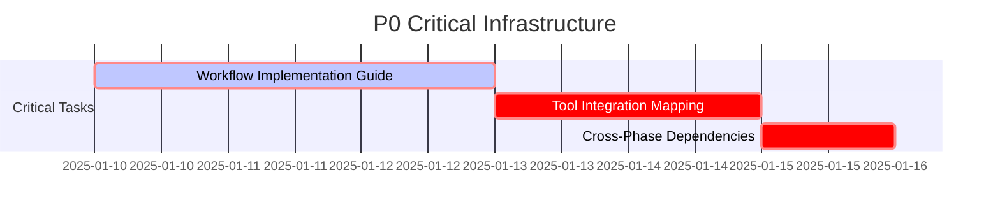
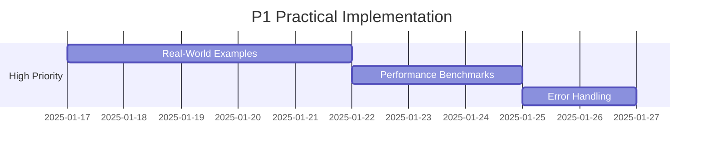
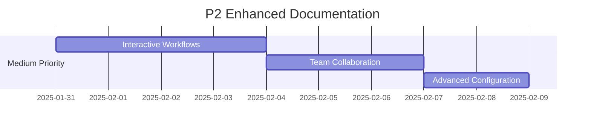
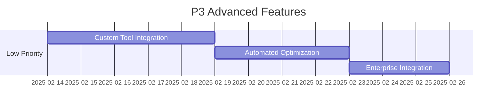

# HELIX Documentation Remediation Plan

## Executive Summary

This remediation plan addresses critical documentation gaps identified in the GRCTool HELIX (High-Efficiency Low-Impact eXecution) implementation. The plan prioritizes security, compliance, and workflow effectiveness to enable successful adoption of HELIX methodologies across the development lifecycle.

## Current State Assessment

### Existing Strengths
- ✅ **Complete HELIX phase structure** with all 6 phases documented
- ✅ **High-quality foundation documents** in each phase
- ✅ **Security-first approach** with comprehensive security architecture
- ✅ **Testing strategy** with 4-tier testing approach and quality metrics
- ✅ **GRC domain expertise** reflected in compliance requirements

### Critical Gaps Identified
- ❌ **Implementation guidance** - Lack of step-by-step workflow implementation
- ❌ **Tool integration** - Missing connections between HELIX phases and actual tools
- ❌ **Practical examples** - Limited real-world usage scenarios
- ❌ **Cross-phase dependencies** - Unclear relationships between phases
- ❌ **Performance benchmarks** - Missing measurable success criteria

## Remediation Strategy

### Priority Framework

#### P0 (Critical) - Immediate Action Required
**Impact**: Blocks HELIX workflow execution
**Timeline**: 1-2 weeks
**Owner**: Lead Developer + DevOps

#### P1 (High) - Significantly Improves Workflow
**Impact**: Major effectiveness improvements
**Timeline**: 2-4 weeks
**Owner**: Development Team

#### P2 (Medium) - Quality and Completeness
**Impact**: Enhanced quality and user experience
**Timeline**: 4-8 weeks
**Owner**: Technical Writers + Developers

#### P3 (Low) - Nice to Have
**Impact**: Advanced features and optimizations
**Timeline**: 8+ weeks
**Owner**: Community Contributors

## Phase 1: Critical Infrastructure (P0)

### 1.1 Workflow Implementation Guide (P0)
**Effort**: 3 days
**Dependencies**: None
**Acceptance Criteria**:
- [ ] Complete step-by-step HELIX workflow documentation
- [ ] Integration with existing CLI commands
- [ ] Clear phase transition criteria

**Tasks**:
- Create `/docs/helix/00-workflow/HELIX-IMPLEMENTATION-GUIDE.md`
- Document phase gates and transition criteria
- Map CLI commands to HELIX phases
- Include decision trees for phase progression

### 1.2 Tool Integration Mapping (P0)
**Effort**: 2 days
**Dependencies**: 1.1
**Acceptance Criteria**:
- [ ] Clear mapping between HELIX phases and GRCTool commands
- [ ] Integration points documented
- [ ] Tool selection criteria defined

**Tasks**:
- Document which `grctool` commands belong to each HELIX phase
- Create tool selection matrices
- Define integration touchpoints
- Map evidence collection tools to compliance requirements

### 1.3 Cross-Phase Dependencies (P0)
**Effort**: 1 day
**Dependencies**: 1.1, 1.2
**Acceptance Criteria**:
- [ ] Dependency matrix between all phases
- [ ] Blocking/non-blocking dependency classification
- [ ] Recovery procedures for blocked phases

**Tasks**:
- Create dependency matrix
- Document critical path through HELIX phases
- Define parallel execution opportunities
- Establish escalation procedures

## Phase 2: Practical Implementation (P1)

### 2.1 Real-World Examples and Case Studies (P1)
**Effort**: 5 days
**Dependencies**: Phase 1 complete
**Acceptance Criteria**:
- [ ] 3 complete end-to-end examples
- [ ] SOC2 compliance use case documented
- [ ] ISO27001 implementation scenario
- [ ] Multi-framework compliance workflow

**Tasks**:
- Document SOC2 evidence collection workflow using HELIX
- Create ISO27001 control implementation example
- Develop multi-framework compliance scenario
- Include troubleshooting examples for each case

### 2.2 Performance Benchmarks and Success Metrics (P1)
**Effort**: 3 days
**Dependencies**: 2.1
**Acceptance Criteria**:
- [ ] Phase-specific performance targets
- [ ] Success criteria for each HELIX phase
- [ ] Measurement procedures documented
- [ ] Baseline performance metrics established

**Tasks**:
- Define performance KPIs for each phase
- Establish measurement procedures
- Create performance monitoring dashboards
- Document performance optimization strategies

### 2.3 Error Handling and Recovery Procedures (P1)
**Effort**: 2 days
**Dependencies**: 1.3
**Acceptance Criteria**:
- [ ] Common failure scenarios documented
- [ ] Recovery procedures for each phase
- [ ] Escalation paths defined
- [ ] Rollback procedures established

**Tasks**:
- Document common failure patterns
- Create recovery playbooks
- Establish rollback procedures
- Define escalation matrices

## Phase 3: Enhanced Documentation (P2)

### 3.1 Interactive Workflow Documentation (P2)
**Effort**: 4 days
**Dependencies**: Phase 2 complete
**Acceptance Criteria**:
- [ ] Interactive decision trees
- [ ] Workflow visualization
- [ ] Progressive disclosure of complexity
- [ ] Self-guided learning paths

**Tasks**:
- Create Mermaid diagrams for all workflows
- Develop interactive decision trees
- Build progressive documentation structure
- Create self-assessment checkpoints

### 3.2 Team Collaboration Patterns (P2)
**Effort**: 3 days
**Dependencies**: 3.1
**Acceptance Criteria**:
- [ ] Multi-team collaboration workflows
- [ ] Role-based access patterns
- [ ] Communication protocols
- [ ] Handoff procedures between phases

**Tasks**:
- Document team collaboration patterns
- Define role-based workflows
- Create communication templates
- Establish handoff checklists

### 3.3 Advanced Configuration Examples (P2)
**Effort**: 2 days
**Dependencies**: 3.2
**Acceptance Criteria**:
- [ ] Environment-specific configurations
- [ ] Scale-based configuration patterns
- [ ] Security-hardened configurations
- [ ] Performance-optimized setups

**Tasks**:
- Create configuration examples for different scales
- Document security hardening options
- Provide performance tuning examples
- Include multi-environment setup guides

## Phase 4: Advanced Features (P3)

### 4.1 Custom Tool Integration Framework (P3)
**Effort**: 5 days
**Dependencies**: Phase 3 complete
**Acceptance Criteria**:
- [ ] Plugin development guide
- [ ] Custom tool integration examples
- [ ] API documentation for extensions
- [ ] Community contribution guidelines

**Tasks**:
- Document plugin architecture
- Create custom tool examples
- Provide API reference documentation
- Establish contribution workflow

### 4.2 Automated Workflow Optimization (P3)
**Effort**: 4 days
**Dependencies**: 4.1
**Acceptance Criteria**:
- [ ] AI-assisted workflow optimization
- [ ] Automated phase progression
- [ ] Predictive analytics for bottlenecks
- [ ] Continuous improvement recommendations

**Tasks**:
- Document AI integration possibilities
- Create automation examples
- Develop predictive analytics framework
- Establish continuous improvement processes

### 4.3 Enterprise Integration Patterns (P3)
**Effort**: 3 days
**Dependencies**: 4.2
**Acceptance Criteria**:
- [ ] Enterprise system integration guides
- [ ] SSO and identity management
- [ ] Audit and compliance reporting
- [ ] Large-scale deployment patterns

**Tasks**:
- Document enterprise integration patterns
- Create SSO configuration examples
- Develop audit reporting frameworks
- Provide scaling guidelines

## Implementation Timeline

### Week 1-2: Critical Infrastructure (P0)

### Week 3-6: Practical Implementation (P1)

### Week 7-14: Enhanced Documentation (P2)

### Week 15+: Advanced Features (P3)

## Resource Requirements

### Human Resources
- **Lead Developer**: 40% allocation for Phases 1-2
- **DevOps Engineer**: 30% allocation for Phases 1-3
- **Technical Writer**: 60% allocation for Phases 2-4
- **Security Specialist**: 20% allocation for security reviews
- **QA Engineer**: 30% allocation for validation and testing

### Technical Resources
- **Development Environment**: Full GRCTool development setup
- **Testing Infrastructure**: Multi-environment testing capability
- **Documentation Tools**: Obsidian, Mermaid, markdown processors
- **CI/CD Pipeline**: Automated documentation validation
- **Review Tools**: Collaborative documentation review platform

## Success Metrics

### Completion Metrics
- **Phase 1 (P0)**: 100% completion required before Phase 2
- **Phase 2 (P1)**: 90% completion target
- **Phase 3 (P2)**: 80% completion target
- **Phase 4 (P3)**: 70% completion target

### Quality Metrics
- **Documentation Coverage**: 95% of HELIX workflow documented
- **Example Completeness**: 100% of examples tested and validated
- **User Satisfaction**: >85% positive feedback on documentation clarity
- **Implementation Success**: >80% successful HELIX adoptions

### Performance Metrics
- **Documentation Access Time**: <30 seconds to find relevant information
- **Workflow Completion Time**: 50% reduction in time-to-implement
- **Error Rate**: <10% workflow execution errors
- **Support Ticket Reduction**: 60% reduction in documentation-related tickets

## Risk Mitigation

### Technical Risks
**Risk**: Documentation becomes outdated quickly
**Mitigation**: Automated validation in CI/CD pipeline

**Risk**: Examples don't work in practice
**Mitigation**: Automated testing of all examples

**Risk**: Complex workflows are difficult to understand
**Mitigation**: Progressive disclosure and multiple learning paths

### Resource Risks
**Risk**: Key personnel unavailable
**Mitigation**: Cross-training and documentation of tribal knowledge

**Risk**: Timeline pressure compromises quality
**Mitigation**: Phased approach with quality gates

### Adoption Risks
**Risk**: Teams resist HELIX methodology
**Mitigation**: Champions program and success story sharing

**Risk**: Documentation doesn't match real-world usage
**Mitigation**: User feedback loops and continuous iteration

## Quality Assurance

### Review Process
1. **Technical Review**: Lead developer validates technical accuracy
2. **Security Review**: Security specialist reviews compliance aspects
3. **Usability Review**: External team tests documentation clarity
4. **Stakeholder Review**: Key stakeholders approve final content

### Validation Criteria
- [ ] All examples are executable and tested
- [ ] Cross-references are accurate and complete
- [ ] Security and compliance requirements are met
- [ ] Performance metrics are measurable and realistic
- [ ] Documentation follows established style guidelines

### Continuous Improvement
- **Monthly Reviews**: Documentation effectiveness assessment
- **Quarterly Updates**: Content freshness and accuracy review
- **Annual Overhaul**: Comprehensive documentation strategy review
- **Feedback Integration**: Continuous user feedback incorporation

## Delivery Schedule

### Milestone 1: Foundation Complete (Week 2)
- ✅ Workflow implementation guide
- ✅ Tool integration mapping
- ✅ Cross-phase dependencies

### Milestone 2: Practical Implementation (Week 6)
- ✅ Real-world examples
- ✅ Performance benchmarks
- ✅ Error handling procedures

### Milestone 3: Enhanced Experience (Week 14)
- ✅ Interactive documentation
- ✅ Team collaboration patterns
- ✅ Advanced configurations

### Milestone 4: Advanced Features (Week 18)
- ✅ Custom integrations
- ✅ Automated optimization
- ✅ Enterprise patterns

## Monitoring and Feedback

### Analytics and Metrics
- **Documentation Usage**: Track page views and engagement
- **Implementation Success**: Monitor HELIX adoption rates
- **User Feedback**: Collect and analyze user satisfaction data
- **Support Metrics**: Track documentation-related support requests

### Feedback Channels
- **GitHub Issues**: Technical feedback and bug reports
- **Slack Channel**: Real-time questions and discussions
- **Monthly Surveys**: Systematic user experience feedback
- **Office Hours**: Direct interaction with documentation team

### Continuous Improvement Process
1. **Weekly**: Review usage analytics and immediate feedback
2. **Monthly**: Analyze trends and plan content updates
3. **Quarterly**: Major content review and strategic adjustments
4. **Annually**: Complete documentation strategy assessment

## References

- [[workflow-implementation-guide]] - Core HELIX workflow implementation
- [[tool-integration-matrix]] - GRCTool command mapping to HELIX phases
- [[performance-benchmarks]] - Success metrics and KPIs
- [[error-recovery-procedures]] - Troubleshooting and recovery workflows
- [[team-collaboration-patterns]] - Multi-team workflow coordination

---

*This remediation plan provides a systematic approach to addressing HELIX documentation gaps while maintaining focus on GRC compliance, security, and practical implementation success.*