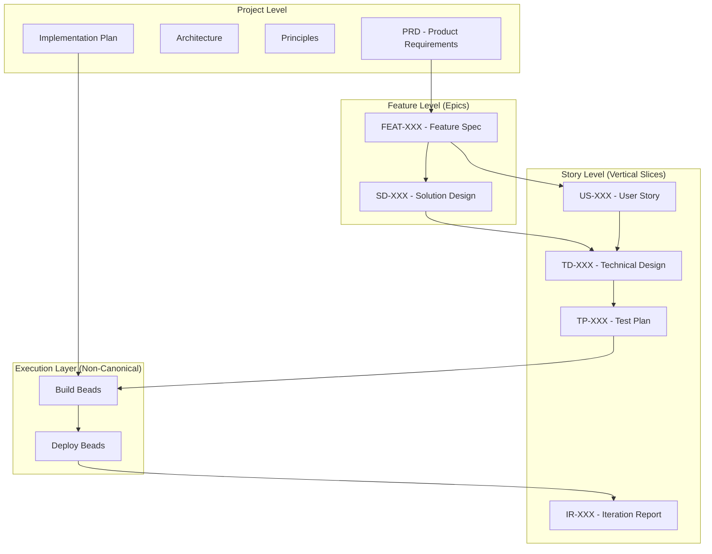

---
dun:
  id: helix.workflow.artifact-hierarchy
  depends_on:
    - helix.workflow
---
# HELIX Artifact Hierarchy and Naming Conventions

*Understanding how artifacts flow through the HELIX workflow*

## Overview

The HELIX workflow uses a consistent artifact naming system that enables:
- **Traceability**: Track artifacts from requirements to deployment
- **Vertical Slicing**: Implement stories independently
- **Parallel Development**: Multiple stories in different phases
- **Clear Organization**: Predictable file locations

The workflow also supports a project-level **Parking Lot** registry at
`docs/helix/parking-lot.md` for deferred and future work. Any artifact can be
marked with `dun.parking_lot: true` to keep it out of dependency graphs and
the main PRD flow while remaining in its normal directory.

## Scope Boundary

This document explains authority order, artifact relationships, naming, and
traceability. It does not define ready-queue logic, loop control, or how to
select execution work.

For execution behavior, follow [EXECUTION.md](EXECUTION.md) and the bounded
action prompts. For upstream Beads conventions, follow [BEADS.md](BEADS.md).

## Canonical Authority Order

Artifact flow and artifact authority are related but not identical. When two
HELIX artifacts disagree, this is the canonical authority order:

1. **Product Vision**
2. **PRD**
3. **Feature Specifications and User Stories**
4. **Architecture and ADRs**
5. **Solution Designs and Technical Designs**
6. **Test Plans and Executable Tests**
7. **Implementation Plans**
8. **Source Code and Build Artifacts**

### Notes

- Feature specifications and user stories refine the PRD and remain above downstream design and implementation artifacts.
- Tests govern Build phase execution because they are executable specifications, but they are still derived from Frame and Design artifacts.
- Source code must conform to higher-order artifacts; it does not redefine them.
- Beads are not part of the canonical authority order. They are execution
  records derived from authoritative artifacts.

## Artifact Types and Relationships

### Canonical Artifacts Plus Execution Beads



## Story-Level Progression and Execution

Each user story progresses through all phases independently:

### Naming Pattern
`{Prefix}-{Number}-{descriptive-name}.md`

### Phase Progression
```
Frame:   US-036-evidence-collection-api.md
Design:  TD-036-evidence-collection-api.md
Test:    TP-036-evidence-collection-api.md
Build:   bead issue `grctool-a3f2dd` labeled `helix`, `phase:build`, `story:US-036`
Deploy:  bead issue `grctool-b4c9e1` labeled `helix`, `phase:deploy`, `story:US-036`
Iterate: IR-036-evidence-collection-api.md
```

### Artifact Descriptions

| Prefix | Artifact Type | Phase | Purpose |
|--------|--------------|-------|---------|
| US | User Story | Frame | Defines WHAT needs to be built |
| TD | Technical Design | Design | Details HOW to build it |
| TP | Test Plan | Test | Specifies tests to verify it |
| BEAD | Build / Deploy Bead | Build / Deploy | Tracks scoped execution work in upstream `bd` |
| IR | Iteration Report | Iterate | Captures metrics and learnings |

## Feature-Level Progression (Epics)

Features represent collections of related stories:

### Naming Pattern
```
Frame:   FEAT-001-evidence-collection.md
Design:  SD-042-example-feature.md
```

### Relationships
- One feature (FEAT) contains multiple user stories (US)
- One solution design (SD) guides multiple technical designs (TD)

## Directory Structure

All HELIX artifacts are under `docs/helix/` to support multiple workflows:

```
docs/
└── helix/                              # HELIX workflow artifacts
    ├── 00-discover/
    │   ├── product-vision.md          # Optional project-level discovery
    │   ├── business-case.md
    │   ├── competitive-analysis.md
    │   └── opportunity-canvas.md
    ├── 01-frame/
    │   ├── prd.md                     # Project-level
    │   ├── principles.md               # Project-level
    │   ├── features/
    │   │   └── FEAT-001-*.md          # Feature-level
    │   └── user-stories/
    │       └── US-XXX-*.md            # Story-level
    ├── 02-design/
    │   ├── architecture.md            # Project-level
    │   ├── solution-designs/
    │   │   └── SD-XXX-*.md           # Feature-level
    │   └── technical-designs/
    │       └── TD-XXX-*.md           # Story-level (NEW)
    ├── 03-test/
    │   ├── test-plan.md               # Project-level
    │   └── test-plans/
    │       └── TP-XXX-*.md           # Story-level (NEW)
    ├── 04-build/
    │   ├── implementation-plan.md     # Project-level
    ├── 05-deploy/
    │   ├── deployment-checklist.md    # Project-level
    └── 06-iterate/
        ├── alignment-reviews/
        │   └── AR-YYYY-MM-DD-*.md    # Cross-phase reconciliation reports
        ├── backfill-reports/
        │   └── BF-YYYY-MM-DD-*.md    # Research-first backfill reports
        ├── metrics-dashboard.md       # Project-level
        └── iteration-reports/
            └── IR-XXX-*.md           # Story-level (NEW)

.beads/                               # Upstream bd workspace (Dolt-backed)
```

## Cross-References

Each artifact references its dependencies:

### Story-Level References
```markdown
# TD-036-evidence-collection-api.md
**User Story**: [[US-036-evidence-collection-api]]
**Parent Feature**: [[FEAT-001-evidence-collection]]
**Solution Design**: [[SD-042-example-feature]]
```

### Traceability Chain
```
FEAT-001 → US-036 → TD-036 → TP-036 → build bead(s) → deploy bead(s) → IR-036
         ↓
         US-037 → TD-037 → TP-037 → build bead(s) → deploy bead(s) → IR-037
         ↓
         US-038 → TD-038 → TP-038 → build bead(s) → deploy bead(s) → IR-038
```

## Naming Rules

### Consistency Rules
1. **Number stays constant**: 036 throughout all phases
2. **Name stays constant**: "evidence-collection-api" throughout
3. **Only canonical artifact prefix changes**: US → TD → TP → IR
4. **Build and Deploy use native bead IDs**: execution is tracked in upstream `bd`, not numbered HELIX files

### Valid Examples
- `US-001-initialize-grctool.md`
- `TD-001-initialize-grctool.md`
- `FEAT-014-tugboat-integration.md`

### Invalid Examples
- `US-1-init.md` (number must be 3 digits)
- `td-001-initialize.md` (prefix must be uppercase)
- `US-001-init-grctool.md` (name changed between artifacts)

## State Detection

The workflow state is determined by which artifacts exist:

### Story State Detection
```yaml
If exists US-036: Story is in FRAME
If exists TD-036: Story is in DESIGN
If exists TP-036: Story is in TEST
If open HELIX build beads exist for story US-036: Story is in BUILD
If open HELIX deploy beads exist for story US-036: Story is in DEPLOY
If exists IR-036: Story is in ITERATE
```

### Feature State Detection
```yaml
If all stories have US: Feature is in FRAME
If all stories have TD: Feature is in DESIGN
If all stories have tests passing: Feature is in BUILD
```

## Benefits

### 1. Vertical Slicing
Each story can be deployed independently:
- US-036 could be in production (ITERATE)
- US-037 could be in testing (TEST)
- US-038 could be in design (DESIGN)

### 2. Clear Traceability
Follow any requirement through its lifecycle:
```bash
grep -r "US-001" docs/helix/  # Find all artifacts for story 001
```

### 3. Parallel Development
Multiple team members can work on different stories:
- Developer A: Implementing US-036 (BUILD)
- Developer B: Designing US-037 (DESIGN)
- Developer C: Writing tests for US-038 (TEST)

### 4. No State File Needed
State is derived from artifacts:
- No `.helix-state.yml` to maintain
- Git history shows state changes
- Self-healing (state always reflects reality)

## Migration Path

For existing projects:

### Option 1: New Stories Only
- Keep existing artifacts as-is
- Use new naming for new stories
- Both systems coexist

### Option 2: Gradual Migration
- Rename artifacts as they're updated
- Start with active stories
- Complete over time

### Option 3: Full Migration
- Batch rename all artifacts
- Update all references
- Clean cutover

## Commands

Use the current HELIX queue controls with this hierarchy:

```bash
# Inspect the current queue
bd ready --label helix --json

# Execute one ready bead
helix implement

# Decide the next action when the queue drains
helix check

# Run the wrapper loop
helix run
```

---

*This hierarchy enables true agile development with independently deployable story slices while maintaining full traceability.*
